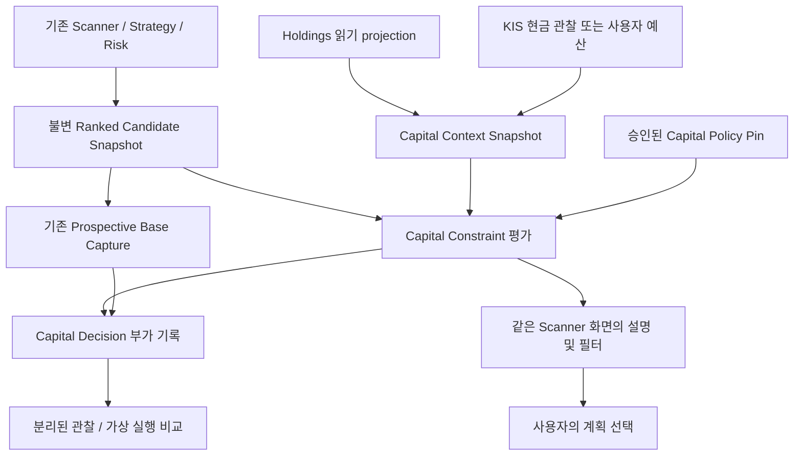

# StockScope Capital Aware Recommendation Design

작성일: 2026-09-29 (Asia/Seoul)  
문서 지위: **설계·검토 제안. 구현, 정책 승인, Roadmap 단계 신설 또는 운영 활성화 결정이 아님.**  
검토 기준: GitHub `main` 및 로컬 `main`, `f6c3e85b599f261bc5a05a9b7dffc1c2081c114e`  
산출 범위: 이 문서 한 개. 코드·DB·migration·UI·테스트·환경설정 변경 없음.

## 1. Executive Summary

**하나의 Scanner를 유지하고, 불변 Scanner 결과를 입력으로 받는 작은 Capital Constraint 평가 계층을 권고한다.** 화면에는 ‘이번 신규 투자에 사용할 금액’과 후보별 자금 조건을 연결한다. `Best Overall / Budget Aware`를 독립 추천 엔진이나 대등한 두 모드로 만들 필요는 없다. 필요하면 같은 결과에서 ‘자금 조건 충족 후보만 보기’를 제공한다.

핵심은 ‘좋은 종목을 싼 종목으로 대체’하는 것이 아니라 **동일한 분석 기준을 통과한 후보 중 현재 조건으로 검토 가능한 후보를 설명**하는 것이다. 원래 순위·조건·위험·계획은 그대로 보존하며, 제약 적용 후에도 원래 상대 순서를 유지한다. 후보가 없으면 없다고 답한다.

현재 코드로 가능한 것과 새 정책이 필요한 것을 구분한다.

- **현재 존재:** Scanner 우선순위·Risk/Entry/Stop/Target, Production SelectionPolicyPin, Holdings 계좌·포지션·KIS 보유 관찰, Prospective·Tracking·Execution Validation, P5 승인/활성화 기반.
- **새 연결 필요:** 개인 예산 문맥, 검증된 매수 가능 현금 관찰, 결정론적 자금 제약 평가, 개인별 선택 기록 및 비교 보고서.
- **정책 미결정:** 허용 손실·집중 한도·계좌 위험 비율·전략/Horizon별 수량·비용/신선도 기준. 기존 Risk Engine이 이를 이미 승인했다고 볼 수 없다.

초기 UX는 **선택적 금액 입력 한 개 + 계산 가능한 사실 표시**가 적절하다. 금액만으로 ‘적정 수량’을 결정하지 않는다. 정책이 없으면 비용 전 예산상 수량 상한과 1주당 손절 기준 손실을 설명하되 권장 수량은 유보한다. 이후 KIS 현금 의미와 신선도를 검증하면, 사용자가 선택한 계좌의 현금과 저장된 투자 상한을 이용해 반복 입력을 줄인다. 계좌 현금 전액을 사용자의 투자 의사로 간주하지 않는다.

이 기능은 NEXT-6 Macro/Jev의 완료를 기다릴 이유가 없다. 다만 지금 진행 중인 Macro 연구를 중단하거나 새 Phase를 확정할 근거도 없다. 기존 P2/P5 근거 계약, P3 계좌 문맥, P7 동선, 필요 시 P8-S1 연결의 **작은 후속 범위**로 검토한다. UI만으로 완전한 개인화 추천을 출시해서는 안 된다.

## 2. Current State Audit

### 2.1 확인 기준과 한계

`git ls-remote origin refs/heads/main`으로 GitHub HEAD를 직접 확인했다. 로컬 HEAD와 일치했고 작업 시작 시 `git status --short`는 비어 있었다. 원격 코드 복사나 checkout 변경 없이 같은 commit의 로컬 소스를 읽었다.

확인한 문서:

- [최신 handoff](StockScope_HANDOFF_2026-09-28_P5S1E_COMPLETE.md): 기준 `4e781b5`. 제품 방향과 P5-E까지의 경계를 설명하지만 현재 HEAD의 기능 목록은 아니다.
- [Master Architecture](StockScope_MASTER_ARCHITECTURE_vNext.md), [Implementation Baseline](StockScope_IMPLEMENTATION_BASELINE_vNext.md), [Development Roadmap](StockScope_DEVELOPMENT_ROADMAP_vNext.md): 목표 책임과 기존 계약 보존 기준. 개발 완료 기록으로 해석하지 않는다.
- [Jev Concept](StockScope_JEV_INTEGRATION_CONCEPT.md), [NEXT-6 Macro 설계](StockScope_NEXT6_MACRO_EVENT_ARCHITECTURE_DESIGN_2026-09-29.md), [운영 도구 설명](../tools/data/README.md): 미래 연결 및 handoff 이후 변경 확인.

handoff의 ‘P5-F/G NEXT, P6 LATER’를 현재 미구현 사실로 복사하지 않았다. 현재 코드에는 Governance API/UI, 복구 연결, P6 Event Evidence, NEXT-2~5 관련 조회/근거 UI, Macro NEXT-6B-S4 후보 고정까지의 코드가 있다. 최신 `main`은 S4 병합 후 optional migration의 `NOT_APPLICABLE` 처리 수정까지 포함한다. **소스 존재, 로컬 migration 완료, 실제 데이터 충분성, 운영 활성화, UAT 완료는 서로 다른 사실**이다.

이번 작업은 runtime DB·계좌·비밀 설정을 조회하지 않았으며, KIS 실계좌 호출·migration·테스트 실행·브라우저 UAT를 수행하지 않았다. 따라서 연결된 실제 계좌의 현금과 운영 정책 활성 상태는 확인하지 않았다. 아래 ‘구현됨’은 소스 수준 확인이다.

### 2.2 영역별 현재 사실

| 영역 | 현재 코드에서 확인한 사실 | 이번 설계와의 관계 |
| --- | --- | --- |
| Scanner 생성 | [`backtest/scanner.py`](../backend/app/backtest/scanner.py)의 `StockScannerService.scan`: universe·유동성·빠른 분석 → 제한된 deep 분석 → 후보 우선순위 → `candidates`와 `more_candidates`. 버전 `0.21.3.9` | 예산은 이 생성 과정과 prepool 필터에 넣지 않는다. 내부 전 종목 분석이 완료된 것처럼 표현하지 않는다 |
| Ranking | [`candidate_priority.py`](../backend/app/backtest/candidate_priority.py)의 `rank_candidates`: tier → 부족 조건 → Risk 품질 → 진입 거리 → 전략 적합도. 동일 기본 key의 tie에서는 구조적 Target1 근접 후보 승격과 코드 안정 정렬 | 단일 ‘Scanner Score 92’로 현재 순위 전체를 설명할 수 없다. 기존 `priority.rank`, tie 정보와 이유를 보존 |
| 점수 의미 | [`strategy/engine.py`](../backend/app/strategy/engine.py)의 suitability score는 조건 적합도. Risk gate 독립 실행, 허용 전략 pool 필터 후 기존 정렬, 최소 적합도 55 미달 시 NO_TRADE | 55는 **기존 코드 값**이며 새 예산 품질 기준으로 제안한 값이 아니다. score는 수익 확률이 아니다 |
| Production baseline | [`scanner-production-baseline_0.21.3.9.json`](../backend/runtime/baseline/scanner-production-baseline_0.21.3.9.json): `SS-SCANNER-0.21.3.9-cf48adb0d19e7953`, `production_changed=false`. [`scanner_production_baseline.py`](../backend/app/baseline/scanner_production_baseline.py)의 기대 버전도 동일 | handoff의 `0.21.3.8`을 현재 baseline으로 쓰지 않는다. manifest 확인이며 이번에 verifier를 실행한 것은 아니다 |
| Selection Policy | [`production_selection_policy.py`](../backend/app/strategy/production_selection_policy.py): `SelectionPolicyPin`, 운영 전략 version/hash, baseline/fingerprint, cache token, active/rollback/legacy fallback. 실행 중 pin 유지 | 현재 Selection은 **운영 전략 pool 선택**이다. 사용자별 자금 선택과 이름·identity를 분리 |
| 분석 요청·캡처 연결 | [`api/backtest.py`](../backend/app/api/backtest.py), [`strategy/service.py`](../backend/app/strategy/service.py): Scanner job/단일 분석의 policy pin 전달, Prospective finalize 연결 | 기존 실행을 다시 개인별 Scanner 실행으로 복제하지 않는다 |
| Risk/가격 계획 | [`risk/engine.py`](../backend/app/risk/engine.py)의 `build_plan`, [`risk/models.py`](../backend/app/risk/models.py), [`entry_risk_guide.py`](../backend/app/backtest/entry_risk_guide.py): 구조 anchor·ATR·invalidation·stop zone·Target·R:R·참고 전용/불가 및 가격 일관성 | 계좌 자산·현금·허용 손실·권장 수량 입력은 없다. `risk_pct`는 Entry 대비 가격 위험 거리이지 계좌 위험 비율이 아니다 |
| Horizon | [`horizon.py`](../backend/app/horizon.py), [`horizon_context.py`](../backend/app/horizon_context.py): `LEGACY_UNSPECIFIED`, SHORT/MEDIUM/LONG 전달·저장·지원 상태 | 명시 Horizon은 현재 `EVALUATION_PENDING`; 수치 정책 미승인. 기존 5/10/20일 관찰을 Horizon으로 대입하지 않는다 |
| Holdings/Account | [`holdings/domain.py`](../backend/app/holdings/domain.py), [`catalog.py`](../backend/app/holdings/catalog.py), [`lifecycle.py`](../backend/app/holdings/lifecycle.py): BROKER/MANUAL/VIRTUAL, 계좌·현재 수량/평균가·원장 이벤트·관찰 시각·sync identity | 현재 상태를 읽어 같은 종목 보유와 계좌 범위를 알 수 있다. 수동 보유와 broker 보유의 중복 및 다른 계좌 누락을 자동 해결하지 못함 |
| Holdings 판단·계획 | [`decision_support.py`](../backend/app/holdings/decision_support.py), [`management.py`](../backend/app/holdings/management.py), [`workspace_query.py`](../backend/app/holdings/workspace_query.py): 판단/계획 분리, source stale 검사, 명시 적용, 손절 완화 차단, 읽기 projection | 신규 후보 화면이 ADD 승인·계획 적용·포지션 원장 변경을 대신하지 않는다 |
| KIS 보유 동기화 | [`integrations/kis/account.py`](../backend/app/integrations/kis/account.py): read-only `inquire_domestic_balance`, holding 및 summary 파싱. [`holdings/kis_sync.py`](../backend/app/holdings/kis_sync.py): 완전 잔고 검증 후 포지션 관찰/조정 | `summary.deposit_amount`는 `dnca_tot_amt`. 현금 ledger/매수 가능 현금 snapshot을 저장하여 Scanner와 연결하는 구현은 없음 |
| KIS 현금 한계 | 같은 adapter에 `net_asset_amount` 등의 summary 필드가 있지만 `_dec`는 결측/파싱 오류 일부를 0으로 바꿈. `KisHolding.orderable_quantity`는 잔고 행 `ord_psbl_qty` | 유효한 현금 0과 현금 미상 구분이 부족하다. 잔고의 수량 필드를 신규 매수 가능 수량으로 재사용하지 않는다 |
| 연결 상태 | [`api/integrations.py`](../backend/app/api/integrations.py): 설정 상태와 명시 KIS 잔고 연결 테스트. 성공 응답은 holding/page count 중심 | 연결 성공은 현금 의미·충분성·동시성 검증 완료가 아니다 |
| Prospective | [`prospective/models.py`](../backend/app/prospective/models.py), [`catalog.py`](../backend/app/prospective/catalog.py), [`service.py`](../backend/app/prospective/service.py): 요청 policy ID/hash, source snapshot/execution identity, 반환된 top+more 저장, COMPLETE/PARTIAL/실패 등 | 개인별 context·feasibility·노출/선택 기록은 없음. base capture를 보존하고 별도 부가 기록 필요 |
| Tracking | [`tracking/models.py`](../backend/app/tracking/models.py), [`service.py`](../backend/app/tracking/service.py), [`store.py`](../backend/app/tracking/store.py): 불변 snapshot·출처 병합·관찰 성과·CLOSED 고정. 동일 시장/종목/일자/기준가격 병합 | 계좌별 선택 이력을 기존 Tracking 중복 제거 key로 표현할 수 없다 |
| Execution Validation | [`simulation/execution_engine.py`](../backend/app/simulation/execution_engine.py), [`prospective/evaluation.py`](../backend/app/prospective/evaluation.py): 로컬 시장자료, 가상 진입/종료, 비용 가정·실행 상태·CENSORED 분리 | 수익률 평가가 실제 현금 제약·다종목 동시 배분 성과를 입증하지 않는다 |
| 기존 자금 산술 | [`simulation/sim1_models.py`](../backend/app/simulation/sim1_models.py), [`sim2_trading_service.py`](../backend/app/simulation/sim2_trading_service.py): 가상 portfolio의 Decimal 자금/정수 수량 및 현금 부족 검사. [`backtest/engine.py`](../backend/app/backtest/engine.py)의 `FULL_CAPITAL_SINGLE_POSITION` 가정 | 산술 관례·fixture는 재사용 가능. 가상 잔고나 단일 포지션 전액 투입 가정을 실제 계좌 추천 정책으로 가져오지 않는다 |
| P5 | [`strategy_evidence.py`](../backend/app/simulation/strategy_evidence.py), [`strategy_change.py`](../backend/app/simulation/strategy_change.py), [`api/strategy_governance.py`](../backend/app/api/strategy_governance.py), [`StrategyOperationsPanel.tsx`](../frontend/src/components/StrategyOperationsPanel.tsx) | 근거→제안→승인→명시 활성화 재사용. 기본 승인 protocol의 `activation_eligible=False`, `q7_precommitted=False`. 자금 정책도 이미 승인됐다고 보지 않음 |
| Adaptive/Macro | [`macro/`](../backend/app/macro/__init__.py) 및 S4 도구: 연구 후보 고정. 운영 전략 자동 Rotation은 승인된 현재 기능이 아님 | 향후 context hook만 허용. Macro calibration/Jev를 자금 산술의 필수 의존성으로 추가하지 않는다 |

### 2.3 연결 전에 알아야 할 실제 제약

1. **반환 범위:** `candidate_limit`은 1~10으로 제한되고 별도 `EXTRA_RESULT_LIMIT` 범위의 more가 반환된다. Prospective는 이 반환 집합만 저장한다. 내부 audit의 `candidate_pool_complete`는 시장 전체 무제한 평가나 Prospective 전체 저장을 뜻하지 않는다.
2. **순위 필드:** `rank_candidates`는 `priority.rank`에 순위를 쓴다. `ProspectiveCatalog.finalize_capture`의 rank 열은 최상위 `candidate.get("rank")`를 읽는다. 원본 snapshot에는 nested priority가 남지만 rank 열만 사용하면 순위가 없을 수 있다. 향후 reader/adapter에서 출처를 명시한 정규화가 필요하며, 이번에는 수정하지 않는다.
3. **identity와 집계는 별개:** Prospective source identity는 Selection Policy를 구분하지만 현재 `summarize`는 전략/시장 등의 집계를 만든다. policy·예산·계좌별 paired 비교를 자동 제공한다고 볼 수 없다. policy 정보가 identity에 있다는 이유만으로 혼합 집계가 안전해지는 것은 아니다.
4. **완료의 의미:** 구조적으로 짧은 과거 이력은 현재 추천 계산의 결측과 다르게 취급된다. Scanner `0.21.3.9`의 `_completion_state` 및 UI는 그 구분을 반영한다. 자금 계층에서 ‘3년 참고 근거 부족’을 무조건 현재 분석 실패로 다시 정의하지 않는다.

## 3. Problem Definition

연결해야 할 세 질문은 서로 다르다.

| 질문 | 답을 소유하는 영역 | 입력으로부터 알 수 없는 것 |
| --- | --- | --- |
| 어떤 종목을 먼저 검토할 만한가? | Scanner/Strategy/Risk | 사용자가 얼마를 투자할 의향인지 |
| 이 예산에서 거래 단위와 비용을 감당할 수 있는가? | Capital Constraint | 감당할 수 있다는 사실만으로 적정 위험인지 |
| 얼마를 배정해도 되는가? | 승인된 Sizing/집중 정책 + 사용자 한도 + 관측 계좌 문맥 | 현금 잔액만으로 개인 위험 허용도 |

최소 목표는 **분석 의미를 보존하면서 실행 불가능/미확인 사유를 조기에 보여주는 것**이다. 완전한 포트폴리오 최적화나 ‘최고 수익 종목’을 찾아주는 목표로 확대하지 않는다.

`Investment Quality ≠ Affordability ≠ Suitable Position Size`. 특히 ‘비싸서 불가능’과 ‘한 주는 가능하지만 예산 대부분을 사용’은 구분한다. 후자를 부적합으로 확정하려면 집중도 정책이 필요하다. 정책이 없으면 비중 사실과 미평가 상태를 보여준다.

## 4. UX Problem

두 모드를 먼저 고르게 하면 사용자는 매번 ‘분석적으로 좋은 것’과 ‘내가 살 수 있는 것’ 중 무엇을 포기할지 결정하게 된다. Budget Aware라는 별도 상품명은 예산이 적을수록 분석 기준도 낮아진다는 인상을 줄 수 있다.

권고 동선은 한 화면에서 질문을 좁히는 것이다.

1. 현재 Scanner 결과를 그대로 본다. 예산 입력 없이도 분석을 읽을 수 있다.
2. 필요할 때 ‘이번 신규 투자에 사용할 금액’을 한 번 입력한다.
3. 각 후보에서 ‘자금상 검토 가능 / 자금 부족 / 위험 정책 확인 필요 / 현재 진입 보류’를 구분한다.
4. 필터를 적용하면 동일 분석 기준 내 통과 후보를 원래 순서로 본다. 제외된 상위 후보와 사유도 한 번에 확인한다.

‘예산 조건 내 최적’은 과도하다. 평가 집합이 제한되고 순위가 기대 수익 최적화도 아니므로 기본 문구는 **‘확인한 후보 중 자금 조건을 충족하는 우선 검토 후보’**로 한다. 후보 수가 적어도 품질 기준을 낮추거나 수를 채우지 않는다.

## 5. Candidate Architectures

| 대안 | 구성 | 판단 |
| --- | --- | --- |
| A. 두 추천 모드 | Best Overall/Budget Aware를 별도 실행·정렬 | 중복 실행, 정책/캐시 분기, 점수 의미 혼동. 같은 엔진의 필터를 두 모드라 부를 실익도 작음 |
| B. Scanner + Personal Fit Layer | 자금·성향·경험·선호 등을 하나의 적합성 점수로 통합 | 확장성은 있지만 현재 입력/근거가 부족. ‘개인 적합’이라는 넓은 보장을 만들 위험 |
| C. Scanner + Capital Constraint Layer | 불변 후보에 예산·거래 단위·위험 한도·관측 집중 조건을 각각 판정 | **권고**. 점수 합산 없이 원래 상대 순위 유지. 포트폴리오 최적화는 별도 |
| D. 자동 계좌 기반 추천 | KIS 현금을 기본 투자금으로 간주 | 반복 입력은 작지만 현금 의미·투자 의사·신선도·다른 계좌 누락을 숨길 수 있음 |
| E. 투자금 한 개 입력 | 사용자가 정한 신규 투입 상한으로 계산 | 첫 도입에 가장 단순. 전체 자산 비중과 권장 위험 수량까지 계산할 수는 없음 |
| F. 추천 후 Sizing만 | 상위 후보를 고른 후 수량 계산 | 구현은 작지만 상위 후보가 모두 불가능하면 발견 문제가 남음. 상세 화면 보조 기능으로 유효 |
| G. 한 Scanner의 제약 주석부터 | 원래 목록에 1주 필요액·예산 점유·판정 제한만 표시. 이후 동일 계층에서 필터·Sizing 확대 | **C의 가장 작은 초기 형태**. 정책 미정 상태에서도 과장 없이 제공 가능 |

D/E는 C와 경쟁하는 엔진 구조라기보다 **Capital Context의 입력 방식**이다. 별개 선택지를 억지로 하나만 고르지 않고, 구조 C에 입력 E를 먼저 연결하고 검증 후 D의 편의성을 도입한다. F는 상세 계획 동선에서 재사용한다.

## 6. Comparison

아래 평가는 설계 판단이며 성능 실험 결과가 아니다.

| 대안 | 사용자 입력량 | Scanner 의미 보존 | 구현 복잡도 | 검증 가능성 | 설명 가능성 | 확장성 | 기존 구조와의 충돌 |
| --- | --- | --- | --- | --- | --- | --- | --- |
| A 두 모드 | 모드 선택 + 예산/계좌 | 별도 rank면 낮음 | 높음 | 두 분모·캐시 관리 필요 | 모드별 차이 설명 부담 | 중복 확장 | baseline/pin/capture 분기 |
| B Personal Fit | 성향 포함 시 다수 | 합성점수면 낮음 | 높음 | 성향 정답·근거 부족 | 한 점수의 원인 불명확 | 넓음 | 현재 정책/권한 범위 초과 |
| C Capital Constraint | 0~1개 반복 입력 | 높음 | 중간 | 결정론·불변 입력 검증 용이 | 각 제한 사유 명확 | 계좌/집중 context 추가 용이 | 부가 identity 설계 필요 |
| D 계좌 자동 | 연결/계좌 선택 후 보통 0개 | 후처리면 높음 | 중간~높음 | provider·시점 검증 추가 | 투자금 자동 추정이 모호 | 계좌 의존 | 예수금과 구매력 혼동 가능 |
| E 금액 하나 | 선택적 1개 | 후처리면 높음 | 낮음 | 재현 쉬움 | 금액 범위 명확 | 계좌 adapter로 확장 | 자산 비중은 미상 |
| F 사후 Sizing | 금액 또는 기존 context | 높음 | 낮음~중간 | 단일 후보 검증 쉬움 | 수량 산출 설명 용이 | 발견 문제는 별도 해결 | top 후보가 불가능하면 막힘 |
| G 주석부터 | 선택적 1개 | 높음 | 가장 낮음 | 사실 산술부터 검증 | 권장과 상한 구분 용이 | C로 자연 확장 | 출시 표현의 과장 방지 필요 |

선택: **C를 목표 책임 경계로 삼되 G+E로 시작한다.** 하나의 Scanner와 한 개의 자금 문맥을 유지한다. 정책 미승인 상태에서 완성된 개인화 추천처럼 보이는 B/D부터 시작하지 않는다.

## 7. Recommended Architecture

### 7.1 최소 책임 단위

새 서비스 군·새 DB·새 전략 엔진을 만들기보다 기존 orchestration 아래의 **순수 평가 함수/작은 도메인 모듈 + 입력 adapter + 부가 기록**이면 충분하다. 아래 이름은 제안이며 현재 구현 심볼이 아니다.



1. `CapitalContextSnapshot`: 사용자 상한, 선택 계좌, 현금 source/시각/완전성, 보유 revision 및 coverage, 금액 의미를 고정한다. 네트워크 조회·동기화는 기존 provider/계좌 owner가 수행한다.
2. `evaluate_capital_constraints`: 입력 snapshot과 승인된 정책만으로 후보별 판정·산술·사유를 반환한다. Scanner/Strategy/Risk를 변경하거나 외부 API를 호출하지 않는다.
3. `CapitalDecision`: base capture에 연결되는 불변 부가 근거. context와 policy, 평가 범위, 원래 순위, 필터 결과·탈락 사유를 저장한다. 화면 노출/사용자 선택은 별도 사건으로 연결한다.

Presentation은 위 결과를 읽어 렌더링한다. 계좌 refresh, 분석 재실행, 결정 기록 발행을 단순 조회의 숨은 부작용으로 넣지 않는다. 기록은 명시된 추천 평가 완료 경로에서 idempotent하게 수행한다. 금액 타이핑 중 모든 숫자를 영속 저장할 필요는 없다. 확정·제시된 결정과 사용자 행동을 기록하는 기준을 고정한다.

### 7.2 후보 집합과 선택 규칙

초기 평가 집합은 **동일 완료 실행에서 반환·보존한 `candidates + more_candidates`**로 한정한다. top 5만 필터한 뒤 ‘다른 후보 없음’이라고 해서는 안 된다. 또한 반환되지 않은 deep 후보를 사후 데이터로 복원해 당시 추천처럼 추가하지 않는다.

권고 선택 규칙은 `원래 순서의 후보 중 기존 진입 요건과 필요한 capital 조건을 모두 통과한 후보를 제한된 표시 수까지 취함`이다. 조건 미충족·미상은 통과로 간주하지 않는다. WAIT/WATCH는 관찰 목록에 남길 수 있지만 ‘지금 신규 매수 적합’으로 승격하지 않는다. score cutoff를 새로 만들어 88점 이상 등으로 확정하지 않는다.

여전히 후보가 부족한 경우 먼저 ‘현재 평가·보존 범위에서 없음’을 알린다. 더 넓은 탐색이 실제로 필요하다는 증거가 생기면 **예산과 무관한 고정 pool export 계약**을 별도 검토한다. pool 변경은 Scanner 계약·Prospective 범위 version·baseline 영향 검토 대상이다. 저가 종목을 찾기 위한 prepool 우회/무제한 스캔은 초기 범위가 아니다.

## 8. Scanner vs Capital Constraint Boundary

| 책임 | Scanner/Strategy/Risk | Capital Constraint |
| --- | --- | --- |
| 종목/전략 매력도 | 기존 조건·suitability·우선순위 | 읽기 전용 |
| 진입·손절·목표 | 기존 공통 분석·Risk/Exit 정책 | 일관된 계획을 참조; 수량을 맞추려고 Stop 축소·Target 확대 금지 |
| NO_TRADE/Risk Gate | 원래 권한 유지 | 가장 먼저 존중. 예산 적합으로 override 금지 |
| 자금/수량 | 계좌 비의존 | 예산·현금·수량 단위·정책 위험/집중 상한 적용 |
| 계좌 보유/업종 편중 | 현재 투자 분석과 분리 | 관측 가능한 범위만 읽고 신규 투입 조건 평가 |
| 순위 | 원래 rank/tie/설명 | filtered position은 별도 필드. 원래 score와 rank 변경 금지 |
| 증권사 주문 | 없음 | 없음 |

기존 Selection Policy fallback이 유효한 Legacy 운영으로 해석되는 경우 기존 계약을 따른다. 모든 fallback을 임의 차단할 필요는 없지만 실제 적용 source·이유를 기록한다. 반대로 **미승인 capital policy를 임의 기본 위험 비율로 대체하지 않는다.** 기존 운영 전략 정책과 새로운 개인 자금 정책의 승인 상태는 별도다.

## 9. Position Feasibility / Sizing Concept

### 9.1 상태는 한 개의 적합 점수로 압축하지 않는다

| 제안 판정 축 | 예시 상태 | 의미 |
| --- | --- | --- |
| `analysis_eligibility` | ELIGIBLE / BLOCKED / WAIT / UNKNOWN | 원래 분석·진입 gate |
| `funding_status` | SUFFICIENT / INSUFFICIENT / UNKNOWN | 평가 목적의 자금 제약 충족 여부 |
| `sizing_status` | CALCULABLE / POLICY_PENDING / INPUT_MISSING | 승인된 수량 산출이 가능한지 |
| `concentration_status` | WITHIN_POLICY / EXCEEDS_POLICY / UNKNOWN / POLICY_PENDING | 관측 coverage와 승인된 한도에 따른 판정 |
| 최종 표시 | 검토 가능 / 조건 대기 / 자금 부족 / 판단 불가 | 필수 축 중 미상·미승인이 있으면 완전 적합을 선언하지 않음 |

수량 `0`은 계산된 불가능 상태이고 `null`은 미상/정책 미승인이다. 두 값을 합치지 않는다. 사용자 예산만으로 계산한 funding은 ‘입력한 예산 기준’이며 실제 증권사 주문 가능 판정이 아니다.

### 9.2 결정론적 산술

아래는 **향후 계약을 설명하는 수식**이며 승인된 숫자 정책이 아니다. 국내 long 현금 매수 시나리오를 우선 범위로 하되 실제 거래 단위는 검증된 instrument 규칙에서 받는다.

| 기호 | 뜻 |
| --- | --- |
| `B` | 사용자가 이번 신규 투입에 허용한 총 금액 상한. 총 자산이 아님 |
| `C_i` | 종목·조회 조건과 시점이 명시된, 검증된 현금 기반 매수 여력. provider가 이미 차감한 예약액을 다시 차감하지 않음 |
| `E_i`, `S_i` | 동일 계획/version의 유효 진입 기준과 채택된 손절 기준 |
| `L_i` | 거래 단위. 임의의 경제적 최소 수량과 구분 |
| `R_i` | 사용자에게 적용 가능한 승인된 위험 금액 한도. 현금 잔액만으로 추론 불가 |
| `A_i` | 승인된 종목/업종 집중 규칙에 따른 추가 투입 상한. 관측 coverage 필요 |
| `cost_i(q)` | 수량 q의 매수 비용 및 자금 소요 가정 |
| `loss_i(q)` | 손절 시나리오에서 q주의 손실과 비용/슬리피지 가정 |

```text
F_i = min(B, C_i)             # 두 값 모두 적용되고 유효할 때
F_i = B                      # 수동 예산 시나리오; broker verified 표시는 금지

q_cash = max { q in 거래단위 배수 : q * E_i + cost_i(q) <= F_i }
q_risk = max { q in 거래단위 배수 : loss_i(q) <= R_i }
q_concentration = 승인된 A_i 및 기존 보유를 반영한 수량 상한

q_allowed_max = min(q_cash, q_risk, q_concentration, 적용되는 기타 승인 한도)
```

필수 한도가 미정일 때 무한대나 0으로 채워 계산하지 않는다. 활성 정책이 요구하는 입력 누락은 `INPUT_MISSING`, 정책 자체 누락은 `POLICY_PENDING`이다. 비용이 단순 선형일 때만 `floor_to_lot(F/E)` 또는 `floor_to_lot(R/(E-S))`로 단순화한다. 실제 비용의 반올림·최소 비용은 함수 형태로 계산한다.

**상한은 권장 수량과 다르다.** 위 결과는 허용 집합의 최대치다. 항상 상한까지 매수하라는 결론은 별도의 배정 정책이다. 위험 한도와 집중 상한을 승인해도 어느 수량을 실제 제안할지는 정책에 명시해야 한다. 승인 전에는 `recommended_quantity=null`을 유지한다.

필요 자금은 `q*E + 매수 비용`, 계획상 손절 손실은 `loss(q)`로 구분한다. `q*E/B`는 이번 예산 사용률이다. 계좌 자산이 검증된 경우에만 `(기존 해당 종목 평가액 + 신규 투입 평가액)/선택 계좌의 정의된 자산 기준`을 계산하며, 이를 사용자 전체 자산 비중으로 표현하지 않는다.

### 9.3 숫자 예시의 정확한 의미

사용자 예시인 `E=50,000원`, `S=47,500원`, `B=500,000원`에서는 비용 전 1주당 손절 기준 손실이 `2,500원`이다. 정수 1주 단위라는 예시 가정 아래 비용 전 예산상 상한은 `10주`이며, 그 수량의 계획상 손절 손실은 `25,000원`이다.

이는 **10주 권장, 25,000원 허용 손실, 계좌의 특정 위험 비율**을 뜻하지 않는다. 비용 반영 시 상한은 달라질 수 있다. Stop에 반드시 체결된다는 보장도 없으므로 ‘최대 손실’이라 부르지 않는다. Target1/Target2 부분 청산이 있는 계획은 작은 수량에서 같은 분할 비율을 구현할 수 있는지도 확인해야 한다. 미검증 반올림으로 최소 2주 등 새 정책을 만들지 않는다.

### 9.4 가격·Risk·Horizon 선행 검증

- `E>S>0`, finite 값, 동일 통화·가격 기준·계획 identity 및 일관성 확인. stop zone 중 어느 값을 `S`로 채택할지는 기존 계획 의미와 별도 산술 계약으로 고정한다.
- Entry가 범위/조건부이면 승인된 기준 가격 또는 범위 시나리오를 사용한다. 현재가를 가장 유리한 Entry로 조용히 대체하지 않는다.
- 기존 ATR 기반 Stop이 이미 변동성을 반영한다. 계좌 Sizing에서 임의의 변동성 배수를 다시 곱하지 않는다.
- NO_TRADE, Risk HOLD/참고 전용, 불가 계획, stale 입력, 명시 Horizon 미승인은 실행 가능한 수량 제안을 차단한다. 참고 산술을 노출하더라도 상태를 유지한다.
- `LEGACY_UNSPECIFIED`는 기존 호환 경로로 남기되, 여기서 새 Horizon별 위험 한도를 추론하지 않는다.
- 갭·거래정지·유동성·슬리피지·호가 단위와 가격 출처를 분리한다. 필요한 가정이 미정이면 비용 전 참고치와 확정 불가 이유를 표시한다.

## 10. Account / Budget Input UX

### 10.1 네 방식의 선택

| 방식 | 권고 사용 | 한계 |
| --- | --- | --- |
| 이번 투자금 한 개 | 초기 기본. 입력 없이도 Scanner 열람 | 위험 허용도·전체 자산·다른 계좌는 알 수 없음 |
| KIS 현금 전액 자동 | 기본값으로 비권고 | 남은 현금이 모두 투자 가능한 생활 여유 자금이라는 근거 없음 |
| 계좌 자동 + 필요 시 override | 현금 계약 검증 후 권고 | 최초 계좌 선택/연결 및 투자 상한의 의미는 확인해야 함 |
| 저장된 투자 상한 + 계좌 현금 제한 | **장기 권고**. 반복 입력 0개, 필요할 때 금액 1개 수정 | 이전 ‘이번 투자금’을 새 자금으로 자동 복원하면 안 됨. 유효 범위·소진/갱신 semantics 필요 |

라벨은 ‘이번 신규 투자에 사용할 금액’, 설명은 ‘여러 후보에 공통으로 적용하는 총 상한’으로 한다. 계좌 선택은 여러 계좌일 때만 필요하다. 사용자에게 총 투자금·최대 비중·손실률·수량을 동시에 입력시키지 않는다.

처음에는 예산만 입력하고 **수량 제안 정책 없음**을 정확히 보여준다. 향후 위험 정책이 검증되어도 개인의 허용 손실을 계좌 현금만으로 알아낼 수는 없다. 권장 수량을 제공하려면 적용 정책과 개인 한도의 근거/동의가 존재해야 한다. 숫자를 감춘 기본값으로 입력 한 개 목표를 달성하지 않는다. 필요한 정보가 없다면 입력을 강제 확대하는 대신 Sizing을 유보한다.

### 10.2 KIS 자동화 가능 범위

현재 잔고 adapter·환경 구분·credential 처리·계좌 fingerprint·보유 sync는 재사용한다. 새 credential 화면이나 중복 보유 원장은 만들지 않는다. 다만 **현재 예수금 필드만으로 검증된 매수 여력을 자동 산출할 수는 없다.**

공식 KIS 예제에는 별도의 read-only [매수가능조회 `inquire_psbl_order`](https://github.com/koreainvestment/open-trading-api/blob/main/examples_llm/domestic_stock/inquire_psbl_order/inquire_psbl_order.py)가 있으며, 계좌 외에 종목·단가·주문구분·포함 옵션을 받는다. 미수 미사용 금액/수량과 최대 금액/수량을 구분하며 주문구분에 따른 수량 해석 주의도 명시한다. 이 API는 현재 StockScope adapter에 구현되어 있지 않다. 공식 자료 확인일은 2026-09-29이고, 실제 계좌 호출 결과는 검증하지 않았다.

향후 adapter는 현금 전용·미수 미사용 의미를 고정하고 source/request 조건, `observed_at`, 통화, 유효성, 완전성 및 실패 원인을 함께 반환해야 한다. `deposit_amount`, `ord_psbl_cash`, `nrcvb_buy_amt`, `max_buy_amt`를 동의어로 취급하지 않는다. 어떤 필드가 서비스의 현금 전용 정책을 충족하는지는 실제 계좌/모의 환경 계약 검증 후 결정한다. 증거금·대용·재사용 금액을 의도치 않게 현금으로 포함하지 않는다.

종목별 조회값을 전 계좌에 통용되는 단일 현금으로 캐시하지 않는다. 후보마다 네트워크 호출하는 Scanner로 만들지 않고, 별도 제한된 관찰 adapter가 준비한 context를 이용한다. provider 호출 한도·조회 시점·계좌/환경 교체 시 캐시 격리를 명세화한다.

### 10.3 override 의미

검증된 현금이 있고 사용자가 더 큰 예산을 입력하면 적용 상한은 둘 중 작은 값이며 이유를 표시한다. 단순히 큰 값을 입력했다고 실제 매수 가능을 허용하지 않는다. 다른 계좌 자금을 포함하려면 그 범위를 별도 선택해야 한다. 계좌 조회 실패 후 수동 예산을 입력하면 ‘수동 가정’으로 표시하고 이전의 ‘계좌 확인됨’ 표식을 유지하지 않는다.

## 11. Portfolio Context Boundary

Scanner는 포트폴리오 엔진으로 바꾸지 않는다. 보유 정보는 별도 projection을 통해 Capital Constraint로 전달한다.

- **같은 종목 보유:** 신규 진입과 추가매수 의미를 구분한다. 현재 ADD 정책이 차단된 상태를 ‘예산 내 후보’가 우회하지 못한다. 기존 Holdings 검토로 연결하고 현금만으로 추가매수를 허용하지 않는다.
- **종목/업종 집중:** 같은 계좌의 평가액, 현금, 가격 시점, 업종 매핑의 coverage가 확인된 범위에서 사실을 표시한다. 승인된 집중 한도가 있을 때만 초과 판정한다.
- **불완전 계좌:** 수동 보유만 있거나 다른 계좌·현금·평가가격을 모르면 전체 비중 `UNKNOWN`. 알려진 자산 합계를 전체 자산으로 위장하지 않는다.
- **중복:** 기존 Holdings가 표시하는 MANUAL/BROKER `potential_overlap`을 유지한다. 합산해 비중 분모를 부풀리지 않는다. REAL/VIRTUAL을 합산하지 않는다.
- **업종 한계:** 현재 넓은 업종 매핑으로 ‘반도체 전체 노출’을 정확히 안다고 보장하지 않는다. 분류 source/version과 unknown 보유를 포함한다.

‘현금은 있지만 반도체 비중이 높음’은 Scanner rank를 낮출 사유가 아니라 개인별 신규 투입 검토 사유다. 위험 한도 초과가 확정되면 필터의 탈락 사유로 기록하고, 미정이면 사실과 제한을 표시한다.

초기 후보 목록은 **각 후보를 하나씩 검토하는 대안 집합**이다. 각 행이 같은 예산으로 계산되므로 모두 동시 매수할 수 있다는 뜻이 아니다. 여러 종목을 선택해 계획을 구성하는 후속 기능은 합계 현금·잔여 위험·기존 노출·부분 청산 가능성을 다시 평가해야 한다. 자금을 먼저 차지하는 순서, 배정 규칙, 현금 잔여 처리 없이 포트폴리오 추천이라 부르지 않는다.

## 12. Ranking / Display Semantics

### 12.1 기본 화면

상단에는 분석 기준일과 ‘이번 투자금 500,000원 · 수동 입력’처럼 적용 context를 표시한다. 후보 행은 다음 순서로 읽히게 한다.

1. 종목·기존 후보 상태·현재 검토 이유.
2. 자금 조건: 필요 자금/예산 사용률/미확인 항목.
3. 주요 Risk와 진입 조건.
4. 원래 분석 우선순위 및 상세 근거.

rank를 숨기거나 개인화 rank로 덮어쓰지 않는다. ‘전체 10위’ 대신 **‘이번 Scanner 평가 후보 중 우선순위 10’**으로 scope를 표현한다. `tie_size`, `strict_rank`가 있다면 동순위 그룹 내 표시 순서가 정밀한 성능 차이라는 인상을 피한다. 예산 필터 안에서는 `display_position`을 쓸 수 있지만 이것은 새 분석 rank가 아니다.

### 12.2 사용자 예시의 표현

SK하이닉스가 분석 우선순위상 앞서지만 확인된 자금 제약을 충족하지 못하고 A종목이 통과했다면:

```text
A종목 · 현재 조건 충족
확인한 후보 중 이번 자금 조건을 충족하는 우선 검토 후보
분석 우선순위 10 · 기존 분석 기준 유지
자금: [해당 평가에서 확인한 필요액과 출처]
위험: [기존 손절 기준과 주요 위험]
선정 이유: 앞선 후보는 자금/집중 제약 미충족
```

별도 접힘 영역에 ‘앞선 후보가 제외된 이유’를 보여준다. 비교 내용은 실제 판정에서 생성하며, 모든 상위 후보가 가격 때문에 제외됐다고 일반화하지 않는다. 수량 정책이 미정이면 ‘권장 수량 보류 · 비용 전 예산 상한 참고’라고 명시한다.

현재 코드에 없는 독립 Scanner Score를 새로 만들지 않는다. 기존 suitability score를 표시할 때는 정확한 전략·버전·점수 의미를 붙이고 ‘투자 매력도 92%’로 변환하지 않는다. 저가·높은 구매 가능 수량·높은 예산 소진율에 보너스 점수를 주지 않는다.

### 12.3 0개/소수 결과

- 완전한 평가에서 2개만 충족: ‘현재 확인한 후보 중 분석 기준과 자금 조건을 함께 충족한 후보는 2개입니다.’
- 평가 범위 내 통과 0개: ‘현재 확인한 후보 범위에서는 자금 조건을 충족한 후보가 없습니다.’
- 정책 미정/입력 결측: ‘자금 적합성을 판단할 정보가 부족합니다.’를 사용하며 ‘좋은 후보 없음’으로 대체하지 않는다.
- 원래 분석이 WAIT/NO_TRADE: ‘진입 조건 대기’ 또는 기존 보류 이유. 예산 조건 충족으로 초록색 매수 상태를 만들지 않는다.

‘항상 5개’는 요구하지 않는다. 금액 확대·대출·기준 완화를 해결책으로 유도하지 않는다. 원래 분석 목록과 관심 관찰 동선은 유지한다.

## 13. Prospective / Tracking / Validation Impact

### 13.1 분석 표본과 개인별 판단을 분리

권고 관계는 다음과 같다. 아래 구조는 논리 제안이며 테이블 생성 명세가 아니다.

```text
기존 Scanner base capture + candidate snapshot (한 번)
  ├─ CapitalDecision: context A, capital policy P, 모든 평가 후보/사유
  ├─ CapitalDecision: context B, capital policy P, 모든 평가 후보/사유
  └─ CapitalDecision: context A, capital policy Q, 모든 평가 후보/사유
       ├─ 제시된 결과의 exposure 사건
       ├─ 사용자의 검토/선택/선택 안 함 사건
       ├─ 가상 실행 결과 (별도 protocol/run)
       └─ 실제 보유/체결 증거 참조 (출처와 확인 수준 구분)
```

base capture 전에 예산 필터를 적용하면 ‘Scanner는 적절한 후보를 냈으나 개인 자금 때문에 제외’된 사건을 잃는다. 반대로 사용자마다 base capture를 복제하면 Scanner 표본 수가 늘어 성과가 왜곡된다. 따라서 기존 base identity에는 사용자 예산을 삽입하지 않고, 부가 decision identity에서 context를 구분한다.

### 13.2 최소 보존 정보

| 묶음 | 필요한 기록 |
| --- | --- |
| 원본 분석 | canonical capture/source execution key, candidate 식별자와 snapshot hash, scanner version/baseline, strategy version/definition hash, 원래 priority/rank/tie/조건·위험 및 기존 score의 의미 |
| 입력 scope | 시장/universe 및 실제 평가·반환 범위, top/more 구분, pool completeness, 데이터 기준일·decision 시각·당시 이용 가능성 |
| 정책 | 기존 selection policy ID/hash/source/fallback, exit policy, Horizon, capital policy·계산 계약·비용/현금 adapter의 version/hash |
| 개인 문맥 | 예산 의미/source, 계좌 내부 ID와 환경, 현금 관찰 ID·시각·유효성, 보유 revision/coverage, context hash. 인증 비밀·원계좌번호 제외 |
| 결과 | 후보별 gate 상태, 미선정/미상 사유, 예산상 수량 상한과 권장 수량의 구분, 필요한 금액, 손절 시나리오 손실, 분모가 명시된 비중 |
| 실제 제시·행동 | 필터/표시된 집합·표시 순서·시각, 사용자 선택 여부·시각·source decision ID. 시스템의 후보 포함과 사용자 실제 선택을 구분 |

0개 결과도 decision으로 남겨야 coverage/자금 부족/유보율을 측정할 수 있다. 선택된 후보만 저장하면 개인화 정책의 실패율과 기회 손실을 측정할 수 없다. 당시 보존하지 않은 후보는 ‘미관측’이며 나중에 성과가 좋아졌다고 prospective 표본으로 소급 등록하지 않는다.

### 13.3 기존 Tracking 보존

현재 Tracking의 ‘same baseline’ 병합 key에는 capital policy/context가 없다. 같은 날짜·종목의 예산 A/B를 새 Tracking 행이나 원본 snapshot 덮어쓰기로 표현하면 기존 병합·Frozen 의미와 충돌한다.

권고는 **기존 Tracking 행에 다수 decision을 참조하는 부가 관계**다. Tracking 원본 rank/기준가격/성과/CLOSED는 유지하고 개인별 선택 이력은 그 관계의 owner가 소유한다. 삭제 후 dangling reference·개인 context 정리 정책도 정의한다. 현재 JSON 필드가 있다는 이유만으로 migration이 전혀 필요 없다고 약속하지 않는다. 다중 decision 저장·조회·무결성 계약에 맞춰 부가 저장 확장을 결정한다.

### 13.4 세 평가 질문과 비교군

| 평가 | 표본/비교 단위 | 판단 가능한 것 |
| --- | --- | --- |
| Scanner 분석 평가 | 동일 canonical candidate의 후속 관찰, 한 번만 집계 | 원래 우선순위·조건의 분석 성질 |
| 자금 선택 평가 | 같은 base run/pool·시점·정책 조건의 UNCONSTRAINED 기준 집합과 CAPITAL_CONSTRAINED 결과 | 제약에 따른 탈락/통과, 관찰 성과 차이. 무제약군은 실제 투자 가능 portfolio가 아님 |
| 배정·실행 평가 | 같은 자금·초기 보유·비용·시점·배정 규칙의 executable control과 비교 | 제약 선택 및 수량 정책의 계좌 수준 효과 |

`UNCONSTRAINED / BUDGET_AWARE`는 비교 cohort label로 사용 가능하나 UI 모드나 완전한 identity로 쓰지 않는다. Holdings 집중까지 포함하면 `CAPITAL_CONSTRAINED`가 더 정확하다. 주석만 있는 `BUDGET_ESTIMATE`와 완전 정책 통과를 같은 그룹으로 합치지 않는다.

‘원래 상위 후보가 자금 때문에 제외됐고 이후 관찰 성과가 좋았다’는 **제약 사유와 관찰 결과**로 보고한다. 그 수익을 실현할 수 있었다는 뜻은 아니다. ‘하위 후보가 더 좋았다’는 동일 기준일·관찰 창·실행 가정 안에서 별도로 비교하며 한 사례를 Scanner 열위의 인과 증거로 보지 않는다.

동일 종목/일자/겹치는 관찰 기간의 상관 표본을 고려하고, budget override를 여러 번 해본 결과를 독립 표본처럼 더하지 않는다. 정책·baseline·시장·Horizon·예산 source 및 coverage를 분리해 보고한다. 현재 계좌 잔고를 과거 시점에 대입하지 않는다. 과거 계좌가 없으면 사전 고정된 합성 시나리오 연구로 표시한다.

### 13.5 Execution/P5에 필요한 확장

기존 D+1/일봉 실행·Exit·CENSORED 처리와 비용 protocol을 재사용하되, 고정 수량·자금 소요·정수 단위·현금 소진·미체결·부분 청산·다종목 자금 중복 사용을 검증하는 별도 실행 context가 필요하다. 후보 수익률 평균을 portfolio 수익률로 표시하지 않는다. 계획 수량과 gap 발생 후 가능한 수량의 차이를 후행 수정하지 않고, 사전 protocol의 미실행/재검토 규칙으로 처리한다.

기본 지표는 충족/탈락/UNKNOWN/정책 유보율, 원래 rank 분포, 자금 사용률, 현금 잔여, 실행 가능 수, 계획상 손실·비용 민감도 및 동일 조건 성과다. 숫자 목표값은 이번에 정하지 않는다. 비교 시 미선정·미성숙·실패·CENSORED와 실제 체결을 분리한다.

P5 EvidenceArtifact에 무조건 신규 cohort를 기존 전략 성과로 넣지 않는다. 현재 검증기는 기존 보고서 contract/hash와 source를 검증한다. 새 capital report를 근거로 쓰려면 evidence schema/검증·comparison group 계약을 version으로 확장해야 한다. Strategy 변경 근거와 Capital Policy 변경 근거의 대상이 다름을 명시한다. Q7 미정·성능 결론 제한·승격 제한은 그대로 유지한다.

## 14. Policy Identity / Versioning

### 14.1 혼동하면 안 되는 네 identity

| identity | 현재/제안 | 책임 |
| --- | --- | --- |
| Scanner baseline + Strategy Selection Policy | 현재 | 운영 전략 pool/분석 구현·실행 pin |
| Exit Policy + Horizon context | 현재 | 계획/실행 종료 조건과 지원 상태 |
| Capital Policy Pin | 제안 | 적용 가능한 자금·수량·집중 규칙과 승인 상태. 사용자 잔고를 정책 파일에 넣지 않음 |
| Capital Context/Decision identity | 제안 | 특정 사용자의 특정 시점 입력과 평가 결과 |

기존 `selection_policy_id`를 BUDGET_AWARE로 바꾸면 P5 운영 전략 identity를 잃는다. 자금 정책은 별도 namespace, schema version, content hash, source/effective time을 가진다. 독립 배포할 이유가 없다면 초기에는 함께 검토되는 하나의 capital policy artifact 안에 sizing/집중/비용 참조를 두고, 불필요하게 여러 registry를 만들지 않는다.

```text
capital_decision_key = hash(
  decision_contract_version,
  canonical_base_capture_id + base_snapshot_hash,
  evaluated_pool_identity,
  capital_policy_id + capital_policy_hash,
  normalized_capital_context_hash,
  calculation_contract_version
)
```

동일 입력의 재조회는 같은 decision, 예산/현금 관찰/보유 revision/가격 계획/정책 변경은 새 decision이다. 화면에 다시 표시된 사건은 별도 ID다. 사용한 policy pin을 평가 시작에 고정하고 실행 중 활성 정책 변경을 섞지 않는다. 개인화 캐시는 이 key와 owner/account scope로 격리하며, Scanner의 공유 캐시에는 개인 현금을 넣지 않는다.

### 14.2 fingerprint 충돌 검토

현재 baseline은 production entrypoint에서 이어지는 local import graph를 포함한다. 따라서 ‘순위를 안 바꿨다’는 이유만으로 fingerprint 영향이 없다고 가정할 수 없다. 초기 연결은 Scanner 출력 이후 API/application composition에서 수행하고 Scanner 내부에 capital 모듈 import를 추가하지 않는 편이 작다. 실제 구현 시 import graph와 verifier로 영향 범위를 확인한다.

기존 baseline 파일을 덮어써 통과시키지 않는다. 후보 export/production graph 변경이 필요하다면 새 계약 version·동등성 증거·명시 baseline 관리 절차를 적용한다. 부가 decision 저장 때문에 현재 Scanner fingerprint가 바뀌지 않는 구조를 우선한다.

### 14.3 저장 owner와 승인 흐름

계좌/현금 snapshot은 Holdings/Account owner가, recommendation decision/capture 및 평가 근거는 기존 Simulation/Prospective owner의 부가 저장이 소유하는 구성을 권고한다. 기존 Tracking은 관찰 owner를 유지한다. 서로 다른 DB 사이에 transaction/FK가 있다고 가정하지 않는다. parent capture 완료 → 부가 decision commit → 읽기 노출 순서와 재시도·부분 실패 상태를 정의한다.

전역 capital 정책 변경도 Evidence → Proposal → Approval → 명시 활성화/rollback 형태를 따른다. 다만 현재 Strategy registry에 capital을 가짜 전략으로 등록하지 않는다. 공통 검증/게시 패턴은 재사용하되 artifact 대상과 권한을 확장해야 한다. 개인 예산 금액 수정은 정책 승인이 아니라 context 변경이다.

## 15. Failure / Fallback

| 상황 | 동작 | 금지되는 대체 |
| --- | --- | --- |
| 예산 미입력 | 원래 Scanner 사용, 자금 평가 미실시 | 숨은 기본 투자금 |
| 예산 0 | 투입 가능한 자금 없음 | 0을 missing으로 바꾸거나 후보 수 채우기 |
| 음수·NaN·통화 오류 | 입력 검증 실패 | 임의 보정 후 추천 |
| KIS 미연결/실패 | 수동 예산 시나리오 또는 UNKNOWN | 이전 잔고를 최신으로 표시 |
| 현금 값 결측/파싱 실패 | 0과 분리된 UNKNOWN | `_dec`의 0 반환을 실제 무현금 증거로 사용 |
| 잔고 partial/stale/계좌 교체 | context 무효 또는 해당 목적 미사용, 재관찰 필요 | 일부 페이지만으로 전 계좌 집중도 계산 |
| 계획·수량·보유 revision 변경 | 새 평가 및 이전 결과 stale 표시 | 옛 q를 그대로 주문 계획에 재사용 |
| NO_TRADE/Risk/Stop 충돌 | 기존 보류·차단 유지 | 예산을 이유로 gate 완화 |
| Capital/Horizon 정책 미승인 | POLICY_PENDING, 권장 수량 없음 | 임의 1%/최대 비중 적용 |
| 제한된 pool에서 0개 | 평가 범위 내 0개라고 명시 | 전체 시장에서 없음으로 일반화 |
| Prospective/decision 저장 실패 | 원래 분석은 유지, 개인화 결과 기록 실패와 추적 불가 상태 표시; 재시도 | 기록 성공으로 표시하거나 승인/평가 표본에 포함 |
| parent capture가 PARTIAL/FAILED | 관찰 정보 표시 가능, 정상 평가 cohort에서 제외 | 성공 표본으로 승격 |
| P5 유효 rollback/legacy fallback | 원래 resolver 의미 유지, 실제 pin 기록 | 자금 정책도 자동 승인됐다고 해석 |

실시간 보유·현금·시장 가격은 동시에 변할 수 있다. freshness/skew 허용치는 미결정이며, 숫자를 임의 추가하지 않는다. 서로 다른 관찰 시각을 하나의 ‘최신’ 상태로 합치지 않는다. 분석의 EOD 기준과 자금 평가 시각은 함께 표시한다.

## 16. Future Live Pilot Compatibility

흐름은 **StockScope 분석/계획/수량 제안 → 사용자 증권사 주문 → StockScope 결과 read/record**로 고정한다. 매수·매도·정정·취소 주문 route와 주문 SDK 호출을 추가하지 않는다.

KIS 보유량 변화는 실제 주문·체결의 시각/가격/수량 전체 증거가 아니다. 현재 `BALANCE_OBSERVED/RECONCILED`를 매수 체결로 추정하지 않는다. 미래 체결 read adapter가 필요하면 독립 read-only 범위로 검토하고, 그 전에는 사용자 입력 원장에 `USER_RECORDED` 성격과 증거 수준을 명확히 표시한다.

각 실제 기록은 가능하면 `capital_decision_id`, 계획 수량/가격, 실제 수량/가격/시간·비용, 수동 변경/미실행 이유를 참조한다. 증거가 없으면 임의 연결하지 않는다. 실제 체결값으로 당시 추천 snapshot이나 가상 실행 결과를 덮어쓰지 않는다.

계획 확인 시 계좌/가격 source가 바뀌었으면 새 평가를 표시한다. 앱의 예산 계획은 증권사의 현금을 예약하지 않는다. 다른 앱에서 이뤄진 주문·자금 이동을 모두 알고 있다고 가정하지 않는다. 이 제한은 개인화 성과 해석과 stale 정책에 포함한다.

## 17. Future Jev / Macro Hook

Macro/Market/Sector/Stock Impact가 향후 검증되면 version/hash·시점·source·허용된 사용 범위를 가진 context 참조를 전달할 수 있다. 그 context가 분석/위험을 바꾸는 경로는 먼저 기존 Strategy/Risk/P5 계약에서 승인되어야 한다.

Capital Constraint는 승인된 결과를 소비한다. Macro shock에 반응해 임의의 위험 비율을 낮추거나 ‘방어적 사이즈’를 자동 선택하지 않는다. 효과가 검증된 sizing 조정도 별도 capital policy 변경이다. 당시 사용한 macro context를 decision identity에 포함한다.

Jev가 향후 애매한 판단을 보조하더라도 수량 내림, 비용, Stop 거리, 자금 부족, 계좌 비중 산술은 결정론적 코드가 수행한다. Jev가 risk cap을 생성하거나 부족한 계좌 값을 상상해 채우는 구조를 두지 않는다. 이번 설계/초기 구현은 Jev 호출·NEXT-6 완료를 선행조건으로 삼지 않는다.

## 18. Required Preconditions

### 18.1 출시 범위별 gate

| 범위 | 필수 조건 | 아직 없어도 되는 것 |
| --- | --- | --- |
| 예산 주석·참고 산술 | 동일 snapshot의 가격/단위 의미, 입력 검증, UNKNOWN/상한 표현, 원래 순위·gate 보존 | KIS 연결, 개인 위험 % 승인, Macro/Jev |
| 자금 조건 필터 | 반환 pool coverage, 기존 진입 가능 상태 mapping, 필터 상태·사유, base/부가 capture 분리 | 전 종목 무제한 탐색, portfolio 최적화 |
| 위험 기반 권장 수량 | 적용 가능한 위험 한도·개인 한도 근거, 배정 규칙, 가격/비용·분할청산 계약, 정책 승인·pin·검증 | 특정 계좌 위험 %를 이번 문서에서 확정하는 것 |
| 계좌 자동 문맥 | 현금 전용 buying power 계약, 계좌/환경 isolation, freshness/partial 규칙, 실계좌 또는 모의 응답 검증과 한계 기록 | 실제 주문 기능 |
| 포트폴리오 집중 제약 | 완전성/중복/분류·평가 기준, 승인된 집중 한도, 기존 보유 포함 | 전 사용자 전체 자산 추정 |
| 효과 주장·운영 정책 변경 | 사전 고정 protocol, 시간 분리/상관/비용/실행 비교, 최소 표본 및 승인 기준의 근거, P5 artifact 검증 확장 | 자동 Rotation |

### 18.2 향후 구현 때 필요한 검증

이번에는 테스트를 추가하거나 실행하지 않는다. 후속 구현의 수용 기준은 다음과 같다.

- 예산 미적용/적용 모두 원래 후보 snapshot·순위·score·Strategy/Exit pin·Risk 결과 동일. 개인 context 간 캐시 누출 없음.
- 예산 경계·수수료 반올림·거래 단위·Stop 결측/같음/역전·가격 구간·부분청산 단위 검증. 한도가 미정이면 권장 수량 null.
- 참조 전용/NO_TRADE/WAIT/Horizon 미승인 우회 불가. 숫자 비율을 숨은 기본값으로 추가하지 않음.
- 0개/2개 결과, top/more 결합 범위, nested rank/tie 보존, 평가되지 않은 후보 제외 및 scope 설명.
- 계좌 전환·REAL/VIRTUAL·중복 보유·partial·stale·결측과 0 구분·동시 refresh 중 version 변경 검증.
- 한 base capture에 여러 context 연결, 중복 평가 idempotency, base 표본 수 불변, 저장 실패·재시도, 삭제·backup/restore 참조 무결성.
- 기존 Tracking 병합/D+1/CLOSED 및 Execution CENSORED/비용 의미 회귀. 새 capital 보고서가 기존 P5 승인 증거로 무검증 수용되지 않음.
- UX에서 예산 사용률과 계좌 자산 비중, 구매 상한과 권장 수량, 대안 후보와 동시 매수 계획을 사용자가 구분하는지 UAT.

기존 baseline verifier와 관련 도메인 테스트를 실제 구현 변경에 맞춰 실행한다. 현재 설계 검토만으로 그 결과가 통과했다고 선언하지 않는다.

## 19. Open Decisions

| 미결정 항목 | 필요한 근거/결정 | 그 전 허용 범위 |
| --- | --- | --- |
| 위험 금액과 계좌 Risk % | 개인 허용 한도 의미, 기존 계좌 위험 포함 방식, 비용/낙폭·기간별 독립 evidence | Stop 거리·예산상 산술만 |
| 권장 수량 배정 규칙 | 상한 내 실제 목표 수량/잔여 현금/여러 후보 선택 규칙 | 허용 상한과 권장 수량 분리 |
| 최대 종목·업종 비중 | 계좌 coverage·중복·업종 품질, 집중 손실 근거·정책 승인 | 관측 사실/분모 표시, 적합 판정 유보 |
| 최소 투자금·최소 경제적 수량 | 거래 단위와 별개인 비용/분할청산 실현 가능성 | 거래 단위만 사용. 임의 최소 금액 금지 |
| Horizon/전략별 sizing | P1-S2의 지원 정책 및 전략별 evidence | legacy 문맥 보존, 신규 기간 수치 미부여 |
| KIS 현금 정의 | 예수금/미수 없는 여력/주문구분/예약·재사용 의미, 실패/결측 처리 | 수동 예산 시나리오 |
| freshness·시각 skew | 실제 provider 갱신/시장 변동·조회 latency 관찰 | UNKNOWN/stale 구분; 임의 TTL 활성화 금지 |
| Entry/Stop/비용 산술 계약 | 기준가·구간 선택·호가/수수료 반올림·gap 시 처리 | 비용 전 조건부 참고치 |
| 후보 탐색 범위 확대 | 반환 pool만으로 목적을 달성하는지 관찰, 비용/재현성 | 기존 top+more 범위 명시 |
| 저장·개인정보 lifecycle | 필요한 수치 snapshot 보존 범위, owner·삭제·backup, 다중 사용자 격리 | 인증 비밀 제외, raw 계좌번호 미저장 |
| capital policy 승인 owner | P5 공통 패턴의 대상 확장 및 권한/효력/rollback | 설계·shadow 산술만 |
| 성과 판정 기준 | 사전 protocol·표본·비교군·holdout 및 P5 Q7 정합성 | 기술 검증과 성능 유효성 분리 |

시뮬레이션 성과는 후보 정책을 비교할 근거이지 사용자의 손실 허용도를 알아내는 방법이 아니다. 모든 미결정 항목을 한꺼번에 사용자 설정 화면으로 보내지 않는다. 데이터로 해결할 항목, 제품 운영 정책으로 승인할 항목, 사용자 의사가 필요한 항목을 구분한다.

## 20. Recommended Implementation Timing

### 20.1 현재 Roadmap과의 배치

**새 NEXT 번호나 Phase를 확정하지 않는다.** 기존 구조 안에서 다음 후속 범위로 묶을 수 있는지 먼저 검토한다.

| 기존 영역 | 수용 가능한 후속 범위 | 별도 주의 |
| --- | --- | --- |
| P7 / 기존 Scanner UX | 금액 한 개·주석·상태/필터·원래 rank 설명 | P7은 원래 큰 도메인 변경 단계가 아니므로 저장/정책을 UI 작업에 숨기지 않음 |
| P2-S2 / NEXT-3·5 계열 근거 동선 | base capture와 CapitalDecision 연결, policy/context별 비교·미선정 사유 | 이미 완료된 capture를 다시 만들지 않고 부가 contract 명세 |
| P3 / NEXT-2 Holdings 문맥 | 선택 계좌의 보유 coverage·revision projection, 현금 관찰 계약의 owner | 기존 current state·plan을 바꾸지 않음 |
| P5 | capital 대상의 evidence/proposal/approval/pin 검증 패턴 확장 | strategy registry에 자금 규칙을 전략으로 등록하지 않음 |
| P8-S1 | 계좌 연결/교체·현금 read adapter가 필요한 부분 | KIS 미연결 사용자에게 필수화하지 않음 |
| NEXT-6 Macro | 선택적 미래 context 참조 | 선행조건/진행 중 연구 대체 단계로 지정하지 않음 |

### 20.2 권고 순서

1. **현재:** 본 설계를 검토 자료로 보관하고 진행 중인 Roadmap을 변경하지 않는다. Prospective 근거 축적은 유지한다.
2. **다음 Scanner/통합 UX 범위 검토 시:** 예산 주석·참고 산술(G+E)과 base/decision 기록 계약을 함께 명세한다. P7 UX와 P2/P3의 작은 후속 확장으로 수용 가능한지 판단한다. KIS·Macro 없이 진행 가능하다.
3. **자금 자동화 가치가 확인되면:** 기존 KIS adapter에 검증된 cash context를 확장한다. 입력 감소와 UNKNOWN 감소를 평가한다. 실제 현금 전체를 쓰는 기본값은 채택하지 않는다.
4. **Risk-based 권장 수량은 나중에:** 위험·배정·집중·비용 정책 및 개인 한도의 근거가 확보되고 사전 검증/승인을 통과한 뒤 활성화한다. 그 전의 구현 완료는 산술/기록 도구 완료에 한정한다.
5. **다종목 배분·Adaptive 변경은 추가 근거 후:** 동시 자금/위험 배분과 체결 가정이 필요하다는 증거가 있을 때 범위를 다시 결정한다. 이번 안건만으로 자동 Rotation·최적화 엔진을 추가하지 않는다.

이 순서는 구현 제안이며 작업 착수 승인이 아니다. ‘예산 입력 한 칸’ 자체보다 **원래 추천의 불변성, 개인 제약의 명시성, 비교 가능한 사전 기록**을 먼저 확보하는 것이 이 기능의 완료 조건이다.

### 20.3 이번 작업 결과

- 생성/변경 파일: `docs/StockScope_CAPITAL_AWARE_RECOMMENDATION_DESIGN_2026-09-29.md` 한 개.
- 코드·DB·migration·UI·테스트·환경설정 변경: **0개**.
- 주문·계좌 live 호출·정책 활성화·Roadmap 변경: **수행하지 않음**.
- 검증 범위: GitHub/local HEAD 대조, 현재 코드·문서 읽기, 공식 KIS 조회 API 자료 확인, 문서 구조·참조 경로·변경 범위 정적 검토.
