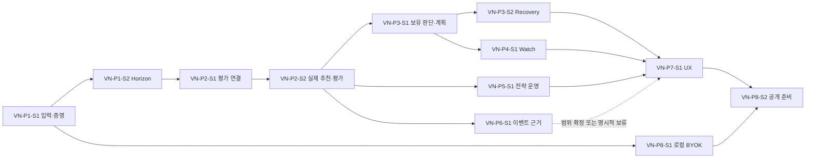

# StockScope Development Roadmap vNext

작성일: 2026-09-27 (Asia/Seoul) · 설계 버전: `vNext-2026-09-27`

> 과거 입력 문서(Current State / Recovery Context / Astra handoff)는 현재 checkout의 active 문서가 아니다. 필요한 설계 이유는 `history/StockScope_R4_R5_R5R_설계변경이력.md`와 Git history에서 확인한다.

## 현재 실행 순서 — 2026-10-06

이 절이 과거 문서의 오래된 NEXT 표현보다 우선한다.

1. **Docs cleanup** — 본 정리 작업으로 완료.
2. **JEV-SHADOW-IMPLEMENT** — provider adapter, `JEV_API_KEY` loader, quant allowlist projector, strict output validator, async shadow persistence, baseline fallback, comparison join/report, fake-provider tests.
3. **JEV-REVIEWER-EVALUATION** — 사전 고정 protocol 아래 reviewer의 incremental value 평가. Shadow Implementation 완료 전 실행하지 않는다.
4. **NEXT-6E-R5R-EVALUATION** — frozen R5R evaluator/Policy/DEV binding의 actual observed-path 평가. AI JEV와 별도 작업이다.
5. 채택/제품화는 각 평가 결과와 프로젝트 소유자 승인 뒤에만 진행한다.

조건부 backlog:
- Capital-aware recommendation은 아직 미승인 설계 후보이며 구현 완료로 간주하지 않는다.
- JEV Holdings/Recovery/Watch/Event 확장은 Phase 1 Scanner reviewer에서 가치가 입증된 뒤 별도 검토한다.
- Macro/Event의 AI input 사용은 source capability 및 R5R/사용권 경계를 우회하지 않는다.

## 1. 범위와 단계 의미

이 Roadmap은 과거 Astra handoff, 고정된 과거 Current State, 과거 Recovery Context에 근거해 **이번 설계에서 새로 만든 8 Phase·12 Stage**다. `VN-P1-S1` 등의 ID는 과거 작업 번호의 복원·후속 번호·별칭이 아니다. `REALTIME.5`, `HOLD.1-H`, `H.0~H.3`, `DEV.*`와 대응시키지 않는다.

[Master Architecture](StockScope_MASTER_ARCHITECTURE_vNext.md)의 책임·데이터 소유권과 [Implementation Baseline](StockScope_IMPLEMENTATION_BASELINE_vNext.md)의 보존·검증 규칙을 따른다. 아래는 미래 개발 계획이다. 이번 작업에서 어떤 Stage도 구현·테스트·Migration·운영 검증을 완료하지 않았다.

각 Stage는 작업 명세로 구체화할 수 있는 개발 묶음이다. 기능 구현 완료, 성능 유효성 입증, 운영 활성화, 공개 배포를 별도 상태로 기록한다. 정책·자료·권한이 부족하면 도구만 완료할 수 있고 차단된 기능을 완료로 보고하지 않는다. 현재 제한된 COMPLETE 기능은 재구현 대상으로 재분류하지 않는다.

## 2. 의존성과 실행 순서

| Phase | 이름 / Stage | 주요 선행 | 실제로 확보하는 것 |
| --- | --- | --- | --- |
| VN-P1 | 입력 재현성과 Horizon 계약 / S1·S2 | 기존 사실 기준 | 같은 입력·정책인지 판단할 근거, 미래 문맥의 호환 계약 |
| VN-P2 | 기존 검증 연결과 Feedback / S1·S2 | P1 | 비교 가능한 평가와 사후 선택 전 실제 추천 표본 |
| VN-P3 | Holdings 판단·계획·Recovery / S1·S2 | P1·P2 | 기존 원장 위의 검증 가능한 관리 제안 |
| VN-P4 | 제한된 Realtime Watch / S1 | P3-S1 | 적용 계획 기준 관찰·confirmation·영속 알림 |
| VN-P5 | Strategy Pool의 승인 기반 운영 / S1 | P2-S2 | 평가 근거를 운영 변경에 연결하는 통제된 절차 |
| VN-P6 | 권한 있는 이벤트 근거와 News 가치 검증 / S1 | P2-S2; 통합 대상 단계 | 허용된 관련성·시점 근거와 도입/보류 판단 |
| VN-P7 | Adaptive UX 통합과 Visual Redesign / S1 | P3·P4·P5의 핵심 동선 | 기능 구조에 맞춘 일관된 사용자 경험 |
| VN-P8 | BYOK 연결과 공개 배포 준비 / S1·S2 | S1은 P1-S1, S2는 P7·P8-S1 | 로컬 연결 경험, 조건부 공개 격리·운영 검증 |

기본 우선순위는 P1 → P2 → P3 → P4 → P5 → P6 → P7 → P8이다. 이는 작업 인력이 제한된 경우의 착수 우선순위이며 모든 Phase가 일렬로 서로 의존한다는 뜻은 아니다. P2의 표본 축적은 이후 단계 동안 계속되고, P5는 P3/P4 완료를 기다릴 필요가 없다. P8-S1은 연결 문제로 검증이 막힐 경우 P1-S1 뒤 앞당길 수 있다. P6의 보류는 P7을 막지 않지만 미지원 기능을 UX에서 명시해야 한다.

P6 결과를 Holdings/Watch에 넣는 구현은 각각 P3-S1/P4-S1의 계약을, 전략 점수에 넣는 구현은 P5의 승인 절차를 추가 선행 조건으로 가진다. 공개 P8-S2는 P6의 기능 구현 전체가 아니라 실제 노출할 데이터의 권한 판정과 배포 범위 확정을 요구한다.

우선순위의 근거는 중복 최소화 → 입력·검증 기반 → 공통 의존성 → 사용자 가치·성능 효과 → 판단 오류 위험 → 재현/테스트 가능성 → 복잡도·확장성이다. 정량 임계값이 없는 자동화나 허용 corpus가 없는 뉴스 예측을 먼저 구현하지 않는다. 기능별 최소 UX는 모든 Stage에 포함하며 P7까지 사용성을 미루지 않는다.

## 3. VN-P1 — 입력 재현성과 Horizon 계약

### VN-P1-S1 — 기존 입력 식별의 연결과 증명 lifecycle

| 항목 | 개발 명세의 기준 |
| --- | --- |
| 목적 | 기존 hash·리비전·정책 식별자를 경로별로 설명하고 저장 판단의 현재 사용 가능성을 증명할 기반 마련 |
| 왜 지금 필요한가 | 비교·승격·계획 변경이 입력 불일치 위에서 이루어지면 이후 성능 결과를 해석할 수 없음 |
| 현재 기능 / 재사용 | `holdings/analysis.py`, `analysis_history.py`, `market_store.py`의 hash, `validation_catalog.py`·`execution_catalog.py`, Data Contract reader/builder, Scanner production baseline, DATA.1 |
| 새 구현 범위 | 경로별 입력 manifest·내용/정책 version, 검증 증명·무효화, 보존 가능한 재생 artifact, 호환 읽기와 변경 세대. 자동 전략/계획 변경은 제외 |
| 선행 조건 | 고정 HEAD와 구현 시작 HEAD 차이 확인, 실제 데이터 보존 요구·경로별 입력 영향 범위 조사, Baseline의 회귀 fixture 확보 |
| 후속 단계 | P1-S2, P2-S1, P8-S1. 다른 단계는 이 식별 계약을 재사용 |
| Backend | 분석·검증 생산자와 명시적 로컬 검증 작업에서 증명 생성; 모든 관련 데이터/정책 쓰기 경로의 세대 변경·동시성 검출; reader는 저장 상태만 비교 |
| Frontend | 기존 상태/복구 UI에 당시 결과 표시와 현재 사용 가능의 차이, 미증명 이유·명시적 검증 동작 추가 |
| DB / 저장 구조 | Market 변경 metadata, Holdings/Simulation의 부가 manifest·증명 테이블 및 artifact 참조. 기존 완료 snapshot·Tracking 스키마는 불변. extensible backup manifest 계약과 현재 존재하는 네 도메인 DB·입력 근거 및 P1에서 생성하는 증명/artifact의 포함·제외·복원 관계 확정. 미래 P4 Watch·P5 Strategy 운영 상태의 구현은 제외 |
| 외부 데이터 | 신규 provider 불필요. 허용된 로컬/합성 자료로 우선 검증. artifact 보존 권한 미확인 자료는 저장·재현 가능 주장 차단 |
| 기존 보존 경계 | Data Contract read-only, EOD/quote 분리, 기존 hash 의미 보존, 분석 경로 차이, Frozen Tracking, 기본 정책/점수 불변 |
| 테스트 | 같은 입력 반복 hash, 관련/무관 입력 변경, 정책 변경, 증명 직후 데이터 정정·동시 갱신, 누락 DB, SQL 쓰기·네트워크 금지. backup/restore는 extensible manifest와 현재 DB·P1 입력 근거의 참조 일관성 검증으로 한정 |
| Validation | 같은 고정 입력의 구·신 기본 분석 결과 비교; 경로별 사용 행/기간과 fingerprint 영향 범위를 대조. 재현 불가 자료의 제외 사유 검증 |
| UAT | 저장 결과가 보이지만 미증명인 경우를 이해할 수 있음; 명시 검증 후 상태 전환, 데이터 정정 후 무효화, 실패 시 기존 결과·계획 보존 |
| 완료 조건 | 지원 경로마다 manifest 생성/검증/무효화 계약과 fixture가 있고 reader 무부작용·기존 결과 동등성 통과. 미지원 경로는 UNVERIFIED로 명확히 남음. 현재 DB·P1 입력 근거의 복원 검사와 후속 Stage가 manifest를 확장할 계약 확정; 아직 없는 Watch/Strategy 운영 상태의 복원 구현은 요구하지 않음 |
| 위험 / 미결정 | 경로별 hash 범위 누락, 전체 데이터 hash 비용, cross-DB 경쟁, 원본 보존 권한·저장량. 단일 공통 hash만으로 해결했다고 처리하지 않음 |

### VN-P1-S2 — Horizon와 판단 문맥의 호환 계약

| 항목 | 개발 명세의 기준 |
| --- | --- |
| 목적 | 추천·분석·계획·검증이 같은 투자 의도와 정책 version을 참조하게 함 |
| 왜 지금 필요한가 | 평가와 관리 기능을 먼저 만든 뒤 기간 의미를 끼워 넣으면 과거 결과의 뜻이 바뀜 |
| 현재 기능 / 재사용 | Backtest 보유기간, Tracking 5/10/20일 관찰, Holdings 계획 version·confirmation_policy, P1-S1 입력 계약 |
| 새 구현 범위 | Horizon 정책 참조, 전략별 지원 여부·필요 입력·Time Stop/Review Cycle 문맥, `LEGACY_UNSPECIFIED` 호환 의미. 새 수익 전략이나 기간별 점수식 자체는 제외 |
| 선행 조건 | P1-S1; 기간 경계·예외·지원 조합 결정표 작성. 숫자 미정이면 해당 정책 활성화 차단 |
| 후속 단계 | P2의 cohort/실행 정책, P3의 계획·보유 판단, P5의 전략 적합성 |
| Backend | 판단 생성 때 정책 version 고정·전달·검증; 미지원 조합 거부와 사유; 기존 기본 경로의 호환 처리 |
| Frontend | 신규 판단의 의도 선택·미지원 설명, 기존 미지정 표시. 라벨 선택만으로 계획/과거 결과가 바뀌지 않음 |
| DB / 저장 구조 | P1 manifest와 새 계획/실행의 부가 문맥. 과거 행은 nullable/미지정 읽기, 과거 Tracking·완료 run의 추정 backfill 금지 |
| 외부 데이터 | 지원하려는 기간의 EOD·기업 정보 범위 확인. 중장기 정책은 관련 데이터와 시점 증명이 없으면 미지원 |
| 기존 보존 경계 | 20일 실행을 단기로 재해석하지 않음, 기간 관찰과 투자 의도 구분, 기존 계획 자동 변경 금지 |
| 테스트 | 구형 데이터 읽기, Horizon 미지정·명시 선택·미지원, version 변경, 같은 종목의 다른 계획 의도, 날짜/거래일 계산 계약 |
| Validation | 호환 기본 정책의 기존 결과 동등성; 새 기간 정책은 별도 cohort로 평가 가능함을 확인. 지원 라벨만으로 성능 검증 완료 주장 금지 |
| UAT | 기존 자료를 열어도 의도 선택을 강제하지 않음; 새 의도·지원 상태·재검토 주기 의미를 설명할 수 있음 |
| 완료 조건 | 문맥 전달·호환·지원 차단이 모든 목표 경로에서 일관됨. 계약 구현과 숫자 정책 승인 상태를 따로 기록하며 미정 정책은 출시하지 않음 |
| 위험 / 미결정 | Q5 기간 경계·예외, 장기 자료 부족, 기업 이벤트의 당시 사용 가능 시각. 사용자 선택만으로 입력 충분성을 확정하지 않음 |

## 4. VN-P2 — 기존 검증 연결과 Feedback

### VN-P2-S1 — 평가 근거 어댑터와 비교 cohort

| 항목 | 개발 명세의 기준 |
| --- | --- |
| 목적 | 기존 Tracking·Replay·Execution·Backtest를 재사용해 근거를 연결하고 비교 가능/불가능을 설명 |
| 왜 지금 필요한가 | 데이터가 이미 있으므로 새 검증 엔진보다 출처·정책·평가 목적의 연결이 먼저 필요 |
| 현재 기능 / 재사용 | `tracking/store.py`, `validation_catalog.py`, `execution_catalog.py`, `validation_outcome.py`, Backtest 결과·정책, `SimulationWorkspace.tsx` |
| 새 구현 범위 | 외부 읽기 adapter, cohort·보고서 version, 출처/입력/정책 호환 검사, 표본·누락·CENSORED 표시, 원본 삭제 후 연결 처리 |
| 선행 조건 | P1-S1·S2의 호환 계약. 기존 저장 fixture와 후보·실행·관찰의 metric 정의 확보 |
| 후속 단계 | P2-S2 실제 표본·비교 정책; P3·P5의 근거 소비 |
| Backend | 기존 계산 결과를 읽어 타입별 평가 view 제공. 관찰과 체결·표본 source·계산 기준을 유지하고 중복 ID와 삭제/변경을 검출 |
| Frontend | 기존 Tracking/Validation workspace에 별도 Feedback/Validation view와 근거 이동·cohort 비교·제외 이유·미성숙 수 화면 추가 허용. Tracking의 기존 DB schema·service semantics·등록/병합/종료/삭제/행 액션·성과 의미는 변경하지 않으며 별도 view 추가를 Tracking 기능 변경으로 해석하지 않음 |
| DB / 저장 구조 | Simulation DB에 별도 평가 참조·cohort·보고서 테이블. Tracking DB에는 쓰지 않음. 재시도 idempotency·원본 삭제 시 파생 무효화·backup 포함 |
| 외부 데이터 | 기존 로컬 Market Store와 저장 결과만 사용. 누락 데이터를 reader가 네트워크로 보충하지 않음 |
| 기존 보존 경계 | TRACK.1 CLOSED/FROZEN: DB schema·service semantics·등록/병합/종료/삭제/행 액션·성과 의미 불변. 별도 Feedback/Validation view 허용과 구분. Manual-only 제외, D+1, CLOSED 동결, 완료 VAL.1/VAL.2 불변, Legacy 구분 |
| 테스트 | 같은 기준 병합·다른 기준 분리, Manual/Scanner 중복·출처, 미성숙/null, 원본 삭제, ACTIVE 관찰 revision, 서로 다른 정책 합산 거부. 별도 Feedback view 추가 후 기존 Tracking 행 액션·service semantics·성과 의미 회귀 검사 |
| Validation | 기존 결과와 adapter의 수·수익·MFE/MAE 정의를 대조. 전체·실행·제외·미성숙 분모를 재계산해 누락/중복 확인 |
| UAT | 같은 후보의 관찰과 실행 결과가 다를 때 이유를 확인하고 원본으로 이동. Manual-only가 Scanner 근거에서 제외됨을 확인 |
| 완료 조건 | 지원 원본 모두 원본 ID/hash/시각·계산 정의로 추적 가능, 기존 결과 무변경, 비교 부적합과 부족 표본이 숨겨지지 않음 |
| 위험 / 미결정 | 과거 snapshot의 필드 누락, ACTIVE 변동, 원본 삭제/보존 정책. 없는 당시 전략·Horizon은 추정하지 않음 |

### VN-P2-S2 — 실제 추천 보존과 시간 분리 평가

| 항목 | 개발 명세의 기준 |
| --- | --- |
| 목적 | 사후 선택 편향을 줄인 운영 추천 표본을 축적하고 후보·진입·청산·전략 선택 성능을 분리 평가 |
| 왜 지금 필요한가 | P3/P5의 판단·운영 변경 근거가 필요하고 실제 관찰기간은 소급 생성할 수 없음 |
| 현재 기능 / 재사용 | 완료 Scanner 실행·기존 후보 snapshot, Replay/Execution·Backtest 계산, P2-S1 cohort, 종료정책 연구와 Validation 도구 |
| 새 구현 범위 | 완료 실행 단위의 prospective 캡처·분모/선별 범위, idempotent 수집과 실패 상태, 사전 평가 프로토콜, 별도 비용/기간/정책 비교 run, 성숙도 보고 |
| 선행 조건 | P2-S1; 수집 범위·실행 중복 기준·원본 보존·평가 목적 합의. 새 비용/기간 값은 실행 전 명세로 고정 |
| 후속 단계 | P3-S1, P5-S1, P6-S1. 표본 축적은 이후 Phase와 함께 지속 |
| Backend | 기존 완료 결과를 캡처하고 source commit 후 재시도 가능한 연결 수행. 자동 조회 자체가 분석을 시작하지 않음. 기존 실행 simulator 재사용, 새 가정은 version별 run으로 분리 |
| Frontend | 수집 여부·부분 실패·미성숙·평가 기간/가정·대조군/제외 사유. 사용자 Tracking 등록과 별개임을 설명 |
| DB / 저장 구조 | Simulation DB에 추천 실행/표본·프로토콜·평가 보고서 추가. 영속 job 상태와 완료 결과, 안전한 checkpoint/재실행 구분. 기존 run의 20일·0% 결과 수정 금지 |
| 외부 데이터 | 명시적으로 준비된 로컬 EOD. 과거 universe·상장폐지·시점 정보 부족을 범위로 기록; 추가 provider를 전제하지 않음 |
| 기존 보존 경계 | 기준 D 이후 결과를 D 판단에 주입 금지, 관찰/체결 분리, Manual-only 분리, 연구 결과 운영 자동 반영 금지 |
| 테스트 | 같은 실행 중복 캡처, 부분 실패·재시작·취소, 미래 행 주입 방어, 정책 고정, CENSORED와 실현 성과 분리, 비용/기간별 재현 |
| Validation | 시간 분리 holdout와 겹치는 보유기간 누수 방지, 동일 cohort의 기존 기준 대비 비교, 비용/슬리피지 민감도, 표본 편중·낙폭·불확실성 보고. 결과를 본 뒤 평가 조건 변경 시 새 프로토콜 |
| UAT | Scanner 실행→추천 보존→아직 결과 없음→충분한 관찰 후 성과의 흐름을 fixture로 재현; 앱을 사용하지 않은 기간을 전체 시장 추천 성과로 표시하지 않음 |
| 완료 조건 | 캡처/복구/평가 도구가 재현되고 프로토콜과 분모가 추적됨. 실제 장기 표본 부족은 그대로 표시. 이 완료가 전략 승격·성능 우수 판정을 의미하지 않음 |
| 위험 / 미결정 | 수집 시점 편향·top 후보 선택, 과거 시장 universe, 비용 가정 현실성, Q7 최소 표본/구간, Q8 자동화 증거 |

## 5. VN-P3 — Holdings 판단·계획·Recovery

### VN-P3-S1 — 기존 관리계획 위의 보유 판단 지원

| 항목 | 개발 명세의 기준 |
| --- | --- |
| 목적 | 기존 보유 상태에서 유지·추가·축소·익절·손절·종료 선택지를 근거와 함께 검토하고 계획에 명시적으로 반영 |
| 왜 지금 필요한가 | 실제 사용자가 이미 가진 원장·계획을 활용해 제품 가치를 제공하며 Watch가 사용할 적용 계획 계약도 안정화 |
| 현재 기능 / 재사용 | Holdings lifecycle·performance·analysis_history·management·live_management, Risk 계산, `HoldingsWorkspace.tsx`, P1/P2 근거 |
| 새 구현 범위 | 판단 제안/유보, 논리·Horizon·Review Cycle·Time Stop·부분 조정 문맥, 검증된 정책별 계획 확장. 신규 포지션 DB나 주문 실행은 제외 |
| 선행 조건 | P2-S2 도구 완료와 P1 계약; 지원할 판단 규칙·관측 노출 범위·정책별 validation fixture 고정 |
| 후속 단계 | P3-S2, P4-S1, P7. P6 이벤트 근거는 나중에 선택적으로 연결 |
| Backend | 원장/적용 계획/현재 입력을 읽는 판단 service 확장. 제안 생성과 계획 적용 command 분리, 적용 시 입력·계획 version 재검사 |
| Frontend | 보유 현재 상태→선택지→근거→계획 비교/명시적 적용. 자료 부족·상충·새 분석 대기 중 이전 적용 계획 표시 |
| DB / 저장 구조 | Holdings의 새 판단 기록과 기존 계획의 version별 부가 필드/참조. 원장·수량·평균가 테이블 의미 유지; 과거 plan 불변 |
| 외부 데이터 | 현재 로컬 EOD와 사용 가능한 기존 기업/공시 자료. 회사 논리나 전체 계좌 위험의 필수 입력이 없으면 미확인 |
| 기존 보존 경계 | 새 분석 자동 계획 교체 금지, 손절 완화 차단, KIS 잔고→체결 추정 금지, BROKER 실현손익 제한, 공식 판단/EOD/quote 분리 |
| 테스트 | 버전 충돌·중복 적용, 미래/미증명 리비전, 신규 분석 vs 적용 계획, 부분 매도·전량 정리·정정, 손절 완화 우회 차단, quote 변화로 원장/계획 불변 |
| Validation | 같은 입력에서 기존 기본 판단 회귀, 추가 정책의 사전 규칙·기간별 replay, 신규 후보 판단과 보유 판단의 오사용 사례, 손실/집중도 시나리오 |
| UAT | 새 제안을 보고도 적용 전 기존 계획 유지; 적용 후 이전 version/이유 조회; 자료 부족에서 ADD 허용 신호가 나오지 않음 |
| 완료 조건 | 지원 행동/정책 목록·미지원 조건 명확, 모든 적용이 version/근거로 추적, 기존 원장/손익/계획 테스트와 사용자 동선 통과 |
| 위험 / 미결정 | Horizon 정책 미정, 노출/현금 범위 부족, 행동 우선순위 상충. 수치가 미정인 행동은 유보하며 임의 확률·한도 생성 금지 |

### VN-P3-S2 — 큰 손실 포지션의 Recovery 검토 문맥

| 항목 | 개발 명세의 기준 |
| --- | --- |
| 목적 | 같은 Holdings 포지션에서 투자 논리·추가 손실·집중 위험과 선택 이유를 재검토 |
| 왜 지금 필요한가 | 일반 관리와 같은 원장·계획 책임을 사용해야 별도 손실 장부나 무조건 물타기 흐름을 피할 수 있음 |
| 현재 기능 / 재사용 | P3-S1 판단/계획, Holdings 손익·이력·계좌 관측, 기존 Risk·공시 근거 |
| 새 구현 범위 | 수동 시작/종료하는 검토 문맥, 논리/위험/정보 부족 기록, 계획 제안 연결. 자동 진입 임계값·자동 추가매수는 기본 범위 제외 |
| 선행 조건 | P3-S1; 수동 검토의 표현·증거 범위 확정. 자동 조건을 추가하려면 별도 검증된 정책 필요 |
| 후속 단계 | P7의 보유 UX. P4 가격 감시는 기존 적용 계획을 사용하므로 이 Stage가 필수 선행은 아님 |
| Backend | 동일 position ID에 검토 기록·선택 근거 연결, 종료 이유 보존. 검토 시작/해제가 lifecycle나 거래를 만들지 않음 |
| Frontend | 추가 손실 위험·논리 유지/훼손·정보 부족을 보여주고 전량/일부 축소·유지·조건부 추가 검토를 구분 |
| DB / 저장 구조 | Holdings의 별도 검토 기록과 plan version 참조. 새 잔고/원장 생성·과거 손실 재분류 없음 |
| 외부 데이터 | 기존 가격/재무/공시 중 시점과 출처가 확인된 자료. 뉴스 권한 미확보를 채우기 위한 무단 변환 없음 |
| 기존 보존 경계 | 본전 회복 최적화·자동 물타기 금지, 기존 stop 완화 차단, 원장/분석/계획 분리, 명시적 계획 적용 |
| 테스트 | 검토 생성/종료 멱등성, 가격 회복만으로 자동 해제되지 않음, 포지션 종료 후 기록 보존, 누락 노출/회사 근거 처리 |
| Validation | 구조적 악화·시장 동반 하락·회사 정보 부족·비중 과대 fixture에서 판단 근거와 유보 확인. 성능 우수·회복 보장 표현 검사 |
| UAT | 손실 포지션 검토→선택 이유 기록→계획 변경 제안→명시 적용; 검토를 닫아도 매도 기록이 생성되지 않음 |
| 완료 조건 | 수동 검토 기능과 기록·계획 연결 완결. 자동 Recovery 조건은 미결정으로 남기고 완료 범위에 포함하지 않음 |
| 위험 / 미결정 | Q10 자동 진입/해제와 행동 수치, 불완전 계좌 정보, hindsight bias. 후속 정책은 별도 Stage 명세/설계 변경으로 승인 |

## 6. VN-P4 — 제한된 Realtime Watch

### VN-P4-S1 — 계획 기반 감시와 영속 알림 lifecycle

| 항목 | 개발 명세의 기준 |
| --- | --- |
| 목적 | 현재 시세 전달 위에서 지정 종목의 관찰·confirmation·의미 있는 앱 내 알림을 제공 |
| 왜 지금 필요한가 | 적용 계획 version이 안정된 뒤에야 가격선의 의미와 알림 무효화 기준을 고정할 수 있음 |
| 현재 기능 / 재사용 | KIS REST/WS, Quote Store·manager·세션, SSE/EventSource·fallback, Holdings live 평가/거리, P3-S1 적용 계획 |
| 새 구현 범위 | 서버 watch 수요 lease, 제한된 등록 범위, coverage/gap 상태, 정책별 확인·재무장, durable episode·알림 outbox·재접속 복원 |
| 선행 조건 | P3-S1; 단일 활성 backend 운영, 정책별 관측/확인/재무장 수치와 허용 sampling을 명세로 고정; 실제 장중 검증 환경 확보는 운영 활성화 gate |
| 후속 단계 | P7, P8 공개 범위 검증. P6 이벤트는 별도 검증 후 추가 |
| Backend | 채택된 quote를 서버에서 평가, 화면/감시 수요 분리·중복 제거, overload/stale/gap 처리, transaction 내 상태/발행 대기 저장·ID 기반 재시도 |
| Frontend | 감시 중/미감시/공백/확인 대기·확인됨을 구분; 앱 내 알림 목록·읽음·원래 계획 연결; quote와 알림 복원 계약 구분 |
| DB / 저장 구조 | Holdings DB의 watch 설정·규칙/plan version·episode·알림 outbox. P4가 이 새 영속 상태의 backup/restore 항목과 integrity·참조 검증을 P1의 extensible manifest에 추가. quote 전체 tick 영속 저장은 기본 범위 아님 |
| 외부 데이터 | 기존 KIS·시장 세션. 분봉/전 tick이 없는 상태에서 그런 confirmation을 지원한다고 주장하지 않음 |
| 기존 보존 경계 | quote가 EOD·원장·계획 변경 금지, 선택 화면 전달 유지, 구독/TTL 제한, 서버 중단 구간 소급 추정 금지 |
| 테스트 | 가짜 시계로 선 근처 왕복·중복·역순·지연·결측·queue 과부하·UNKNOWN 세션; 재시작·재접속·계획 변경·포지션 종료·credential 교체; 동일 알림 ID 재전송. P4 추가 상태의 backup/restore·integrity·계획 참조·복원 후 gap/중복 처리 검증 |
| Validation | 기록된 관측 fixture의 예상 episode와 대조하고 sampling/gap별 오탐·미탐을 보고. 전 tick 완전성 검증으로 확대하지 않음 |
| UAT | 지정 종목 관찰→확인→알림→조건 해소; 서버 재시작 후 알림 중복 제거·공백 표시; 브라우저 종료 중 서버 감시와 서버 종료 중 비감시 구분 |
| 완료 조건 | lifecycle·복구·coverage·기존 전달 회귀와 P4 자체 manifest 확장·backup/restore·integrity 검증 통과. 실제 장중 세션/연결 smoke 증거가 없으면 기능 테스트 완료와 운영 미검증을 별도로 보고 |
| 위험 / 미결정 | 공급자 제한·장중 연결 증거, sampling 정확도, 정책별 confirmation 수치, 단일 프로세스 운영. 다중 worker/상시 감시는 별도 운영 설계 전 미지원 |

## 7. VN-P5 — Strategy Pool의 승인 기반 운영

### VN-P5-S1 — 전략 version·변경 제안·검증·승인·활성화

| 항목 | 개발 명세의 기준 |
| --- | --- |
| 목적 | 측정 결과를 근거 있는 운영 전략 변경으로 연결하되 기존 정상 정책을 보존 |
| 왜 지금 필요한가 | P2의 비교 가능한 평가와 prospective 기록 없이는 승격/강등이 사후 해석에 의존함 |
| 현재 기능 / 재사용 | 10전략·Risk gate, 국면 입력, Backtest 비교, production baseline·exit policy mapping의 version·근거 서명·명시적 활성화·원자적 파일 교체·fallback 패턴과 운영 설정 저장 구조, P2 cohort/보고서 |
| 새 구현 범위 | 후보/운영/보류 registry, 변경 제안·승인 근거, 별도 선택 정책 version, 효력 시점·실행 고정·rollback. 무승인 자동 Rotation 제외 |
| 선행 조건 | P2-S2 도구, P1 identity/Horizon. 수치 기반 승격 제안 활성화 전 Q7 평가 프로토콜과 최소 표본을 사전 고정 |
| 후속 단계 | P7 운영 UI, 향후 조건부 shadow/자동화 연구. P3/P4는 하드 선행 아님 |
| Backend | 초기 10전략 기본 version 유지. Simulation은 평가/제안/승인 artifact/version/hash 제공; Scanner/Strategy 운영 설정 owner가 이를 검증해 게시하고 Production active/rollback reference를 명시적으로 관리. 실행은 게시된 정책 version을 고정하며 Simulation 최신 행을 활성 정책으로 직접 사용하지 않음. 실패 시 운영 설정 측 이전 정상 reference로 복원 |
| Frontend | 근거·기존 대비 차이·표본 부족·국면/Horizon 영향·승인 이력·현재 활성 정책·되돌림 표시 |
| DB / 저장 구조 | Simulation DB는 registry·평가/제안/승인 artifact/version/hash를 소유. Production selection policy snapshot/version·active/rollback reference는 Scanner/Strategy 운영 설정이 소유하고 승인 근거를 참조. 기존 baseline/운영 정책 저장 구조 우선 재사용, 새 DB 불필요. selection과 exit policy 파일/token 의미는 분리. P5가 양측 자료·참조의 backup/restore/integrity를 manifest에 추가; 과거 run·Holdings plan 수정 없음 |
| 외부 데이터 | P2의 허용된 평가 자료. 새 자동 전략 발굴이나 외부 AI 모델을 전제하지 않음 |
| 기존 보존 경계 | Risk gate 우선, 점수≠수익확률, research≠production, 기존 baseline 의미 유지, 승인 변경은 미래 신규 판단부터 |
| 테스트 | 미승인/미검증 활성화 차단, stale 승인·동시 활성화 충돌, 실행 중 version 고정, 실패 rollback, 과거 포지션 plan 불변, 기본 10전략 동등성. Simulation 재실행/최신 행 변경이 Production reference를 자동 변경하지 않음, 승인 artifact hash 불일치 차단, P5 자체 backup/restore/integrity와 active/rollback·승인 근거 참조 검증 |
| Validation | 장기/최근·국면·Horizon별 대조군 비교, 독립 holdout·비용/낙폭·표본 상관/편중, 운영 전 shadow. 임계값 미정이면 승격 가능 상태 금지 |
| UAT | 후보 등록→근거 조회→제안→검증→승인→명시 활성화→다음 판단 적용→되돌림. 이전 포지션은 계획 유지 |
| 완료 조건 | registry·승인과 Production activation/rollback의 owner 분리, 기존 운영 설정 재사용, P5 자체 manifest 확장·backup/restore/integrity 및 회귀 증거 완결. 데이터 부족 시 도구 완료·실제 승격 보류. 자동화는 완료 범위가 아님 |
| 위험 / 미결정 | Q7 임계값/표본, Q8 자동화 충분성, 다중 검정·국면 변화, 평가 구간 반복 사용. 숫자 임의 설정으로 gate 통과 금지 |

## 8. VN-P6 — 이벤트 근거와 News 가치 검증

### VN-P6-S1 — 자료 권한·시점 검증과 단계적 제품 연결

| 항목 | 개발 명세의 기준 |
| --- | --- |
| 목적 | 최근 기사 표시·공시 분석을 유지하며 실제 가치가 있는 이벤트 근거 범위를 확인 |
| 왜 지금 필요한가 | P2 평가 체계가 있어야 뉴스 없이도 가능한 성능과 추가 효과를 구분할 수 있음 |
| 현재 기능 / 재사용 | NEWS.1 provider/API/UI·source policy·오류 격리, OpenDART event/fundamental·Strategy 위험 연계, P2 평가 |
| 새 구현 범위 | 먼저 source별 사용/보존/변환/AI 권한·시점 corpus·품질 판정. 통과 범위만 관련성/중복·출처 view와 참고 근거 연결. 예측 전면 구현은 약속하지 않음 |
| 선행 조건 | P2-S2. Holdings/Watch 통합은 P3-S1/P4-S1, 전략 반영은 P5-S1 추가 필요. 허용 자료 없으면 분석 구현 분기 보류 |
| 후속 단계 | P7에 지원/보류 범위 전달, P8에 배포 데이터 권한 조건 전달. 예측은 추가 효과 입증 후 별도 범위 명세 |
| Backend | source별 policy check와 이벤트 시각/정정/관련성 경로. NAVER 현재 비허용 정책을 임의 해제하지 않음. 허용 근거만 판단에 참조 |
| Frontend | NEWS.1과 공시 근거를 구분, 관련성·출처·시각·불확실성 표시. 참고 근거와 검증된 점수/예측의 표현 분리 |
| DB / 저장 구조 | 허용된 자료만 평가 artifact/참조로 보존. 금지·기간 제한 자료는 원문 누적 금지, 삭제·보존 만료가 파생 근거에 전파. 원장/계획 자동 쓰기 없음 |
| 외부 데이터 | source별 권한 증거, 과거 발표/수집/정정 시각, 평가 라벨. 이번 설계는 그 확보를 완료로 선언하지 않음 |
| 기존 보존 경계 | NEWS.1 독립 표시, DART 별도 규칙, 시간 분리, source별 캐시/AI 정책, 뉴스 오류가 핵심 분석을 깨지 않음 |
| 테스트 | 권한/보존 기간 차단, 중복/정정·늦은 수집·관련 없는 회사, source 실패, 과거 시점 누수, 원문/키 비노출 |
| Validation | 먼저 관련성·근거 품질 평가, 다음 시간 분리된 event/no-event 대조와 증분 효과. 예측은 별도 라벨·오차/확률 보정 근거 없으면 비활성 |
| UAT | 사용자가 뉴스/공시의 출처·시각·참고 의미를 구별; 근거 실패에도 기존 보유/분석 이용; 미지원 예측을 완료 기능으로 보지 않음 |
| 완료 조건 | 권한·품질·제품 가치 판정 및 지원/보류 결정 기록. 구현 분기는 허용·검증된 범위의 테스트/UAT 통과 시만 완료. 보류 시 '범위 판정 완료 / 분석 기능 미구현'으로 보고 |
| 위험 / 미결정 | Q9 권한·corpus·예측 가치, 발표/수집 시점 불일치, 선택 편향, 비싼 모델의 불필요한 도입 |

## 9. VN-P7 — Adaptive UX와 Visual Redesign

### VN-P7-S1 — 검증된 제품 동선의 통합과 시각 체계

| 항목 | 개발 명세의 기준 |
| --- | --- |
| 목적 | 안정된 판단·계획·감시·검증 흐름을 일관된 정보 구조와 시각 체계로 제공 |
| 왜 지금 필요한가 | 책임/상태가 확정되기 전 전체 UI를 갈아엎으면 기능 변경마다 다시 설계해야 함 |
| 현재 기능 / 재사용 | 기존 React 화면·테마·차트·세션·비동기 응답 보호·관심/보유 관점·Data Contract·단계별 최소 UX |
| 새 구현 범위 | 결론→선택지→이유→근거, Responsive/Context/Data/Priority Adaptive, 핵심 동선과 디자인 시스템 정리 |
| 선행 조건 | P3-S1·S2, P4-S1, P5-S1의 기능/상태 계약과 fixture UAT. P6는 구현 또는 명시적 보류 범위 확정이면 됨 |
| 후속 단계 | P8-S2 공개 제품 UAT. P8-S1 연결 센터는 같은 규칙을 적용 |
| Backend | 필요한 읽기 view/오류 의미 보완만. UI 편의를 위해 도메인 owner나 계산·원장 책임을 옮기지 않음 |
| Frontend | 후보→분석→보유 계획→감시→근거 검증의 연결, 접근성·화면 폭·로딩/오류/유보. Editorial + Product UI, typography 중심, low-glare dark, restrained light, 데이터 중심 시각화를 아래 Visual 검수 기준에 따라 구현 |
| DB / 저장 구조 | 원칙적으로 도메인 Migration 없음. 사용자 UI 설정이 필요하면 도메인 상태와 분리하고 별도 명세 |
| 외부 데이터 | 합성/익명화 fixture로 UX 검증. 운영 계정 데이터나 외부 provider를 기본 테스트 의존성으로 두지 않음 |
| 기존 보존 경계 | TRACK.1 조작 계약, 데이터 부족≠성능 약함, 상태 조회≠실행, 세션/선택 유지, 기존 분석·계획 보존 |
| 테스트 | 실제 브라우저 핵심 동선·키보드/작은 화면·느린/역순 응답·reload·오프라인·복구; 대표 화면의 dark/light·화면 폭별 Visual 리뷰. 기존 정적 계약 검사는 보조 |
| Validation | 같은 판단/근거의 의미가 구·신 화면에서 유지되는지, 사용자가 관찰/체결·제안/적용·미성숙/손실을 구별하는지 검증 |
| UAT | 대표 사용자가 주요 상태와 다음 선택지를 이해하고 상세 근거로 이동 가능; 화면 이동·재접속 후 문맥 보존; 내부 hash/테이블명은 기본 흐름에서 숨김. 아래 Visual 기준을 대표 화면·dark/light·화면 폭별로 대조하고 정보 위계·가독성·금지 패턴 부재를 검수 |
| 완료 조건 | 핵심 동선 기능 계약·브라우저 UAT·Visual 디자인/리뷰/UAT 검수 기준 모두 통과. 지원/미지원/보류 기능 일관 표시, 신규 visual이 계산 의미를 바꾸지 않음. Visual 미충족은 완료로 판정하지 않음 |
| 위험 / 미결정 | 기능 상태 변동, 과도한 정보 압축, 장치별 차이. 자동화·뉴스 예측 미출시를 전면 UX 완료의 필수 조건으로 두지 않음 |

**P7 Visual 디자인·리뷰·UAT 필수 검수 기준:** Editorial + Product UI, typography 중심, low-glare dark, restrained light, 데이터 중심 시각화를 따른다. 반복적인 둥근 카드, 흔한 3분할 통계 카드, 의미 없는 badge, pastel gradient 남발, generic AI-generated SaaS 느낌, 박스 나열형 관리툴 스타일을 피한다. 단순 참고가 아니라 완료 판정 기준이며, 대표 화면별로 글자 크기·굵기·간격에 의한 정보 위계, 두 테마의 눈부심/대비·가독성, 데이터의 비교·판단을 돕는 시각화와 위 패턴의 부재를 리뷰/UAT 기록에 남긴다.

## 10. VN-P8 — BYOK 연결과 공개 배포 준비

### VN-P8-S1 — 로컬 데이터 연결 센터

| 항목 | 개발 명세의 기준 |
| --- | --- |
| 목적 | 기존 provider 설정·상태 확인을 사용자가 이해할 수 있는 발급 안내→입력→명시 테스트→완료 흐름으로 제공 |
| 왜 지금 필요한가 | 연결 실패를 데이터 부족/분석 실패와 구분하고 외부 운영 확인의 반복성을 높임. 필요하면 P1 뒤 앞당길 수 있음 |
| 현재 기능 / 재사용 | 서버 Settings, integrations/data_sources API, KIS/NAVER/KRX/DART provider·토큰/오류 처리, 기존 설정 상태 UI |
| 새 구현 범위 | 로컬 한 사용자에 대한 연결/교체/삭제·만료/오류 상태, 비밀 입력과 저장 adapter, cache/세션 재설정 |
| 선행 조건 | P1-S1. host와 비밀 저장 방식을 먼저 결정하고 보안·복구 수용 기준을 Stage 명세에 고정 |
| 후속 단계 | P8-S2. P4 운영 smoke 준비와도 연결 가능 |
| Backend | 명시적 연결 테스트 command, secret 저장/회전·삭제와 provider 설정 주입. 상태 조회는 발급/외부 호출 없이 관찰값 제공 |
| Frontend | 발급/권한 안내·마스킹 입력·명시 테스트·결과·삭제, 비밀값 재조회/LocalStorage 저장 금지 |
| DB / 저장 구조 | 비밀은 선택한 보호 저장소, 일반 DB는 비밀 없는 연결 ID/상태만. 환경 설정 호환과 새 설정 우선순위를 명시; 일반 backup에 비밀 포함 금지 |
| 외부 데이터 | 사용자 자신의 계정/키·서비스 권한. 도구 테스트는 fake provider, 실제 테스트는 명시적으로 수행 |
| 기존 보존 경계 | 주문 금지, credential 비노출, Data Contract read-only, 현재 데이터/원장 보존 |
| 테스트 | 키 오류·만료·교체·삭제, 로그/응답/브라우저 저장 비노출, cache/WS 자격증명 격리, 실패 시 기존 정상 설정 복구 |
| Validation | 연결 성공이 데이터 완전성·성능 유효성을 뜻하지 않음을 확인; provider별 성공 기준과 실패 사유 검증 |
| UAT | 키 등록→테스트→연결 상태→교체/삭제를 수행하고 실패 이유 확인. 실제 연결 미실시 항목은 미검증 표시 |
| 완료 조건 | 로컬 연결 lifecycle·비밀 보호·기존 provider 회귀 통과. 공개 사용자 격리는 이 단계 완료 범위 아님 |
| 위험 / 미결정 | Q13 host·보호 저장 매체, 비밀 복구 정책, 외부 rate limit/권한. 구체 저장 방식 미결정 상태에서 평문 임시 저장으로 대체 금지 |

### VN-P8-S2 — Demo / 공개 Full Mode의 격리와 배포 준비

| 항목 | 개발 명세의 기준 |
| --- | --- |
| 목적 | 허용된 Demo와 개인 credential 기반 Full의 제품 경계를 운영 가능한 수준으로 검증 |
| 왜 지금 필요한가 | 안정된 로컬 제품과 연결 경험 없이 공개 다중 사용자 구조를 현재 완료 기능으로 취급할 수 없음 |
| 현재 기능 / 재사용 | P7 핵심 화면, P8-S1 연결 adapter, 도메인 서비스·read-only 계약·backup/restore·P4 감시 |
| 새 구현 범위 | 인증/owner 권한·사용자별 상태/정책/캐시/SSE/credential 격리, 사용량/구독 제한, 샘플 Demo 분리, 배포/복구 절차. 실제 공개 배포는 별도 실행 승인 범위 |
| 선행 조건 | P7·P8-S1, 실제 제공 자료의 권한 판정, host·인증·비밀 저장·예상 동시성·DB/프로세스 운영 모델 결정. 현재 글로벌 설정/메모리 상태의 owner 분리 설계 검토 |
| 후속 단계 | 조건을 통과한 범위의 공개 릴리스 준비. 자동 Rotation·뉴스 예측은 이 단계로 자동 승인되지 않음 |
| Backend | 모든 자원 접근의 owner 검증, provider/cache/WS pool 격리, 관리 작업 권한·audit·회전/삭제, 실제 주문 route 부재 유지 |
| Frontend | Demo/Full 구분, 자기 연결·데이터·알림만 표시, 로그아웃/세션 변경 시 민감 문맥 제거 |
| DB / 저장 구조 | 확정한 owner 모델에 따른 명시적 Migration. 로컬 사용자 데이터를 암묵적 첫 사용자에 할당 금지. SQLite 유지/전환·단일/다중 프로세스는 부하/격리 증거로 결정하고 되돌림 검증 |
| 외부 데이터 | 계정별 허용 이용 범위·재배포 조건, 실제 provider·호스팅 환경. BYOK만으로 공유/재배포 권한을 추정하지 않음 |
| 기존 보존 경계 | 원장·계획·증명·Frozen 데이터 의미, credential 및 사용자 데이터 비노출, broker 주문 금지 |
| 테스트 | 서로 다른 두 사용자와 Demo 간 API/DB/cache/SSE/job/backup 교차 접근 차단, ID 추측·세션 교체·삭제/회전, 동시 실행/구독 limit·재시작·restore |
| Validation | 격리와 재현성·운영 성능을 분리 평가. 정의된 부하/가용성 목표에서 지연·공백·provider 실패·복원 검증 |
| UAT | 두 사용자와 Demo가 독립적으로 연결·분석·보유·감시; 재접속/로그아웃 후 타 사용자 흔적 없음; 복구 후 자원 소유권 유지 |
| 완료 조건 | 대상 환경/권한/격리/부하·복구 gate 증거 완결. 충족 전 공개 Full 보류. Demo만 준비됐다면 Full 완료로 보고하지 않음 |
| 위험 / 미결정 | Q13 배포/인증/비밀 구조·운영 비용, provider별 제한, SQLite 동시성, 실제 환경 미확인. 특정 hosting 공급자나 출시 날짜 미확정 |

## 11. 조건부 장기 목표와 질문 처리

자동 Regime Adaptive / Strategy Rotation, 뉴스 예측의 제품 통합, 무제한·상시 감시는 기본 12 Stage의 완료 선언에 포함하지 않는다. 각각 P5의 데이터 충분성·shadow/rollback, P6의 권한·증분 가치, P4/P8의 coverage·운영 구조가 입증된 뒤 새 범위 명세를 작성한다. 단순 대기기간 경과로 구현을 자동 승인하지 않는다.

질문 상태의 단일 기준은 [Architecture §13](StockScope_MASTER_ARCHITECTURE_vNext.md#questions)이다. **15개 모두 검토: 설계에서 해결 8, 아직 미결정 4, 추가 증거 필요 3.** Q5는 P1-S2, Q7은 P2-S2/P5-S1, Q10은 P3-S2, Q13은 P8의 명세·활성화 gate에서 갱신한다. Q8·Q9는 데이터/권한 증거, Q14는 역사 자료가 필요한 항목이다. 원본 번호의 증거를 찾지 못해도 새 설계의 첫 Phase는 진행 가능하다.

첫 개발 작업은 **VN-P1-S1의 구현 명세 작성과 입력/회귀 범위 확정**이다. 이 Roadmap 자체는 코드·DB 변경의 실행 기록이 아니다.