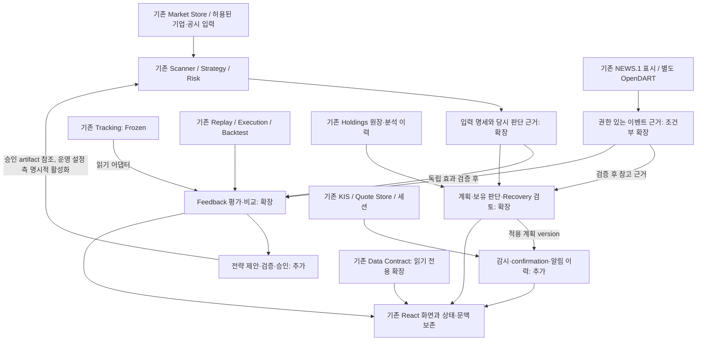

# StockScope Master Architecture vNext

작성일: 2026-09-27 (Asia/Seoul) · 설계 버전: `vNext-2026-09-27`

> 과거 입력 문서(Current State / Recovery Context / Astra handoff)는 현재 checkout의 active 문서가 아니다. 필요한 설계 이유는 `history/StockScope_R4_R5_R5R_설계변경이력.md`와 Git history에서 확인한다.

## 현재 기준과 읽는 순서 — 2026-10-06

이 문서가 제품 책임의 최상위 진입점이다. 새 작업에서는 다음 순서만 기본으로 읽고, 과거 resolution을 연속으로 읽지 않는다.

1. **Master Architecture (이 문서)** — 제품 목적·도메인 owner·금지 경계
2. **Implementation Baseline** — 현재 구현 계약·회귀·운영 경계
3. **현재 작업 기준 하나** — R5R이면 `설계/StockScope_NEXT6E_R5R_통합설계기준_2026-10-05.md`, JEV이면 `설계/StockScope_JEV_통합설계_v2_2026-10-06.md`
4. **Development Roadmap** — 현재 다음 작업과 조건부 backlog
5. **History** — 특정 결정 이유가 필요할 때만 `history/StockScope_R4_R5_R5R_설계변경이력.md`

### 통합된 제품 불변식

- StockScope는 **판단 보조** 제품이며 실제 주문 owner가 아니다.
- 전략 적합도·조건 확인률·스타일 점수는 상승확률이 아니다.
- Risk/NO_TRADE가 전략 점수보다 우선하며 AI/JEV가 이를 우회하지 않는다.
- entry/stop/target은 기존 Strategy/Risk owner가 계산한다. Reference/JEV가 자동 변경하지 않는다.
- Historical evidence, current ranking, execution outcome, prospective evidence를 같은 의미로 합산하지 않는다.
- 사용자 화면은 **결론 → 행동 → 핵심 근거 → 상세** 순서를 기본으로 하고 원시 수치·진단은 접을 수 있다.
- EOD 확정값과 장중 preview/reference를 구분하며 입력 변경 시 stale/revision 규칙을 지킨다.
- JEV Phase 1은 Scanner의 Decision Reviewer shadow이며 rank/action/Risk/plan을 바꾸지 않는다.

## 1. 문서 지위와 근거

이 문서는 **현재 구현을 출발점으로 새로 작성한 목표 설계**다. 아래의 선택은 유실된 과거 설계를 복원한 결과나 현재 구현 완료 선언이 아니다. 설계 문서 작성만 수행했으며 코드·DB·기존 기준 문서는 변경하지 않았다.

입력은 과거 Astra handoff → 과거 Current State → 과거 Recovery Context 순서로 읽었다. Handoff의 재설계 원칙을 따른다. Handoff 10절의 STEP 5 문서 생성 한정은 완료된 이전 작업의 범위이고, 이번 작업은 사용자가 명시적으로 요청한 세 설계 문서 작성이다.

| 기준 | 확인 내용 |
| --- | --- |
| 현재 구현의 고정 기준 | `4f10bc91d16413b437ed5c60d05602d40b1b1b1c` |
| 이번 설계 시작 HEAD | `26524e12d0f3050a311b1f41d7fa08ca2e25996d`, `feature/ux-redesign-1` |
| 두 HEAD 사이 | 입력 Markdown 세 파일만 추가됨. 실행 코드 변경 없음 |
| 추가 확인 | 아래 코드·테스트 소스와 저장 구조를 읽음. 테스트 재실행, runtime DB 조회, 외부 연결·배포 확인은 수행하지 않음 |
| 상태 해석 | Current State의 제한된 COMPLETE/PARTIAL 등을 유지. 목표 역할의 설계 결정은 기존 구현의 상태 변경이 아님 |

세 문서는 같은 설계 버전을 사용한다. 이 문서는 책임·데이터 소유권·결정과 UNKNOWN의 기준, [Development Roadmap](StockScope_DEVELOPMENT_ROADMAP_vNext.md)은 의존성과 개발 범위의 기준, [Implementation Baseline](StockScope_IMPLEMENTATION_BASELINE_vNext.md)은 구현·Migration·검증 규칙의 기준이다. 충돌 발견 시 셋을 함께 정정하며 문서 우선순위로 모순을 숨기지 않는다.

### 추가로 확인한 구현 근거

| 근거 | 확인한 사실과 설계상의 의미 |
| --- | --- |
| [Tracking baseline](TRACKING_BASELINE.md) | TRACK.1 CLOSED/FROZEN, 동일 기준 병합, D+1, Manual-only 제외, CLOSED 성과 동결. 외부 읽기 어댑터가 기본 확장 지점 |
| [validation_catalog.py](../backend/app/simulation/validation_catalog.py), [execution_catalog.py](../backend/app/simulation/execution_catalog.py) | 일별 input fingerprint·result hash·후보 snapshot hash와 별도 실행 결과·정책 token이 이미 존재. 새 검증 엔진 전체를 만들 필요 없음 |
| [execution_engine.py](../backend/app/simulation/execution_engine.py), [관련 테스트](../backend/tests/test_simulation_execution_engine_val2c.py) | 로컬 데이터, 신호 D까지/실행 D+1부터, 20일·0% 고정, CENSORED·정책 불일치 처리. 기존 실행 정책을 새 비교 정책으로 덮어쓰지 않음 |
| [holdings/analysis.py](../backend/app/holdings/analysis.py), [analysis_history.py](../backend/app/holdings/analysis_history.py) | Scanner 현재 경로 재사용, 영향 범위 입력 hash, 버전·snapshot·리비전 저장. 모든 분석 경로의 입력 동일성을 증명하는 공통 계약은 별도 과제 |
| [management.py](../backend/app/holdings/management.py), [계획 테스트](../backend/tests/test_holdings_plan1_g6_management.py) | 계획 version·명시적 적용·confirmation_policy가 이미 존재. 손절 완화 차단, 새 분석 자동 적용 금지 등 기존 규칙을 확장 기준으로 사용 |
| [market_store.py](../backend/app/backtest/market_store.py) | 로컬 재현성 hash 기능과 날짜 snapshot 교체가 존재. hash 존재만으로 변경 전 입력을 재생할 수 있는 것은 아님 |
| [data_contract/builder.py](../backend/app/data_contract/builder.py), [reader 테스트](../backend/tests/test_data_contract_read_only_reader.py) | 현재 입력 미증명과 읽기 전용 경계가 명시됨. 최신성 증명 생성은 조회 밖에서 처리해야 함 |
| [quotes/event_hub.py](../backend/app/quotes/event_hub.py), [SSE 테스트](../backend/tests/test_quote_sse.py) | 프로세스 내 latest-only fan-out이며 느린 소비자의 중간 시세는 버려짐. 모든 tick·가격 도달의 무손실 기록으로 사용할 수 없음 |
| [websocket_manager.py](../backend/app/quotes/websocket_manager.py) | 수요 TTL·구독 제한·credential별 상태. 서버 감시 수요와 화면 선택 수요의 소유권 구분이 필요 |
| [news/policy.py](../backend/app/news/policy.py) | AI/변환 비허용과 source별 캐시 정책. 뉴스 예측 데이터셋 확보를 완료 사실로 둘 수 없음 |
| [config.py](../backend/app/core/config.py), [DATA.1](../tools/data/README.md) | 서버 설정·환경 자격증명과 로컬 도구. 현재 기본 백업은 Holdings이며 Market Store는 선택 포함; 새 평가·감시 상태까지 자동 보호된다고 볼 수 없음 |
| [Scanner baseline](../backend/app/baseline/scanner_production_baseline.py), [CI](../.github/workflows/ci.yml) | 운영 코드/정책 fingerprint와 연구 비반영 경계, Python 테스트와 프론트 빌드. 새 운영 정책 활성화는 baseline 변경 근거가 필요 |

## 2. 목표 구조와 주요 선택

**기존 FastAPI·React·도메인별 SQLite를 유지하는 모듈형 단일 애플리케이션**으로 확장한다. 초기 운영 단위는 로컬 단일 사용자·단일 활성 backend 프로세스다. 별도 마이크로서비스, 새 주문 시스템, 경쟁 OHLC 저장소를 만들지 않는다. 성능·사용자 격리 요구가 입증되면 배포 경계는 이후 재검토한다.

새 논리 책임의 이름은 코드 디렉터리나 독립 서버 생성을 강제하지 않는다. 화면 이동을 위한 API는 현재 경로와 호환성을 유지하며, 조회·명시적 계산/준비·계획 적용·운영 정책 활성화를 구분한다.

| 결정 | 이번 설계에서 선택한 내용 |
| --- | --- |
| 입력과 근거 | 기존 fingerprint·리비전을 경로별로 설명하는 버전 있는 입력 명세와 검증 증명을 추가. 단일 hash가 모든 경로의 동일성을 의미하지 않음 |
| Validation | 기존 Replay·Execution·Backtest 위에 평가 근거 연결·비교·실제 추천 표본 축적을 확장. Tracking은 외부에서 읽기만 함 |
| Horizon | 추천·분석·계획·평가 정책에 전달되는 1급 문맥으로 추가. 과거 자료에는 미지정 값을 보존 |
| Position Manager | Holdings 내부의 계획·판단 지원 책임을 확장. 원장과 동일한 포지션을 사용하며 별도 포지션 원장을 만들지 않음 |
| Recovery | Holdings의 검토 문맥으로 추가하는 방향을 선택. 포지션 OPEN/CLOSED나 거래 이벤트를 대체하지 않음. 자동 진입·행동 수치는 미정 |
| Realtime Watch | 기존 quote 전달 위에 감시 설정·confirmation·알림 이력을 추가. 브라우저 SSE를 감시의 유일한 입력이나 영속 상태로 사용하지 않음 |
| Adaptive Strategy | 현재 10전략을 초기 운영 집합으로 보존하고 등록·평가·제안·승인을 확장. 승인 근거는 Simulation, Production active/rollback reference는 Scanner/Strategy 운영 설정이 소유. 무승인 자동 Rotation은 기본 비활성 |
| News | 표시·공시 규칙·새 이벤트 근거를 분리. 권한과 시간 정보가 확보된 자료만 평가에 사용하며 예측 제품화는 조건부 |
| UX / BYOK | 기능별 UX는 각 단계에서 제공하고 전면 시각 재설계는 후반. 로컬 연결 센터와 공개 사용자별 격리를 별도 완료 단위로 둠 |

화살표는 목표 책임 사이의 데이터 사용을 뜻한다. 분석·감시·평가에서 원장 거래나 증권사 주문을 발생시키는 경로는 없다. Data Contract는 각 도메인의 저장·관찰 상태를 읽으며 계산을 지휘하지 않는다.

## 3. 유지·확장·추가·분리의 범위

| 영역 | 그대로 유지 | 확장 또는 추가 | 통합·분리와 실제 Gap |
| --- | --- | --- | --- |
| Scanner | EOD 후보 처리·진행/취소·Embedded Scanner·기존 기본 순위 | 실행별 당시 후보·정책·입력 근거 캡처, 승인된 선택 정책 적용 | 분석/검증의 경로별 입력을 명시하고 공통 계산만 재사용. 전체 후보군을 같은 깊이로 평가했다고 주장하지 않음 |
| Strategy / Risk | 10전략·NO_TRADE·위험 게이트·적합도 점수 | 전략 version 등록, Horizon 적합성, 운영 변경 제안·승인 | 위험 게이트와 전략 성능 가중치를 분리. 성과 점수가 위험 차단을 무력화하지 않음 |
| Backtest / Legacy Simulation | 기존 체결 가정·정책·결과와 SIM.1~3 호환 | 버전 있는 비교 실행, 평가 어댑터 | Legacy 포트폴리오를 자동 재개하거나 실시간 모의운용으로 승격하지 않음 |
| Historical / Execution Validation | 후보·실행 결과 분리, hash·정책 검증·성과 계산 | 평가 cohort·보고서·실제 추천 연결·추가 정책 비교 | 별도 엔진 교체 대신 orchestration과 평가 범위를 확장. 기존 20일·0% 실행 결과 불변 |
| Tracking | TRACK.1의 DB schema·service semantics·등록/병합/종료/삭제/행 액션·성과 의미 | 외부 읽기 어댑터와 workspace의 별도 Feedback/Validation view | 기존 Tracking 기능은 변경하지 않고 근거 이동·cohort 비교 화면 추가는 허용. 사용자가 고른 표본과 전체 추천 표본을 혼합하지 않음 |
| Holdings | 계좌·원장·lifecycle·손익·KIS 관찰·분석 이력·계획 적용 | Horizon/논리/재검토 문맥, 행동 제안, Recovery 검토 | 계획 후보·적용 계획·시장 관찰·실제 수동 원장 조작을 분리 |
| Realtime | REST/WS·Store·SSE·fallback·세션·평가/거리 | 서버 감시 수요, 영속 confirmation/알림, 공백 표시 | quote stream과 알림 stream의 전달 보장을 분리. 감시 범위를 무제한 전 종목으로 확대하지 않음 |
| NEWS.1 / OpenDART | 독립 뉴스 표시와 기존 공시 규칙 분석 | 허용된 이벤트 근거의 출처·시점·관련성 평가 | 뉴스 패널과 전략 점수 통합을 동일시하지 않음. 예측은 독립 검증을 통과해야 함 |
| Data Contract | 읽기 전용 자원별 상태·날짜·표시/사용 구분 | 현재 입력과 저장 판단의 비교 증명, 증명 범위·사유 | 증명 생성/준비와 상태 조회 분리 |
| UX | 탐색→분석→보유 연결, 관심/보유 관점, 상태/복구·세션 | 판단·계획·감시·검증의 일관된 정보 구조 | 도메인 DB를 합치지 않고 근거를 화면에서 연결 |
| DB / 외부 API | 기존 도메인 소유권·provider·DATA.1 | 새 영속 상태 백업, 로컬 연결 센터, 조건부 사용자 격리 | 공개 다중 사용자 요구를 현재 로컬 기능의 완료로 보지 않음 |

## 4. 입력 식별·재현성·Horizon

### 4.1 입력 명세와 증명

기존 hash를 제거하거나 모두 같은 뜻으로 통일하지 않는다. 새 입력 명세는 계산 경로, 종목/시장, 기준 시각과 데이터 사용 가능 시각, 사용 기간·행 범위, source와 내용 hash, 코드/엔진/정책 version, Horizon 정책, 실행 가정, 누락 항목을 식별한다. 실제 사용한 입력을 기준으로 하며, 외부 비밀키는 포함하지 않는다.

세 가지를 별도로 증명한다: **당시 판단을 재생할 수 있음**, **현재 입력과 동일함**, **현재 목적에 사용 가능함**. 옛 판단을 재생할 수 있어도 현재 정책과 다를 수 있다. 데이터가 같아도 그 시점에 알 수 없었던 재무·공시·업종 자료를 사용했다면 과거 성과 검증에 적합하지 않다.

생산자 경로 또는 사용자가 시작한 검증 작업이 입력 명세·내용 식별자·검증 증명을 저장한다. Data Contract reader는 저장 증명과 현재 저장소의 변경 세대/정책 version을 읽어 비교한다. 준비·네트워크·분석·hash 재생성을 조회에 숨기지 않는다. 증명 생성 뒤 입력이 바뀌면 무효화하며, 변경 세대를 보장하지 못하는 입력은 계속 UNVERIFIED다. 여러 DB를 읽는 동안 값이 바뀌는 경우 일관된 snapshot 또는 전후 세대 확인으로 경쟁을 검출하고 사용 직전에도 유효성을 재확인한다.

Market Store는 확정 시장 이력의 단일 기준으로 유지한다. 재수집·정정 시 사용했던 입력이 사라질 수 있으므로, 검증에 필요한 **보존 허용된 입력 묶음**은 실행 근거용 불변 artifact로 참조한다. 이는 별도 실시간 OHLC 서비스가 아니며 일반 조회의 두 번째 원천으로 사용하지 않는다. 보존 권한·원본이 없으면 hash만으로 재현 가능이라고 표시하지 않는다.

분석 경로가 다른 `StrategyAnalysisService`와 Scanner/Holdings를 강제로 같게 만들지 않는다. P1에서 경로별 입력 범위와 공통 부분을 검증한다. 기존 리비전은 새 필드를 추정해서 채우지 않고 LEGACY/미증명으로 읽는다.

### 4.2 Horizon의 목표 계약

Horizon은 종목 속성이 아니라 **특정 판단·적용 계획·평가의 의도**다. 추천/분석 snapshot과 적용 계획 version에 Horizon 참조를 고정하고, 실행/평가 run도 같은 Horizon 정책 version을 참조한다. 단기·중기·장기별 전략 허용 범위, 보호/목표 규칙, Time Stop, Review Cycle, confirmation 요구는 버전 있는 정책의 책임이다.

기존 자료는 `LEGACY_UNSPECIFIED`라는 새 설계상의 호환 의미로 취급한다. 기존 enum에 이미 있는 값이라는 주장이 아니다. 20일 실행 한도나 5/10/20일 관찰 기간을 단기 의도로 역추정하지 않는다. 새 계획에서 Horizon을 바꾸면 새로운 계획 version과 변경 이유를 만들고 이전 판단·평가를 수정하지 않는다.

**정확한 기간 경계와 전략별 예외는 미결정**이다. P1의 계약과 지원 여부 표현은 먼저 구현할 수 있으나, 숫자를 임의로 채운 장기 전략을 출시하지 않는다. 기존 동작은 호환 정책으로 유지한다. 정책에 필요한 과거 데이터·재무 시점·긴 관찰기간이 없으면 해당 조합을 미지원/평가 중으로 표시한다.

## 5. Validation과 Feedback의 연결

### 5.1 책임과 표본

기존 Replay는 과거 후보를 생성하고 Execution은 저장된 후보를 가상 실행하며 Backtest는 특정 전략·조건의 가상 성과를 계산한다. 새 Feedback 책임은 이 결과와 실제 추천 관찰을 **출처와 정책을 유지한 채 연결하고 비교·보고하는 것**이다. 실행 계산을 다시 구현하지 않는다.

Tracking의 기존 DB schema, service semantics, 등록·병합·종료·삭제·행 액션 및 성과 의미는 변경하지 않는다. 기존 Tracking/Validation workspace에 별도 Feedback/Validation view와 근거 이동·cohort 비교 화면을 추가하는 것은 허용한다. 이 view 추가를 Tracking 기능 자체의 변경으로 해석하지 않으며, 기존 Tracking 행 액션을 확장 지점으로 사용하지 않는다.

| 표본 종류 | 사용 목적 | 함께 표시할 한계 |
| --- | --- | --- |
| 과거 Scanner replay | 당시 입력으로 후보 선정·정책 비교 | 시장 universe·생존편향·시점 자료·재생 가능 범위 |
| Execution / Backtest | 진입·보유·청산 및 비용 가정 평가 | 가상 체결·정책 version·일봉 순서·CENSORED |
| 기존 Tracking | 등록 기준 이후 관찰, 선택된 추천의 설명 | 선택 편향. Manual-only는 Scanner 성과에 제외. 도달은 체결이 아님 |
| 새 실제 추천 표본 | 운영 결과를 사후 선택 전에 보존하고 이후 관찰 | 앱 실행 시점·선별 단계·실행 누락·시장 범위의 편향 |
| Holdings 사용자 기록 | 계획 준수·관측 가능한 실제 관리 결과 | 사용자 매매 선택과 BROKER 관측 범위. 전략 인과효과로 단정 금지 |

새 추천 수집은 기존 완료 Scanner 실행의 식별자·반환 후보/판단 상태·선별 범위·기준 입력을 보존한다. 화면에서 등록한 종목만 수집하지 않으며 Embedded Scanner의 같은 실행도 중복 계산하지 않는다. 평가하지 않은 전 종목의 분모를 만들어내지 않는다. 실패·취소·부분 실행·수집 실패는 별도로 기록하고 성공 표본에 조용히 섞지 않는다.

### 5.2 평가 규칙

평가 cohort는 데이터 기간·시장·선정 방식·전략/정책 version·Horizon·비용/체결 가정이 같은 비교 단위다. 비교 불가능한 값은 합산하지 않고 이유를 보여준다. 후보 선정, 진입 타이밍, 보유/청산, 전략 선택을 나누어 MFE/MAE·기간 수익·낙폭·종료 결과를 연결한다. 최대 상승/하락 관찰과 가상 포지션 MFE/MAE는 시작점·기간·정의를 명시한다.

현재 20일·왕복 0% VAL.2는 기존 정책으로 남긴다. 다른 Horizon·비용·슬리피지·종료정책은 새 run과 정책 version에서 비교한다. 기존 완료 run이나 Tracking CLOSED 값을 소급 재계산해 덮어쓰지 않는다. 새 파생 보고서의 재계산은 새로운 보고서 version이다.

미래 기간 부족은 미성숙/CENSORED와 이유로 남긴다. 보고서에는 전체 후보·실행 가능·미실행·미성숙·제외 수를 함께 표시한다. 학습/조정 구간과 평가 구간을 시간으로 분리하고, 보유기간이 겹치는 표본의 누수도 방지한다. 현재 universe와 상장폐지·과거 구성 데이터의 완전성은 추가 확인 대상이다.

전략 평가의 좋은 결과가 자동으로 운영 정책을 바꾸지 않는다. 보고서와 승인된 version만 §8의 운영 변경 절차에 전달한다. 자료가 부족해도 평가 도구 단계는 완료할 수 있으나 성능 우수·승격 가능 상태는 별도다.

## 6. Holdings 확장과 Recovery

Position Manager는 새 원장 대신 Holdings의 **판단 지원·계획 관리 책임**으로 구현한다. 기존 lifecycle, 수량/평균가, 손익, 원장 정정, KIS 잔고 관찰과 분석 이력을 유지한다.

목표 흐름은 `현재 입력과 보유 문맥 → 판단 제안 → 사용자 검토 → 명시적 계획 적용`이다. 판단 제안은 HOLD/ADD/REDUCE/TAKE PROFIT/STOP/EXIT의 선택지·근거·반대 근거·입력 시각·미확인 조건을 가진다. 이는 거래 명령이나 포지션 lifecycle enum이 아니다. 정보 부족은 판단 유보이며 HOLD로 강제 치환하지 않는다.

Investment Plan은 기존 stop/target·confirmation_policy·version·이전 계획 관계를 확장해 Horizon, 진입 논리, 무효화 조건, 부분 축소/익절, Trailing, Time Stop, 검토 주기를 표현한다. 새 계획은 이전 계획을 보존한다. 기존 손절 완화 차단을 기본 유지하며, 별도 변경 검토 없이 Horizon 변경을 우회 수단으로 쓰지 않는다. 정책별 실제 계산 규칙은 비교 검증 후 지원 목록에 추가한다.

계좌 노출·집중도는 관측 가능한 계좌/포지션 범위로만 계산한다. 현금·다른 계좌·평가가격이 없으면 전체 자산 비중을 확정하지 않는다. ADD는 손실률이나 평단만으로 허용하지 않고 논리·추세·시장/업종·재무·비중·자료 충분성의 조건을 설명한다. 정책과 검증 근거가 미완성이면 ADD 실행 가능 신호를 만들지 않는다.

**Recovery는 동일 포지션에 연결된 별도 검토 문맥**으로 설계한다. 사용자가 큰 손실 상황의 논리·위험·선택지를 검토할 수 있게 하되 별도 잔고를 만들거나 lifecycle를 바꾸지 않는다. 최초 범위는 명시적으로 시작·종료하는 검토와 기록이며, 자동 진입 임계값·조건부 추가매수/축소의 수치는 미정이다. 가격 회복만으로 자동 해제하지 않는다. 구조적 악화·집중 위험·정보 부족과 선택 이유를 저장하며 계획 변경은 기존 명시적 적용 경로를 따른다.

## 7. Realtime Watch의 관찰 범위와 알림

현재 전달·보유 평가·가격 거리 계산은 유지한다. 새 감시는 **사용자가 지정한 제한된 관심/보유 종목과 적용 계획**부터 지원하고, 서버가 실행되는 동안 별도 감시 수요 lease를 관리한다. 화면 선택 수요와 감시 수요는 합산·중복 제거하되 구독 제한을 넘는 종목은 미감시로 표시한다. 브라우저를 닫아도 서버가 살아 있으면 지정 범위의 감시를 유지하는 것이 목표이며, 서버 종료 중 24시간 감시를 약속하지 않는다.

Quote Store에서 채택된 시세와 세션 상태를 사용하는 서버 평가 경로를 추가한다. 기존 latest-only browser SSE에 접속해 모든 tick을 봤다고 간주하지 않는다. 실제 구현은 bounded queue 또는 명시적 sampling 정책을 사용하고, 누락·과부하·stale·시장 UNKNOWN은 coverage 공백으로 기록한다. 지속 관측이 필요한 confirmation은 공백에서 중단하며 재연결 때 연속 관측으로 이어 붙이지 않는다. 분봉·체결 전체 기록을 현재 데이터로 재구성했다고 주장하지 않는다.

새 감시 규칙은 적용 계획 version, 입력 시각/품질, 관찰 조건, confirmation 방법, 재무장 조건을 식별한다. 관찰→확인 대기→확인됨→조건 해소/재무장의 전이를 영속화하고, 사용자 읽음/확인은 시장 조건 해소와 별도로 관리한다. 가격선 반복 왕복은 정책별 hysteresis/재확인 조건으로 같은 episode의 중복 알림을 억제한다. 구체적인 시간·가격 허용폭은 정책별 검증 항목이며 이번 설계에서 숫자를 날조하지 않는다.

알림은 episode·규칙 version·계획 version에 연결된 안정된 ID를 가진다. 상태 전이와 알림 발행 대기를 같은 DB transaction에 기록하고 전송 재시도는 같은 ID로 중복 제거한다. 최초 사용자 채널은 앱 내 목록·상태 표시이며 외부 push/SMS/메일은 이번 기본 범위가 아니다. quote SSE와 알림 조회/재접속 복원 계약을 구분한다. 무조건 exactly-once 전송을 주장하지 않는다.

재시작 후 durable watch 설정·알림은 복원하고 quote·구독은 다시 확보한다. 공백 구간 가격을 소급 추정하지 않으며, 미완료 확인은 새 유효 관측으로 다시 시작한다. 계획 변경·포지션 종료·credential 교체 시 이전 규칙을 종료/무효화하고 이력은 남긴다. 알림은 원장·적용 계획·공식 EOD 판단을 바꾸지 않는다.

## 8. Adaptive Strategy 운영

현재 10전략과 기존 기본 선택/위험 정책을 초기 운영 version으로 등록한다. 과거 검증 보고서가 없는 전략을 새로 검증 완료라고 표시하지 않는다. 후보·운영·보류/강등은 **전략 version의 운영 상태**이며 기존 `StrategyName` 의미를 재명명하지 않는다.

목표 절차는 `측정 → 변경 제안 → 고정된 평가 조건 검증 → 사용자/관리자 승인 → 효력 시점이 있는 활성화 → 관찰/되돌림`이다. 제안에는 근거 cohort, 기존 대비 차이, 표본·불확실성·위험, 영향받는 Horizon/국면, rollback version을 포함한다. 승인할 때 데이터/정책 version이 바뀌면 재검증한다.

**Research/Validation의 승인과 Production activation의 소유권을 분리한다.** Simulation은 전략 registry·평가·제안·승인 artifact/version/hash를 보존할 수 있지만 Production의 실제 active strategy selection policy/version이나 rollback reference를 소유하지 않는다. 그 owner는 Scanner/Strategy 운영 설정이다. 운영 설정 측이 고정된 승인 artifact/version/hash를 검증한 뒤 명시적으로 정책을 게시하고 active/rollback reference를 일관되게 갱신한다. 실행은 게시된 운영 정책 snapshot/version을 사용하며 매 실행마다 Simulation의 최신 승인 행을 조회해 활성 정책을 결정하지 않는다. 연구 재실행이나 Simulation의 상태 변경이 Production reference를 자동 변경하지 않는다.

기존 [production baseline](../backend/app/baseline/scanner_production_baseline.py)과 [production policy](../backend/app/backtest/production_exit_policy.py)의 version·근거 서명·명시적 활성화·원자적 파일 교체·fallback 패턴 및 운영 설정 저장 구조를 우선 재사용한다. selection policy는 exit-policy mapping과 별도 의미로 식별하며 기존 매핑을 덮어쓰지 않는다. 구체적인 운영 설정 파일/스키마는 P5 명세에서 정하고, 이 분리만을 위해 새 DB나 별도 저장 서비스를 만들지 않는다.

운영 가중치·선택 정책과 기존 exit-policy mapping은 서로 다른 책임이다. 둘을 하나의 token 의미로 섞지 않고 실행 근거에 각각 기록한다. 실행 시작 시 version을 고정하며 진행 중 활성화가 기존 run 입력을 바꾸지 않는다. 승인된 변경은 이후 신규 추천/분석에 적용하고 기존 포지션의 적용 계획은 바꾸지 않는다. 실패 시 명시된 이전 정상 version으로 돌아가며 어떤 정책을 썼는지 표시한다.

최소 표본·최근/장기 구간·승격/강등 임계값은 **아직 미결정**이다. P2의 데이터로 효과 크기·상관 표본·국면 편중·손실/낙폭·비용 민감도를 평가한 뒤 평가 프로토콜을 먼저 고정해야 한다. 선택 후 같은 평가 구간을 반복 사용해 좋은 숫자만 채택하지 않는다. 기준 미정/표본 부족 상태에서는 수동 근거 검토는 가능하지만 추천 승격이나 자동 변경은 비활성이다.

Regime Adaptive / Strategy Rotation 자동화는 장기 목표로 남긴다. 시간 분리 평가, 여러 국면의 독립 표본, prospective 관찰, shadow 운영, 실패 감지·rollback의 증거가 있어야 검토한다. 기간이 지났다는 이유나 수익률 한 숫자만으로 활성화하지 않는다. 이 Roadmap은 승인 기반 운영까지를 기본 범위로 삼으며 자동화 출시일·알고리즘을 확정하지 않는다.

## 9. News / OpenDART의 제품 연결

NEWS.1은 계속 독립 표시 경로로 제공하고 기존 OpenDART의 규칙 기반 Strategy 위험 연계도 보존한다. 향후 이벤트 근거는 source·발표 시각·실제 수집 시각·정정 이력·종목 관련성·허용 사용 범위를 가진다. source 계약이 다르면 같은 저장/AI 처리 정책을 적용하지 않는다.

기본 순서는 **권한과 시점 자료 확인 → 관련성·중복·사실 근거의 품질 평가 → 참고 정보 제공 → 시간 분리된 증분 효과 검증 → 필요한 경우 판단/예측 통합**이다. NEWS.2~4 번호를 이 순서의 새 Phase ID로 재활용하지 않는다. NAVER의 AI/변환 비허용은 현재 코드 정책으로 유지하며 별도 적법한 권한 근거 없이 해제하지 않는다. 이번 문서는 외부 약관의 법적 판정을 새로 내리지 않는다.

초기 제품 가치는 관련 이벤트와 기존 공시 근거를 찾고 출처·시각을 확인하는 데 둔다. Holdings에서는 계획 재검토의 참고 근거로, Watch에서는 중요 이벤트 확인 대상으로 사용할 수 있으나 자동 계획 변경은 없다. 뉴스 점수나 예측의 Strategy 반영은 기존 위험/전략만 사용하는 대조군과 비교해 실제 추가 가치가 검증된 경우에 한한다.

권한 있는 시점 데이터셋, 정정·중복 처리, 평가 라벨과 분리 구간이 없으면 연구를 보류한다. **보류 결정과 근거도 P6의 유효한 결과**지만 뉴스 분석/예측 구현 완료로 보고하지 않는다. 미검증 예측을 사용자 확률처럼 표시하지 않는다.

## 10. 저장 소유권·연결·복구

아래는 **새 설계의 논리적 저장 책임**이다. 기존 파일을 합치거나 지금 Migration을 실행하지 않는다. 정확한 DDL·인덱스·API payload는 해당 Stage 명세에서 이 책임을 구체화한다.

| 저장소/영역 | 현재 데이터 활용 | 목표 추가 책임 |
| --- | --- | --- |
| `market_history.db` | 확정 일별 이력·날짜 상태·무결성 hash | 입력 변경 세대와 보존 가능한 실행 근거 artifact 참조. live 조회의 단일 원천 유지 |
| `recommendation_tracking.db` | 기준점·출처·snapshot·관찰 결과 | 스키마/동작 변경 없음. 외부 adapter가 읽은 source ID/hash/범위를 다른 저장소에 기록 |
| `simulation.db` | Legacy·과거 후보·가상 실행·성과 | 별도 새 테이블로 실행 근거·cohort/보고서·실제 추천 표본·전략 registry·평가/제안/승인 artifact/version/hash. Production active/rollback reference는 소유하지 않음. 기존 완료 행 불변 |
| Scanner/Strategy 운영 설정 | 기존 production baseline·정책 version·매핑·활성화/fallback 구조 | Production selection policy snapshot/version 및 active/rollback reference 소유. Simulation 승인 artifact/version/hash 참조·검증, 기존 운영 설정 구조 우선 재사용. 별도 신규 DB 전제 없음 |
| `holdings.db` | 원장·분석 리비전·적용 계획 | 별도 version/연결 구조로 Horizon·판단/Recovery 검토, watch 설정·상태·알림 outbox. 거래 원장과 분리 |
| 입력 근거 artifact | 현재 일반 시장 저장과 구분 | 허용된 재현 입력의 불변 묶음, hash·참조·보존 정책. 캐시나 경쟁 시장 DB로 쓰지 않음 |
| credential 저장 | 현재 서버 환경 설정 | P8에서 저장 매체/암호화·회전·권한을 결정. 일반 분석 DB·보고서·LocalStorage에 평문 저장하지 않음 |

계산 경로별 명세는 그 판단의 소유 저장소에 둔다. 동일 근거는 ID/hash로 참조하고 필요한 당시 문맥만 보존한다. 서로 다른 DB 사이에 SQLite FK나 원자적 전역 transaction이 있는 것처럼 설계하지 않는다. 원본은 기존 owner만 수정하며 연결 작업은 idempotent ID·완료 상태·재검사로 부분 실패를 복구한다. 소비자가 producer commit 전에 불완전한 결과를 읽으면 평가 가능으로 승격하지 않는다.

Tracking의 ACTIVE 관찰 변화는 읽기 시각·내용 hash가 다른 파생 근거로 취급하고, CLOSED 원본은 갱신하지 않는다. 사용자 삭제 권한을 우회하는 숨은 사본을 남기지 않는다. 원본 삭제 시 후속 동기화가 연결 근거의 삭제/사용 불가를 반영하고 파생 보고서를 무효화한다. 승인 이력의 ID·hash 등 최소 감사정보 보존 여부는 삭제 정책에 명시하며, 삭제된 원문으로 새 평가를 계속하지 않는다. 이미 적용된 보유 계획을 근거 삭제만으로 자동 변경하지 않는다.

P1-S1의 백업·복원 책임은 **extensible backup manifest 계약과 현재 존재하는 DB·입력 근거의 포함·제외·복원 관계 확정**이다. P1에서 생성하는 입력 증명/artifact도 이 범위에 포함하되 아직 없는 P4 Watch·P5 Strategy 운영 상태를 선행 구현하지 않는다. 이후 새 영속 상태를 추가하는 Stage가 자신의 manifest 항목·backup/restore·integrity 검증을 함께 추가한다. P4는 감시 설정·상태·알림, P5는 Simulation 승인 근거와 Scanner/Strategy 운영 설정의 active/rollback reference·정책 snapshot 및 그 연결 검증을 담당한다.

현재 기본 Holdings 백업만으로 새 시스템 전체가 복구된다고 주장하지 않는다. 각 Stage에서 DB/운영 설정의 일관된 snapshot, 연결 대상 version/hash 검증, 해당 상태의 복원 후 재검사를 수행한다. credential은 일반 백업과 별도 취급한다.

서버 메모리 job 전체를 한꺼번에 재개 가능하게 바꾸지 않는다. 새 평가/감시 작업은 영속 실행 상태를 갖추고, 안전한 checkpoint가 없는 기존 job은 재시작 후 interrupted/unknown으로 표시해 명시적으로 재실행한다. 완료된 과거 결과를 진행 중 job과 혼동하지 않는다.

## 11. Frontend UX와 제품 구조

기존 화면과 탐색 문맥을 기본으로 유지한다. 기존 Tracking/Validation workspace에 별도 Feedback/Validation view·근거 이동·cohort 비교 화면을 추가할 수 있으며, Tracking의 DB schema·service semantics·등록/병합/종료/삭제/행 액션·성과 의미는 그대로 보존한다. Holdings는 신규 후보 분석보다 적용 계획·보유 위험·행동 선택지를 먼저 보여준다. Watch는 감시 범위·공백·확인된 변화와 계획을 연결한다. 관리되지 않는 전 종목을 감시 중이라고 표시하지 않는다.

정보 구조는 **결론 → 행동 선택지 → 핵심 이유 → 상세 근거**다. 모든 판단에 기반 시각·계획 version·자료 부족/판단 유보의 이유를 필요한 깊이에 표시한다. 기술 식별자는 상세 근거에 두고 기본 흐름에 내부 테이블명·hash를 나열하지 않는다.

각 Stage가 자신의 정상/부족/오류/재시도·문맥 보존 UX를 함께 제공한다. P7에서 Responsive, Context, Data, Priority Adaptive를 공통 기준으로 통합한다. 시각 전면 재설계는 주요 계획/검증/감시 동선과 상태 계약의 UAT 통과 뒤 진행한다. 뉴스·자동화가 보류되어도 미지원 상태가 명확하면 그 기능 출시를 기다려 모든 UX 개선을 막지 않는다.

P7의 최종 Visual 방향은 **Editorial + Product UI, typography 중심, low-glare dark, restrained light, 데이터 중심 시각화**다. 반복적인 둥근 카드, 흔한 3분할 통계 카드, 의미 없는 badge, pastel gradient 남발, generic AI-generated SaaS 느낌, 박스 나열형 관리툴 스타일을 피한다. 이는 단순 참고가 아니라 P7 디자인·리뷰·UAT의 검수 기준이며, 대표 화면·두 테마·화면 폭별 결과를 기준과 대조해 완료를 판정한다.

## 12. 연결 센터와 공개 배포 경계

현재 로컬 사용자 흐름을 우선 유지한다. P8의 로컬 연결 센터는 provider별 권한/발급 안내, 비밀 입력, 명시적 연결 테스트, 상태/만료·교체·삭제를 제공한다. 상태 조회만으로 토큰을 발급하지 않고 연결 테스트는 별도 명시적 동작이다. 저장 방식은 구현 전 host 환경과 비밀 저장 요구를 확인해 정하며 브라우저 LocalStorage 평문 저장은 허용하지 않는다.

Demo는 명시된 샘플/허용 데이터만, Full은 해당 사용자의 provider 권한으로 동작한다는 제품 경계를 선택한다. 특정 공급자·공개 호스팅·인증 제공자·암호화 제품은 아직 선택하지 않는다. BYOK만으로 데이터 재배포 권한을 얻었다고 가정하지 않는다.

공개 다중 사용자 Full Mode는 인증·권한·owner별 원장/추천/평가/정책/감시/credential·캐시·SSE 격리가 입증된 뒤에만 허용한다. 기존 계좌 ID나 credential fingerprint를 사용자 인증의 대체물로 쓰지 않는다. 로컬 상태를 다른 사용자에게 묵시적으로 귀속시키지 않으며 소유자 확인을 거친 Migration만 허용한다. DB 엔진 교체·분리 프로세스가 필요한지는 예상 동시 사용자·운영 환경 증거로 결정한다. 이 결정 전 공개 Full 배포는 보류한다.

## 13. Recovery Context PART D — 15개 질문 추적

상태는 질문 전체의 해결 여부다. 구조 일부를 결정했어도 필수 기준이 남으면 미결정/추가 증거 필요로 둔다. “설계에서 해결”은 구현 완료를 뜻하지 않는다. 아래 Q 번호는 원문의 질문 번호이며 개발 작업 번호가 아니다.

| 질문 | 상태 | 설계 답변 또는 남은 문제 | 위치·해결 단계 |
| --- | --- | --- | --- |
| Q1 Historical/Execution과 Feedback 역할 | 설계에서 해결 | 기존 생성·가상 실행·성과 계산 유지, Feedback은 근거 연결·cohort·비교/보고 | §5, P2 |
| Q2 TRACK 동결과 데이터 재사용 | 설계에서 해결 | 외부 읽기 adapter, source/hash·선택 편향 보존, 기존 데이터에서 없는 당시 문맥은 추정 금지 | §3·5·10, P2 |
| Q3 Position Manager 형태·기존 책임 | 설계에서 해결 | Holdings 내부 판단/계획 확장, 동일 원장·포지션·명시적 적용 유지 | §6, P3 |
| Q4 Watch와 전달/평가 경계 | 설계에서 해결 | 기존 전달 재사용, 서버 감시 수요·영속 episode·coverage 공백·앱 내 알림 분리 | §7, P4 |
| Q5 Horizon 저장·전략/관리/검증 영향 | 아직 미결정 | snapshot/계획/run의 정책 참조 구조 결정. 기간 경계·전략별 예외·지원 데이터 범위 미정 | §4.2, P1-S2 및 P2/P3 |
| Q6 Strategy Pool과 현재 10전략 | 설계에서 해결 | 초기 운영 version 보존, 후보/운영/보류 version과 승인 활성화 추가 | §8, P5 |
| Q7 장기/최근·국면·표본·승격 기준 | 아직 미결정 | 평가·승인 절차 결정. 수치·구간·최소 표본은 cohort 분석 후 사전 고정 필요 | §8, P2-S2 → P5-S1 |
| Q8 Rotation 자동화 데이터 충분성 | 추가 증거 필요 | 시간 분리·국면별 독립 표본·prospective/shadow·rollback 증거 필요. 자동화 기본 비활성 | §8, P5 이후 조건부 재검토 |
| Q9 NEWS.2~4 권한·검증·판단 연결 | 추가 증거 필요 | 현재 정책으로 AI/변환 허용 불가. 권한 있는 시점 corpus·관련성/증분 효과 증거 필요 | §9, P6 |
| Q10 Recovery 형태·행동 기준 | 아직 미결정 | Holdings 검토 문맥으로 선택. 자동 진입/해제·추가매수/축소 수치와 검증 기준 미정 | §6, P3-S2 |
| Q11 Data Contract와 입력 식별 | 설계에서 해결 | 생산자/명시 작업의 증명 저장, read-only 비교, 세대 변경·경쟁 검출, 미증명 유지 | §4.1·10, P1-S1 |
| Q12 현재 UX 재사용·안정 조건 | 설계에서 해결 | 기존 화면/문맥 유지, 단계별 UX, 핵심 동선 UAT 후 P7 전면 정리 | §11, P7 |
| Q13 연결 센터·credential·Demo/Full | 아직 미결정 | 제품 경계와 공개 격리 gate 결정. 비밀 저장 매체·배포/인증 구조는 환경 선택 필요 | §12, P8 |
| Q14 DEV.1·H.0~H.3 유효성/대응 | 추가 증거 필요 | 유실 대화/원본 공식 정의가 없으므로 역사적 의미 UNKNOWN 유지. 새 Phase와 대응표를 만들지 않음 | §14, 역사 자료 확보 시만 갱신 |
| Q15 의존성에 따른 개발 순서 | 설계에서 해결 | 새 8 Phase·12 Stage와 조건부 병렬 분기를 정의 | Roadmap §2~10 |

**집계: 설계에서 해결 8 / 아직 미결정 4 / 추가 증거 필요 3.**

## 14. 남은 UNKNOWN과 결정 차단 범위

| 항목 | 필요한 근거/결정 | 그 전 허용 범위와 차단 범위 |
| --- | --- | --- |
| `REALTIME.5`, `HOLD.1-H` 대응, `H.0~H.3`, `DEV.*` | 공식 원본·이력 증거 | 기존 구현 재사용과 새 설계는 가능. 과거 번호 의미/대응 확정 금지 |
| Horizon 수치·전략 적합성 | 사용자 의도, 데이터 기간, 정책별 비교 | 미지정 호환·계약·연구 가능. 미검증 조합 운영 추천 금지 |
| 전략 평가 임계값·자동화 | 사전 프로토콜·독립 표본·shadow 증거 | 도구·수동 검토 가능. 자동 승격/Rotation 금지 |
| Recovery 자동 조건 | 위험 한도·노출 범위·논리/행동 검증 | 수동 검토·기록 가능. 자동 진입/추가매수 신호 금지 |
| 뉴스 권한·시점 자료·예측 가치 | source별 보존/변환/AI/표시 근거와 평가 데이터 | NEWS.1·기존 DART 유지. 금지된 자료 축적/학습·미검증 점수 반영 금지 |
| 감시 coverage·장중 smoke | 실제 자격증명 환경에서 구독/세션/재접속 관측 | 합성 입력 테스트 가능. 장중 운영 검증 완료 선언 금지 |
| runtime DB·현재 인증·활성 종료정책 | 사용자 환경의 명시적 read-only 확인 | fixture 설계 가능. 운영 데이터량/활성값 추정 금지 |
| 공개 BYOK 기술·배포 | host·인증·비밀 저장·owner 격리·권한/부하 증거 | 로컬 제품 개발 가능. 공개 Full Mode gate 미충족 시 배포 보류 |
| 과거 universe·사용 가능 시각 | 상장폐지/구성·정정·수집시각 근거 | 범위 한정 결과 표시. 전체 시장 무편향·당시 재현 주장 금지 |

새 개발 ID는 Roadmap의 `VN-P*`만 사용한다. 기존 확인된 작업 이력은 Current State의 의미대로 보존하며 이 문서가 그 정의를 바꾸지 않는다.