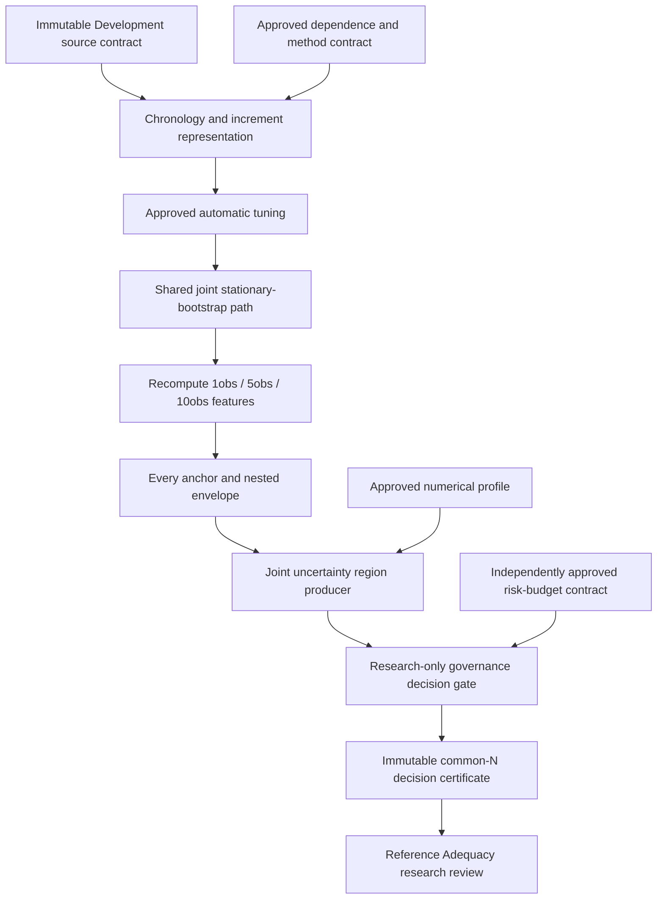
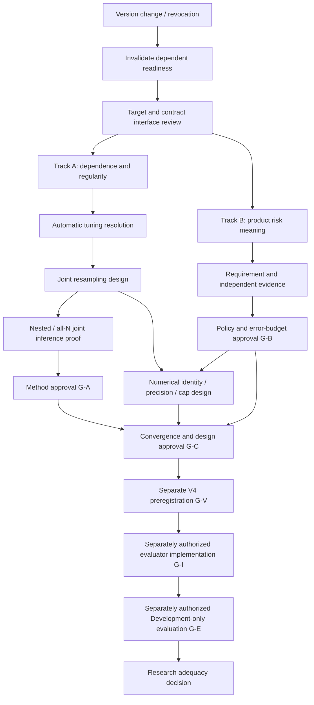
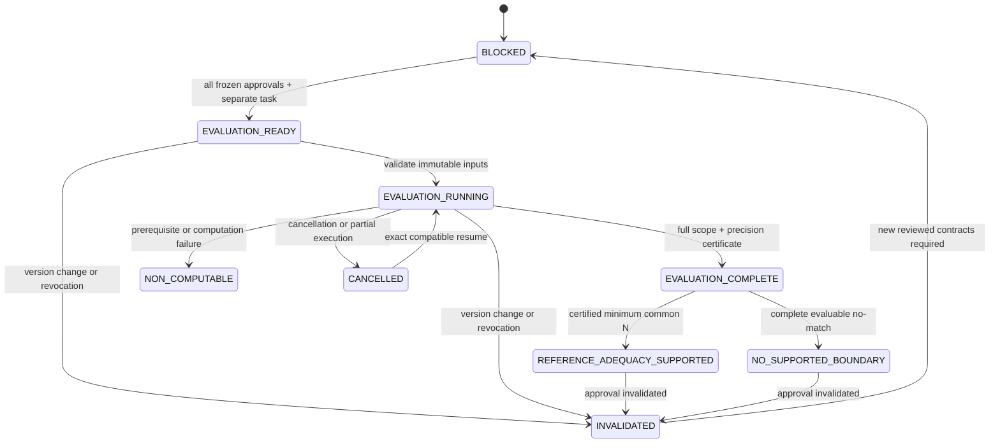

# StockScope NEXT-6E — Reference Adequacy Resolution Architecture

## 1. Document Status / Baseline

- Date: 2026-10-02, Asia/Seoul.
- Artifact: actual Architecture / Statistical Method / Governance Design, document revision 1.
- Status: **DESIGN_DOCUMENT_COMPLETE; METHOD_RESEARCH_REQUIRED; RISK_BUDGET_GOVERNANCE_REQUIRED; V4_PREREGISTRATION_BLOCKED**.
- Primary specification: [Post-S5 Design Document Task Specification](StockScope_NEXT6E_POST_S5_DESIGN_DOCUMENT_TASK_SPEC_2026-10-02.md), especially §§3–23. This document makes architectural proposals and decisions; it is not another task specification.
- Verified remote main and authoring base: `6185b39b53a59c1492c229479c86cf4f46267bcb`.
- Specification's earlier base: `020d2bf842b1e0e1d8ad33e7d20856463476c373`.
- Delta: one commit, `6185b39`, adding the primary specification through PR #72. No V3, S1–S4, or upper architecture/roadmap/baseline contract change.
- Authoring branch: `docs/next6e-reference-adequacy-architecture`; initial HEAD equals verified main. No tracked local changes. Two pre-existing untracked task documents are preserved and excluded: `StockScope_FRESH_CLONE_BOOTSTRAP_TASK_SPEC_2026-10-02.md` and `StockScope_NEXT6E_S5_REFERENCE_ADEQUACY_GOVERNANCE_TASK_SPEC_2026-10-02.md` under `docs/`.

The baseline was verified through the connected GitHub commit/compare API and local Git metadata. This SHA is the source baseline, not a claim about the eventual merge SHA. PR, hosted CI, squash merge and post-merge main are reported with delivery evidence separately.

Reading boundary: tracked definitions and approved research documents only. No current Development evidence payload, distribution, envelope, passing N, survival, covered-years or horizon result was inspected. No runtime manifest was loaded or rehashed. Holdout remains **LOCKED / NOT ACCESSED**, including no existence, search, directory, metadata, hash, count or date-range probe. No local application import, startup, statistics, bootstrap, diagnostics, capture, DB, migration or evaluator was run. Local StockScope runtime writes: **0**. Repository/document/PR metadata writes are distinct from runtime writes. Hosted CI is an isolated repository check, not evidence of statistical validity.

DECIDED denotes a constraint adopted for this design. PROPOSED denotes a reviewable recommendation without approval evidence. OPEN denotes a precisely identified unresolved decision. BLOCKED denotes a downstream gate that cannot currently pass. A merged design document does not supply methodological or policy approval. Accountable review roles below are proposed roles; no named incumbent or existing delegated authority is invented.

## 2. Executive Architecture Decision

**PROPOSED: Architecture C — Reference-Stability Confidence Region plus Separate Operational Governance Gate.** Its statistical producer may use a single joint stationary-bootstrap engine from Architecture A, conditionally on a resolved representation, automatic selector and joint coverage proof. Architecture C is the responsibility boundary; Architecture A is a candidate engine inside it. Architecture B remains a research alternative requiring a coupling argument.

**PROPOSED: Option 2 — one NEXT-6E-S6 resolution umbrella, two independently reviewed workstreams, followed by a convergence gate.** S6A resolves method, S6B resolves risk-budget requirements, and S6C reconciles their versions, numerical contract and approvals. These stage extensions are proposals, not existing approved roadmap entries.

The reason for C is concrete: an observed forward envelope is an exact property of a recorded path. Resampling variability neither changes that property nor determines how much movement StockScope should accept. A separately defined uncertainty claim and separately sourced policy can be audited, revoked and versioned independently. C also prevents a narrower bootstrap interval from manufacturing an operational tolerance.

The recommendation is conditional. **NO ARCHITECTURE READY FOR EXECUTION APPROVAL**: neither a selector valid for the complete family nor a simultaneous, post-selection uncertainty construction has been established. Operational and numerical budgets have no approved values. §11 specifies a candidate repeat-record estimand to make this gap explicit; accepting that estimand itself requires review. This architecture does not claim to predict regime change, certify calibration performance or approve Production.

## 3. S5 / R2.4 Starting State

The following are baseline facts from [R2.4](StockScope_NEXT6B_S4_2B16_R24_METHOD_RISK_GOVERNANCE_2026-10-02.md), not statuses upgraded by this design:

```text
NEXT-6E-S5 = COMPLETE
Research lineage = NEXT-6B-S4.2-B.1.6-R2.4
Final verdict = NO_JUSTIFIED_NUMERIC_ADEQUACY_POLICY

Primary dependence method candidate = STATIONARY_BOOTSTRAP
Automatic tuning rule = UNRESOLVED
Dependence assumption = ASSUMPTION_UNRESOLVED
Assumption verified = NO
Joint multiplicity framework = CONCEPTUALLY_SUPPORTED
StockScope simultaneous procedure = UNRESOLVED

Risk-budget source = NONE
Confidence/error budget = null
TAIL tolerance = null
MAD normalized median tolerance = null
MAD relative scale tolerance = null
Suffix sufficiency = UNRESOLVED_POLICY
Reference Adequacy = UNRESOLVED
minimum_prior_observations = null
recommended_support = null
RATE_SPIKE = UNCALIBRATED

Ready for V4 evaluator = NO
Ready for adequacy evaluation = NO
Ready for Holdout = NO
Holdout = LOCKED / NOT ACCESSED
Production impact = NONE
```

S5 established conditional method candidates and conceptual multiplicity support, not an executable policy. Existing project requirement is `NONE`; applicable external operational requirement is `NONE_IN_REVIEWED_SCOPE`; formal statistical control is `PROCEDURE_SUPPORT_ONLY`. That bounded literature/governance review is not a universal claim that no requirement could exist. R2.3/V3 history remains `POLICY_ORIGIN = DEVELOPMENT_INFORMED`; this work must not recast historically observed Development evidence as data-blind research.

## 4. Current V3 / S1–S4 Contract Inventory

| Source / symbol | Current contract and responsibility | Integration boundary |
| --- | --- | --- |
| [reference_adequacy_protocol.py](../backend/app/macro/reference_adequacy_protocol.py), constants/builders | `VN_NEXT6B_S4_2B16_REFERENCE_ADEQUACY_PROTOCOL_V3`; `BLOCKED_UNJUSTIFIED_TOLERANCE` | Immutable baseline; no new method approval through its existing builder |
| Same source, TAIL specification | `ECDF_SUP_DISTANCE`, `OBSERVED_VALUES_UNION_ONLY`, `MAX_OVER_VALIDATION_SUFFIX` | No synthetic x-grid; retain empirical right-continuous CDF semantics |
| Same source, MAD forward specification | `ABSOLUTE_MEDIAN_SHIFT`, `ABSOLUTE_MAD_SHIFT`, `RELATIVE_MAD_SHIFT` | Absolute shifts in bp are implemented; normalized median is research intent, not current V3 implementation |
| Same source, selection / suffix | `COMMON_N_FIRST`, `ALL_FAMILIES_AND`; suffix transition minimum null, `UNRESOLVED_PARAMETER`, violation policy null | Procedure-defined sufficiency is a future change, not already operational |
| [validation_entry_gate.py](../backend/app/macro/validation_entry_gate.py), `build_next6e_validation_entry_gate` | `VN_NEXT6E_S1_VALIDATION_ENTRY_GATE_V1`; `REFERENCE_VALIDATION_ONLY`; lanes `ELIGIBLE`, `READY_TO_IMPLEMENT`, `BLOCKED`, `LOCKED` | Pure builder, Scanner policy pin required; accepts unresolved adequacy / uncalibrated RATE_SPIKE. It is not an adequacy/effectiveness approval path |
| [development_coverage.py](../backend/app/macro/development_coverage.py) | `VN_NEXT6E_S2_DEVELOPMENT_REFERENCE_COVERAGE_V1`; `VN_NEXT6E_S2_DEVELOPMENT_DAY_END_CUTOFF_V1` | Read-only day-end coverage and immutable source manifest linkage; no signal-time equivalence, adequacy or outcome claim |
| [reference_capture.py](../backend/app/prospective/reference_capture.py) | `VN_NEXT6E_S3_PROSPECTIVE_REFERENCE_CAPTURE_V1`, `VN_NEXT6E_S3_PROSPECTIVE_REFERENCE_STORAGE_V1`, `VN_NEXT6E_S3_CAPTURE_COMPLETED_AT_CUTOFF_V1` | `POST_SCANNER_CAPTURE`; completed capture attachment, not Scanner decision input. Explicit service write path was read, never invoked |
| [reference_readiness.py](../backend/app/macro/reference_readiness.py), `_readiness_state`, `_next_allowed_scope` | `VN_NEXT6E_S4_REFERENCE_READINESS_V1`; validates S1/S2/S3 linkage | `REFERENCE_VALIDATION_READY`, `PROSPECTIVE_ACCUMULATION_REQUIRED`, `DEVELOPMENT_COVERAGE_INSUFFICIENT`, `SOURCE_COVERAGE_UNAVAILABLE`, `REFERENCE_ADEQUACY_UNRESOLVED`, `BLOCKED`; review permission is not inference approval |

V3 blocker codes remain `TAIL_FORWARD_ENVELOPE_TOLERANCE_UNJUSTIFIED`, `MAD_FORWARD_ENVELOPE_TOLERANCES_UNJUSTIFIED`, `VALIDATION_SUFFIX_SUFFICIENCY_UNRESOLVED`. Proposed richer blocker records must not replace these literals in place.

`EXPANDING_STRICTLY_PRIOR`, current-observation exclusion, `BOUNDARY_ANCHORED_FORWARD_ENVELOPE`, common method/horizon N and `ALL_FAMILIES_AND` remain constraints. EPT does not use an expanding reference and is excluded. Local append and temporal perturbation are diagnostics only; no weighted stability score substitutes for nine required components.

The top-level [Master Architecture](StockScope_MASTER_ARCHITECTURE_vNext.md) §§4.1, 5, 8 separates input identity, research approval and Production activation. The [Roadmap](StockScope_DEVELOPMENT_ROADMAP_vNext.md) distinguishes delivery, evidence and activation. The [Implementation Baseline](StockScope_IMPLEMENTATION_BASELINE_vNext.md) §§3, 5, 7–9 requires preserved contracts, identity, preregistration and explicit stage gates. This design stays inside those responsibilities; §25 records follow-up documentation needs.

## 5. Problem Decomposition

| Object | Question answered | Producer / reviewer | Cannot substitute for |
| --- | --- | --- | --- |
| Exact observed envelope | What movement occurred within the declared Development record? | Future deterministic statistic builder | Sampling uncertainty or acceptable harm |
| Statistical uncertainty | What joint statement about the declared repeat-record target is supported under accepted assumptions? | Method reviewer / uncertainty producer | Product tolerance or empirical proof of stationarity |
| Operational acceptable movement | Why may the declared internal reference use tolerate this probability/location/scale movement? | Proposed project risk owner / nominated approval authority | Bootstrap dispersion, desired N, UI preference |
| Statistical error budget | What risk of falsely supporting adequacy is accepted for the entire decision family? | Policy authority with method review | Movement tolerance or Monte Carlo precision |
| Monte Carlo numerical error | How accurately is the specified statistical bound approximated? | Numerical reviewer / immutable execution profile | Statistical coverage or operational harm |
| Common-N decision | Does a single N meet all computability, evidence, uncertainty and policy conditions? | Future evaluation certificate builder | Separate component passes or Production approval |

**DECIDED:** four independent ledgers for uncertainty, movement, statistical error and numerical error. `bootstrap CI width = operational tolerance` is invalid. A stable reference does not establish RATE_SPIKE calibration, prediction quality, effectiveness or a usable trading decision.

## 6. Track A — Statistical Method Architecture

Track A owns the exact statistic and uncertainty target, dependence assumptions, automatic tuning, shared resampling path, all nested states/candidate N, simultaneous coverage, post-selection argument and non-computability semantics. It produces immutable method/assumption/resampling contracts and a proof/applicability dossier. It does not supply operational values.

| Component | Proposed output | Approval prerequisite | Present disposition |
| --- | --- | --- | --- |
| Target resolver | Nine-component envelope-law target and scope | Accept repeat-record meaning; state finite/asymptotic claim | PROPOSED / OPEN D04 |
| Assumption resolver | Required process/regularity class and diagnostic protocol | Primary theorem conditions and independent review | OPEN D05 |
| Selector resolver | Exact automatic rule including internal cutoffs/pilot choices | Applicability to all functionals and selection scope | OPEN D06 |
| Joint engine design | One increment path per replicate, all horizons/windows | Representation and coupling proof | PROPOSED D07 |
| Uncertainty constructor | Confidence region or equivalently justified joint upper bounds | Root, centering, scale, critical rule and uniform coverage proof | OPEN D08 |
| Method approval | Signed applicability dossier against exact versions | All preceding obligations, numerical interface specified | BLOCKED G-A |

An accepted method can be designed for symbolic error budgets before their values are approved. No numeric execution is ready until statistical-error and numerical budgets are also approved. Method-only completion permits governance/convergence review, never evaluation.

## 7. Track B — Risk-Budget Governance Architecture

Product purpose is **PROPOSED**: bound unsupported reuse of an expanding reference during internal calibration research. ECDF movement can change empirical probability assignments; location or scale movement can alter robust standardized magnitudes. Therefore a reference that moves beyond an independently justified limit may no longer support reuse under the same declared calibration assumptions. This is a rationale to validate, not an approved claim that a particular amount causes financial harm.

Track B must link each acceptable movement to a named internal use, a harm model and independent evidence. Candidate evidence can be an independently approved project requirement, an applicable dated external requirement, or outcome-independent analytical/synthetic sensitivity research in a separate task. Current Development envelopes, passing N, calibration survival and Production results cannot set these values. Synthetic sensitivity is evidence for a requirement proposal, not automatic authority to approve it.

Track B owns policy provenance, nominations of accountable owner and approval authority, units, purpose, conflicts, expiration and revocation. A method reviewer checks whether the policy can be tested but cannot silently approve the product harm budget. No authority is named in the source baseline; appointment is a blocker. Policy approval alone permits method review, not execution of an unresolved method.

## 8. Workstream Organization Options

| Criterion | Option 1: separate stages | Option 2: umbrella with two streams | Option 3: budget first | Option 4: method first, budget gate |
| --- | --- | --- | --- | --- |
| Advantage | Independent artifacts and approvals | Shared target vocabulary, independent approvals, early interface review | Product harm meaning precedes machinery | Theory gaps discovered before numeric promises |
| Disadvantage | Cross-stage interface drift and repeated integration | Needs explicit convergence owner; umbrella completion can be misread | No current budget source; method feasibility may force redesign | Method can optimize an uncertainty object irrelevant to the product |
| Dependency | Second stage must validate first stage's units/scope | Both depend on target/interface; neither on observed outcomes | Statistical design depends on approved requirement | Policy needs interpretable method outputs, not its observed width |
| Parallel work | Evidence research possible, formal stages separate | A/B design and independent evidence work in parallel | Limited before requirement approval | Policy-purpose research possible before method completion |
| Failure propagation | One stage blocks integration, preserves other | Rejected A or B closes convergence; other artifact remains reviewable | Revoked budget invalidates downstream integration | Method revision triggers policy applicability review |
| Review ownership | Separate method and policy owners plus integrator | Method reviewer, risk owner/authority, convergence reviewer | Risk authority first, then method reviewer | Method reviewer first, separate risk authority |
| Approval order | Independent approvals then compatibility | Independent A/B approvals, numerical freeze, joint gate | Policy then method then numerical/design gate | Method then policy then numerical/design gate |
| Implementation order | None before both and V4 | None before S6C and V4 | None merely because budget approved | None merely because method approved |
| Rollback | Revoke affected stage and dependent versions | Revoke affected axis and joined certificate, preserve other axis | Budget revocation closes joined gate | Method revision closes joined gate; reassess budget mapping |
| Fail-closed behavior | Missing either approval blocks V4 | Explicit AND guard across independent approvals | Numeric policy cannot rescue method failure | Computable method cannot rescue missing policy |

**PROPOSED D02: Option 2.** Current blockers are independent but share a not-yet-approved uncertainty target. An umbrella avoids premature sequencing while retaining separate authority. A lightweight target/interface review starts both streams; numerical design begins alongside A and closes with both. “Parallel” describes independent work scheduling, not authorization to run data or delegate this authoring task. An unresolved stream does not erase valid research from the other. Option 1 is the fallback organization if independent ownership cannot be maintained, requiring a revised stage proposal rather than automatic execution.

## 9. Architecture Alternatives

| Criterion | A: single joint stationary-bootstrap evaluator | B: functional-specific estimators + joint layer | C: confidence region + separate governance gate |
| --- | --- | --- | --- |
| Theoretical support | S5 candidate; whole-path/envelope law transfer unproved | Scalar specialist support exists; joint composition unproved | Coverage-to-policy implication is explicit; region construction remains unproved |
| ECDF sup | Needs empirical-process/sup-norm result, not variance selector | Dedicated empirical-process estimator possible | Region must include ECDF envelope-law dimension |
| Median | Requires quantile regularity and correct joint recomputation | Quantile-specific route plausible | Same regularity; no abstraction-level exemption |
| MAD | Nonlinear functional and random anchor denominator need proof | Separate influence/quantile derivation required | Same MAD proof plus explicit non-computability mass |
| Joint correctness | Shared paths preserve coupling mechanically, not a coverage proof | Independent marginal fits insufficient; coupling/aggregation must be proved | One region for complete family and one policy intersection |
| Nested windows | Recompute inside each whole path | Separate procedures can destroy nested coupling | Envelope is deterministic pushforward of joint path |
| Common-N | Shared all-N family possible | Must expose all-N simultaneous coupling | Policy selector ranges over region-covered N |
| Automatic tuning | One valid rule not yet found | Multiple rules plus justified aggregation | Pluggable approved engine; selector still unresolved |
| Post-selection | Requires uniform or selective theorem | Requires joint selection theorem across estimators | Coverage event includes every selectable N; §15 implication |
| Reproducibility | One path stream, one numerical profile | More identities and numerical dependencies | Scientific region and policy certificate separately identified |
| Compute complexity | B times full path/statistic work, plus inference | Sum of functional costs plus coupling layer, possibly extra resampling | Engine cost plus region optimization; may need a second inference layer |
| Failure behavior | Global joint engine failure blocks result | Any required component/joint-layer failure blocks result | Statistics can remain auditable while policy decision is blocked |
| Maintainability | Fewer interfaces, tightly coupled inference/policy if monolithic | More specialist code and version combinations | Clear producer/gate contracts; larger proof/serialization surface |
| Auditability | Must distinguish estimator parameters from risk choices | Must explain composition of specialist assumptions | Explicit uncertainty, budget and decision identities |
| Future V4 compatibility | New joint fields; no V3 reinterpretation | Multiple method IDs and joint-layer ID | Separate approved contracts joined by V4 |
| Future Holdout boundary | New independently scoped authorization would be needed | Same | Same; no evaluation-to-Holdout edge |
| Production isolation | Possible only with explicit research-only output | Same | Gate explicitly produces research certificate only |

Here B is the resample count symbol, not a selected number. For path length R, C candidate anchors and prefix medians computed by straightforward sorting, a conservative engine cost is O(B R² log R + B C R²) with streaming alternatives requiring separate verification. This is an algorithmic comparison, not a measured cost or input-size claim. A second layer or law-region optimizer may substantially increase C's cost; no constant-cost promise is made.

A supplies a coherent mechanical joint engine but cannot hide unproved inference behind a single evaluator. B may solve individual targets better, yet combining their block choices/estimators can define no single coherent joint law. C best fits the independent S5 blockers and policy revocation needs. It does not solve dependence or coverage merely by adding interfaces. Recommendation: C conditionally, with A as its first engine research candidate; no execution-approved winner.

## 10. Recommended Architecture



The uncertainty producer has no authority to invent tolerances. The decision gate cannot change the estimator, selector, family, numerical result or source. It reads a frozen region and frozen policy, checks their applicability/version/approval status, then produces either a supported certificate, complete no-match result, or explicit failure. There is no edge to Scanner, calibration, Holdout or Production.

Method and policy changes create new identities and invalidate dependent readiness; historical results remain immutable. A policy revocation may invalidate the joined decision without deleting a still-valid statistical artifact. A method change invalidates its statistical artifact and every dependent decision. V3 remains a separate historical protocol.

## 11. Statistical Target & Estimand

### 11.1 Exact observed functional

Let h belong to H = {1, 5, 10}, measured in native observation positions, not calendar days. For a chronological, fully numeric source path Y₁,…,Y_R in DGS10 percentage points, Xᵢʰ = 100(Yᵢ − Yᵢ₋ₕ) bp for i = h+1,…,R. In a future evaluation these are strictly prior observations under its declared cutoff; the current observation is excluded. No R or current observations are read here.

Let X₁ʰ,…,X_mhʰ denote the h-feature sequence in chronological support order. For a complete source, m_h = R−h. Define F_h,t(x) = (1/t)Σᵢ≤t 1{Xᵢʰ≤x}, m_h,t = median(X₁ʰ,…,X_tʰ), and d_h,t = median(|Xᵢʰ−m_h,t| : i≤t). Raw MAD is unscaled; no normal-consistency multiplier is introduced. The source's even-sample median averages the middle two values.

For anchor N and every t in {N+1,…,m_h}:

```text
T_h,N,t = sup_x |F_h,t(x) − F_h,N(x)|
L_h,N,t = |m_h,t − m_h,N| / |d_h,N|
S_h,N,t = |d_h,t − d_h,N| / |d_h,N|
E_h,q,N = max over all later t of q_h,N,t, q in {T,L,S}
```

The ECDF supremum is evaluated exactly at the union of observed values in those two prefixes, with right-continuous CDFs; no invented x-grid. Location/scale denominators are anchor MADs and are recomputed jointly with numerators in every replicate. d_h,N = 0 yields `NON_COMPUTABLE_ZERO_SCALE`, never zero movement/pass. Non-finite/missing input is not silently deleted. Absolute bp location/MAD shifts remain audit diagnostics, not alternate adequacy dimensions.

The nine component indices are (h,q) in H×{T,L,S}. Common N means the same count N per feature sequence, not the same raw endpoint/calendar date across different h. The lag warmups differ. Endpoints and cutoff relationships must be explicit in the lineage. S4 coverage does not establish inference sufficiency.

### 11.2 Candidate domain and selection event

**PROPOSED:** full structural integer domain C_R = {N : 1≤N≤min_h(m_h−1)}. Each included N has at least one genuinely later state per horizon; this structural condition is not a sufficiency rule. A numerical/asymptotic method may require more evidence, but cannot suppress candidates after seeing outcomes. The existing compact review/support points in research source are not a license to redefine a minimum over all integers. A future restricted grid would need explicit preregistration and must describe its result as grid-specific, or prove equivalence to the full-domain minimum. No support values are selected now.

Candidate outcomes include supported, determinately not supported, structurally non-computable and inference unresolved. A supported minimum requires all smaller candidates to be classified without an unresolved potentially qualifying candidate. No method/horizon-specific N is returned. Tie-breaking is smallest admissible integer N; duplicate observations remain observations.

### 11.3 Observed statistic versus uncertainty target

E(D) is a known finite-path statistic after recording D. A confidence interval for that same known number is not a meaningful sampling claim. Under stationary feature marginals, a population-prefix distribution difference is zero by assumption and cannot independently establish the adequacy of finite reference samples or diagnose drift.

**PROPOSED D04:** use a repeat-record stability target. Let P be an unknown increment-process law satisfying the approved assumptions. For a new path D′ of the same declared finite record/cutoff/support construction, let G_R(P) be the joint law of the complete indexed envelope array {E_h,q,N(D′)} and its non-computability indicators. This concerns repeated reference records under P; it is not a forecast of a future regime or a different-length record. Finite-record observed movement and process uncertainty remain separate outputs.

The required statistical product is a confidence region C_stat(D) for G_R(P), simultaneously over all selectable N and nine components:

```text
Pr_P{G_R(P) ∈ C_stat(D)} ≥ 1 − α_stat
```

This is a desired guarantee, not an established theorem. If only an asymptotic guarantee is defensible, state liminf coverage and the exact growing-record/candidate restrictions; do not present a finite-sample guarantee. Uniform control with small anchors and growing windows is a major unresolved obstacle. A bootstrap empirical law G_hat* alone is an estimator, not C_stat. The confidence-region root, centering, critical construction, possible second inference layer and coverage proof are OPEN D08.

### 11.4 Proposed acceptance event

For approved movement vector τ = (τ_T, τ_L, τ_S), define A_N(τ) on a repeat record as “all nine envelopes are computable and at most their corresponding τ.” Missing/zero-scale mass is outside A_N. Define an upper recurrence-risk bound:

```text
U_N(τ) = sup over G in C_stat(D) of Pr_G{A_N(τ) fails}
Pass_N = prerequisites_N
         AND all observed nine envelopes ≤ τ
         AND U_N(τ) ≤ γ_repeat
N* = min{N in C_R : Pass_N}, when its minimum is certifiable
```

`γ_repeat` is a **new proposed operational entry**, not an S5 value or a disguised α. It expresses how frequently excessive/non-computable reference movement may recur under the declared process. Its value, justification and even adoption of this recurrence-risk claim are OPEN D04/D09. All values remain null. If the project approves a different uncertainty meaning, it needs a revised target/method/preregistration before evaluation; it cannot silently reinterpret this certificate as latent drift, effectiveness or prediction evidence.

This target is chosen because it asks a non-tautological question about finite reference stability while retaining the exact forward-envelope audit. Its additional law-estimation burden is explicit. A useful boundary may not be certifiable under it; producing N is not the acceptance criterion for the research.

## 12. Dependence Assumption Architecture

| Required/possible condition | Why it matters | Diagnostic role / limitation | Disposition |
| --- | --- | --- | --- |
| Strict stationarity of increments under the proposed representation | Candidate resampling law uses a single process distribution | Level stationarity is neither assumed nor established; plots/break studies can challenge increment model | PROPOSED class; acceptance OPEN |
| Sufficient weak dependence / mixing rate | Empirical-process, quantile and bootstrap approximations need specific rates | Dependence summaries support/challenge plausibility, cannot prove infinite-sequence rates | Exact theorem conditions OPEN |
| Quantile/MAD regularity | Unique median, locally positive suitable density, positive population MAD and regular absolute-deviation quantile | Ties/atoms/flat regions may reject particular asymptotic derivations; rounded yields need explicit treatment | OPEN, no continuity inferred from source type |
| Moment conditions | Influence/studentization routes may require moments absent from bounded ECDF arguments | Future diagnostics cannot establish population moments | Must list per theorem, not assume a common generic class |
| Association alternative | Associated-sequence results impose a distinct class | Positive empirical correlations do not prove association | Background alternative only; no automatic replacement for mixing |
| Breaks / regime shifts | A single stationary increment law may be inapplicable | Outcome-independent break/chronology review can reject scope | Rejection blocks engine; no convenient segmentation |
| Overlapping horizons | h-features share underlying observations | Exact rolling-sum identities and joint serial structure must be preserved | Required, not removed by marginal autocorrelation checks |
| Chronology and cutoff | Past/suffix ordering and current-observation exclusion | Contract/mask validation can verify recorded ordering, not process law | Required structural precondition |

`INFORMATIONAL`: describe dependence/rounding/chronology without a decision threshold. `ASSUMPTION_SUPPORTING`: a preregistered diagnostic and substantive rationale support a nominated reviewer accepting assumptions conditionally. `ASSUMPTION_REJECTING`: a preregistered incompatibility or violated structural precondition blocks the method. A single p-value never changes `ASSUMPTION_UNRESOLVED` to proven stationarity. No diagnostic significance threshold is selected here.

Required future assumption dossier: process representation, theorem-by-theorem conditions, diagnostic definitions and roles, preapproved interpretation rules, substantive domain rationale, untestable limitations, review signature and applicability period/scope. “Accepted for this scoped research” is distinct from “verified as a mathematical fact.” Diagnostics are not run now. The S5 `Assumption verified = NO` remains unchanged.

Rejected/unresolved assumptions block numerical inference before bootstrap. A new regime method or predeclared segmentation requires independent rationale and new version/preregistration; it cannot shorten inconvenient suffixes or become an evaluation-time fallback. iid resampling is not the default when dependence is unresolved.

## 13. Automatic Tuning Architecture

The selector interface consumes a frozen permitted source representation and method/assumption versions; it emits a deterministic block-length/restart-law specification, applicability checks, internal parameters and selector identity. It does not read operational τ, γ, passing N or survival. Statistical tuning on permitted inputs is possible only later under an exactly frozen automatic rule; design authoring does no such calculation.

| Candidate | Target, assumptions, input → output | Hidden parameters / automaticity | Transfer to TAIL / median / MAD / joint / nested-N | Failure / complexity |
| --- | --- | --- | --- | --- |
| Politis–White original | Dependence-based variance-estimation block optimization; stationary scalar input → estimated block size | Spectral estimation, lag/window/cutoff rules are part of algorithm | No whole-family ECDF-sup or nonlinear envelope-law proof; scalar variance objective is insufficient | Undefined pilot/invalid length blocks; spectral/pilot work plus input scan |
| Patton–Politis–White corrected | Corrected version of that procedure; exact corrected equations/version must be pinned | Same internal-rule disclosure; correction cannot be omitted | Better version fidelity, not expanded target validity; median/MAD/joint/all-N transfer still absent | Incorrect version invalidates selector identity; similar pilot complexity |
| Influence-function selector | Regular nonlinear functional approximated by its influence sequence; estimated influence data → block size for specified error objective | Influence estimator, density/bandwidth and pilot rules must all be automatic/versioned | Potential median first-order support; MAD influence/denominator derivation needed; ECDF indexed influence process and max/N aggregation unproved | Nonregular quantile/zero density/non-computable influence fails; component estimation plus dependence work |
| Quantile-specific selector | Sample-quantile distribution approximation under stated stationarity/mixing/regularity; quantile data → block/hybrid parameters | Pilot resampling, empirical selection loss and b/ell choices require exact version | Supports relevant median research; not a stationary-bootstrap ECDF-sup + MAD + all-N theorem | Degenerate quantile/pilot failure blocks; potentially expensive pilot resampling |
| Custom statistic-specific selector | Proposed joint envelope-law approximation objective on increment process → common rule | Objective, rate, pilot, optimization domain, ties, cap and failure must be derived | Could address all dimensions if proved; currently no derivation or primary support | New method research required; no implement-first shortcut or promised cost |

Evidence: PW author paper §3.2; PPW correction; Bühlmann–Künsch nonlinear-functionals literature as scoped by S5; Kuffner–Lee–Young quantile paper/preprint, §2/Theorem 1 and empirical-selection discussion. Exact access and transfer limits appear in §30. First-order standard-error accuracy is not distributional, sup-norm, studentized, nested-envelope or selection coverage.

**OPEN D06:** no final selector is justified for G_R(P) or another accepted full-family target. A common increment-process selector is the preferred interface, but “largest of specialist lengths” is not automatically a valid joint solution. Architecture B would need a deterministic aggregation rule and a proof that its resulting joint resampling law supports the required claim. Merely giving each component its own optimum breaks the single-law construction.

Closure dossier must specify exact source/correction, optimized loss, input representation, all pilot/cutoff/rounding parameters, domain/candidate dependence, automatic failure behavior, theorem transfer and uniform anchor/suffix conditions. Full-record tuning versus prefix-specific tuning is OPEN: tuning on a full path must be represented in the sampling law and cannot claim leakage-free prospective inference; prefix-specific rules must remain coherently coupled and proved. No fixed manual length, sqrt(N) convention, block sweep chosen for outcomes, or manual override.

The same dossier must state whether each outer/inner inference layer re-estimates the automatic selector or conditions on a frozen observed-input selector, and prove the chosen treatment accounts for tuning uncertainty. Reusing a point-estimated length is not automatically valid. This is another D06/D08 closure obligation, not an implementation default.

## 14. Joint Resampling Architecture

### 14.1 Resampling-unit decision

| Unit | Preserves | Main limitation | Recommendation |
| --- | --- | --- | --- |
| Raw DGS10 levels | Native observation order within blocks; rebuildable features | Block concatenation can create artificial level jumps; assumes suitable level process | Do not adopt without a level-process/seam argument |
| Aligned derived horizon vector | Within-row cross-horizon coupling and block dependence | Complete-case alignment can change support; rolling-sum identities across seams are not exact | Research alternative, needs explicit mask/cross-seam target |
| Independent feature sequences | Within-feature local dependence | Loses cross-horizon coupling and shared observation overlap | Reject for this joint claim |
| Raw one-observation increments Wᵢ = 100(Yᵢ−Yᵢ₋₁) | Native positions, additive overlapping horizons, one common underlying path | Stronger completeness requirement; increment stationarity/regularity unresolved | **PROPOSED D07**, conditional on assumption and missingness approval |

For the proposed unit, rebuild Xᵢʰ as the sum of h consecutive W values. This maintains the 1/5/10 observation rolling-sum algebra even across synthetic seams. It avoids inventing level jumps; it does not eliminate the resampling approximation at those seams. The level origin is irrelevant to these deltas. A future independently relevant level feature would require a different reviewed representation.

The current feature builder uses endpoint deltas and can define a longer-h delta even when an interior level is missing. The increment route is stricter: unavailable consecutive increments make this engine non-computable even where an endpoint feature exists. Do not compress positions, drop rows, fill calendars, impute values or claim the source currently meets this condition. A missingness-aware alternative would need its own target and proof before evaluation. Warmup is h positions from the same source path; no horizon is removed to gain support.

### 14.2 Pipeline contracts

Each row below has a document-only interface version `DESIGN-V1`; future executable versions must be approved independently. Identity is SHA-256 over the parent identities, interface version and canonical named payload under §18. Producers are future research components, not code created now.

| Step | Input → output | Identity material | Precondition / failure | Producer → consumer |
| --- | --- | --- | --- | --- |
| Source boundary | Approved immutable Development manifest/cutoff → ordered source descriptor | Existing dataset/sample/protocol/manifest IDs treated as opaque parent IDs | Missing lineage/version/cutoff → INVALIDATED | Scope validator → representation builder |
| Horizon alignment | Native positions/endpoints/masks → increment sequence and per-h support map | Representation, units, order, masks, warmup/cutoff versions | Missing/non-numeric increment, changed endpoint semantics → NON_COMPUTABLE | Representation builder → selector and observed statistic builder |
| Automatic tuning | Representation + approved method → restart law / applicability report | Selector/correction/internal-rule versions, input ID | Unresolved/non-computable selector → block execution | Selector → joint path generator |
| Joint resampling | Shared restart law + PRNG scope → complete resampled increment path and block trace | Scientific ID, phase/replicate/substream/index | Invalid length/wrap/index/counter → NON_COMPUTABLE | Joint generator → all-h feature builder |
| Horizon recomputation | One increment path → all three chronological feature sequences | Joint resample ID + feature version | Algebra/mask/warmup discrepancy → global failure | Feature builder → prefix statistic builder |
| Functional recomputation | All prefixes → ECDF/median/MAD and computability masks | Same path ID, exact normalization/order version | Zero scale / nonregular inference requirements → explicit status | Prefix builder → envelope builder |
| Nested envelope | Every N,t pair → nine-component envelope arrays | Candidate-domain, state-index, max/union-support version | Missing later states, arbitrary deletion → failure | Envelope builder → uncertainty constructor |
| Simultaneous inference | Full coupled arrays + method/numerical profile → region and precision evidence | Root/centering/studentizer/critical-rule versions | Unproved rule or numerical failure → no valid region | Uncertainty constructor → governance gate |
| Common-N decision | Valid region + observed envelopes + approved policy → certificate / no-match / failure | Region ID + policy ID + approval snapshots + evaluation version | Any gate/unknown smaller N → no minimum support | Governance gate → research review only |

### 14.3 Shared paths, seams and stochastic denominators

Conditional engine design: choose block starts uniformly on the increment sequence, continue circularly within a block, restart with geometric-block probability p = 1/ell. ell and its admissibility are produced by the approved automatic selector, not selected here. Every start, restart, continuation and wrap is recorded by draw index. Circular wrap joins and block boundaries are modeled approximations requiring a theorem for the increment law.

Each resample is a synthetic ordinal chronological path. Original source-position indices are retained in its trace, but historical dates are not reassigned as if blocks were a new real calendar record. Within-block serial order and the full synthetic rolling-sum algebra are preserved; historical order across block seams is replaced by the declared resampling law, not claimed unchanged.

One full path of the declared length is generated per joint replicate. All h,N,t are deterministic views of that path; there are no unrelated seeds for separate windows or components. Recompute every prefix median and MAD, including anchor denominators, within that replicate. Fixing the observed denominator while resampling numerators defines a different law and is forbidden without a separate target/proof. No deletion of unsuccessful replicates. Non-computability indicators are part of the proposed target; if an approved estimator cannot represent their mass, the entire law estimate fails rather than conditioning on convenient valid paths.

## 15. Nested Envelope / Common-N Inference

State indexing is (h,N,t) with t strictly later than N in that horizon's ordered support. Anchor and later states are overlapping prefixes. They are not independent observations, validation folds or separately resampled windows. The envelope is a deterministic maximum over all genuine later states; nested dependence is carried by the shared path.

**DECIDED:** candidate N belongs to the simultaneous decision scope. Every nested t is included explicitly in the path statistic; it may be compressed into its maximum only as an exact deterministic pushforward, not dropped from the theorem. x for ECDF is covered by the exact observed-union supremum for each empirical comparison; a confidence theorem still needs appropriate empirical-process control. Common-N selection is represented by selecting from the entire simultaneously covered indexed array, not by adjusting a favorable fixed-N interval afterwards.

Conditional post-selection argument for §11: on event G_R(P)∈C_stat(D), the actual recurrence risk at every N is at most U_N(τ). Therefore any selected N* with U_N*(τ)≤γ_repeat satisfies that risk requirement, even though N* depends on D. False certification of that requirement can occur only outside the coverage event, plus the separately controlled numerical failure event. This set-inclusion argument is a design derivation; it proves neither the existence nor the accuracy of C_stat. α_stat and δ_MC are distinct inputs; a union bound may report α_stat+δ_MC, not merge their meanings or silently allocate them per component. Asymptotic approximation error must be disclosed separately and cannot be assigned an invented finite-sample bound.

Suffix sufficiency is true **iff** the approved procedure can produce the required joint statement using genuinely future Development states for the declared anchors and scope. The future contract must return `SUFFICIENT`, `INSUFFICIENT_EVIDENCE`, or `UNRESOLVED` with checks/parent IDs. It checks chronology/cutoff, later-state availability, method-specific regularity and approximation conditions across the requested family, and numerical precision. It does not use a standalone arbitrary K. A full-record valid resampling size does not automatically establish sufficient blocks or information in every anchor/suffix.

Small anchors, empty/short suffixes and growing candidate families create unresolved uniform-asymptotic problems. A procedure must prove its full-domain coverage or explicitly return unresolved for unsupported candidates. It may not silently limit inference to surviving N. A supported N above an unresolved smaller candidate does not establish the minimum common N; result remains NON_COMPUTABLE with null support. Complete deterministic classification of structurally impossible candidates may precede valid inference for the rest, with a proof that no possibly qualifying candidate was excluded.

## 16. Joint Multiplicity Architecture

Required scope is `ALL_REQUIRED_REFERENCE_ADEQUACY_COMPONENTS_JOINTLY`: H×{T,L,S}×C_R, with all nested t represented through exact envelopes. Independent per-component alpha is forbidden. Nine coordinates are a minimum description, not the full multiplicity count when candidate N is selected.

| Construction | Claim / direction | Centering, scale and critical rule | Selection scope / limitation | Disposition |
| --- | --- | --- | --- | --- |
| Joint max statistic | Upper control of the worst indexed estimation error | Must center on the accepted unknown target/root, not treat raw E* as error; scale choice explicit | All h,q,N needed; heterogeneous units and uniform validity unresolved | Candidate root only |
| Studentized max | Simultaneous bounds on standardized estimation error | Each scale is inferential, estimated jointly; zero/degenerate scale fails; critical quantile from full joint law | May improve comparability, adds density/variance and stability obligations | OPEN; no default studentizer |
| Romano–Wolf stepdown | Strong/asymptotic familywise control for specified hypotheses | Proper null-root resampling, joint subset statistics and monotonic critical construction | Fixed-family primary support does not cover this growing/nonregular envelope-law target automatically; non-rejection is not stability | Not preferred default |
| Simultaneous confidence bands | Region containing unknown indexed target/law | Exact root/centering/critical construction required; inequalities oriented toward upper unsafe-risk bound | Uniform coverage supplies selection inclusion argument | Preferred interface in C, construction OPEN |
| Law-region projection in §11 | Upper bound on recurrence risk of excessive/non-computable movement | Supremum over a valid region; numerical outer approximation must be conservative | Covers all selectable N and explicit mass; more difficult than scalar CIs | PROPOSED target, not an available theorem |

Policy normalization (e.g. E_T/τ_T when τ_T>0) is not inferential studentization and does not validate a sampling root. τ=0 needs direct inequalities, not division. Median/MAD normalization by d_N is intrinsic to the target, not an optional variance stabilizer. Heterogeneous functionals cannot be made jointly valid by merely converting them to ratios.

A hypothesis route would have to control falsely accepting an inadequate reference, with null “risk exceeds the acceptable boundary” and a justified one-sided/equivalence construction. Failing to reject drift or equality does not establish that risk is below policy limits. Romano–Wolf's primary results (§3 Assumption 3.1 / Theorem 3.1 in the reviewed working paper) require a valid approximated joint limit; they do not choose α or τ and do not provide the missing StockScope target/root proof. See §30 for version/access limits.

## 17. Risk-Budget Policy Architecture

### 17.1 Policy entries and provenance

**PROPOSED D09:** retain the source hierarchy as provenance categories, with mandatory metric-specific applicability checks. Rank does not allow an inapplicable requirement to fill another entry. `FORMAL_STATISTICAL_ERROR_CONTROL` can support an error-control procedure conditional on a level; it does not set acceptable movement. Conflicting applicable requirements require explicit authority resolution; the evaluator never averages or chooses the convenient value. Mandatory external constraints cannot be overridden merely by labeling a project requirement higher in this research hierarchy.

| Source category | Required evidence and applicability | Present finding |
| --- | --- | --- |
| `EXISTING_PROJECT_REQUIREMENT` | Versioned approved project requirement, named use/harm, metric/unit, authority, approval date and scope | NONE |
| `EXTERNAL_DOMAIN_REQUIREMENT` | Dated official text, exact applicable entity/use/statistic/unit, legal/domain review and mapped approval | NONE_IN_REVIEWED_SCOPE; not a newly performed exhaustive external search |
| `FORMAL_STATISTICAL_ERROR_CONTROL` | Exact theorem/conditions and declared conditional error meaning; authority separately approves the level | PROCEDURE_SUPPORT_ONLY |
| `NONE` | Explicit absence of applicable provenance | All current operational entries blocked |

Each entry has fields `value`, `unit`, `source_category`, `source_reference`, `justification`, `purpose`, `harm`, `scope`, `owner`, `approval_authority`, `approval_reference`, `approval_date`, `version`, `status`, `review_date`, `expiry`, `revocation_rule`, `revocation_reference`. Unapproved value is null, never a permissive zero/default. A non-null proposal remains PROPOSED until signed approval; runnable policy requires APPROVED, unexpired, unrevoked entries with exact scope match. Expiry/review intervals themselves require governance, not a conventional duration.

| Entry | Value now | Unit and interpretation | Independent source needed | Gate affected |
| --- | --- | --- | --- | --- |
| τ_T / TAIL movement | null | Absolute probability difference, dimensionless in [0,1]; not percent without explicit conversion | Harm/sensitivity rationale for reference probability reuse | Decision gate |
| τ_L / normalized median movement | null | Absolute median displacement in anchor raw-MAD units, nonnegative | Rationale for acceptable robust-location movement | Decision gate |
| τ_S / relative MAD movement | null | Absolute relative scale movement, dimensionless nonnegative | Rationale for acceptable scale change | Decision gate |
| α_stat / family-wide error | null | Probability of false statistical support through joint coverage failure, in (0,1) | Error consequences, scope and authority-approved risk appetite | Method numerical execution and decision gate |
| γ_repeat / proposed recurrence risk | null | Probability of excessive or non-computable movement on the declared repeat record | Accept target meaning first, then approve recurring-risk harm budget | Target approval and decision gate |
| δ_MC / numerical failure | null | Probability/assurance specification for approximation failure, separate numerical ledger | Conservative approximation plan and approved accuracy requirement | Numerical execution and decision gate |

The proposed default is one τ per functional shared across horizons, giving nine comparisons and one common family-wide claim. Horizon-specific operational requirements would require independently justified entries and a new exact policy version; they would not authorize horizon-specific N or scope deletion. No threshold is inferred from ECDF range, normalized units or a theorem's example.

### 17.2 Approval, review and revocation workflow

```mermaid
sequenceDiagram
    participant O as Proposed project risk owner
    participant M as Method reviewer
    participant A as Nominated approval authority
    participant R as Immutable requirement register
    participant G as Future decision gate
    O->>R: Draft purpose, harm, metrics, sources, evidence, scope
    M->>O: Validate units, uncertainty meaning, testability and limitations
    O->>A: Submit versioned requirement and independent evidence
    A->>R: Approve or reject exact entries; assign review/expiry/revocation
    G->>R: Require approved current version and matching scope
    R-->>G: Approved snapshot or blocked reason
    A->>R: Record revocation / superseding version when justified
    R-->>G: Invalidate dependent decision readiness
```

No existing approver is assumed. Nomination and authority acceptance must precede approval. A new StockScope requirement needs purpose, harm controlled, metrics/units, independent evidence, owner, authority, signature/date, review date, immutable version and revocation rule. Method review can reject a mismatch but cannot manufacture authority. Requirement creation and methodological research are the allowed next tasks; policy changes are not performed by this document.

If one entry is missing, unsupported, expired or revoked, the decision is blocked even if uncertainty is computable. A supported statistical artifact may be retained with `POLICY_BLOCKED`; minimum/recommended support remain null. A material policy change produces a new policy ID and a separately reviewed applicability decision, not a retroactive relabeling of a favorable run. Current Development values cannot justify the new requirement.

## 18. Numerical Reproducibility Architecture

### 18.1 Scientific identity and serialization

**PROPOSED D10:** prospective restricted canonical JSON following the existing [identity.py](../backend/app/macro/identity.py) `canonical_json` recipe: UTF-8, sorted keys, compact separators, `ensure_ascii=False`, `allow_nan=False`; SHA-256. It is not silently renamed RFC 8785. Old macro hashes remain opaque parent IDs and are never rehashed with new rules.

New numerical payloads use ASCII schema keys; exact text enum/version fields; booleans/null; ordered arrays; nonnegative index/count strings in canonical base-10. Source decimal quantities use canonical finite base-10 decimal strings without exponent, redundant leading/trailing zeros, plus sign or negative zero. Exact rational outputs, including recurring ratios, use an explicitly typed object with signed canonical integer `numerator` and positive canonical integer `denominator` strings, reduced to coprime terms; zero is 0/1. Each field's schema fixes decimal versus rational encoding, so equivalent values cannot acquire interchangeable encodings. Decimal normalization is exact, never rounded. Mixed number/string encodings, duplicate keys, NaN/infinity and unknown fields are invalid. Source IDs preserve their existing semantics. Human prose/approval attachments are referenced by immutable IDs, outside the numerical payload. The new canonical-domain/profile definition requires conformance review before execution.

Domain separator is `StockScope/NEXT6E/JointResampling/DESIGN-V1`; the future approved executable contract must freeze its actual versioned separator. Scientific identity includes source/manifest/cutoff lineage, accepted target, representation/feature units, assumption approval ID, method/selector/correction, joint-family/candidate-domain, root/studentization and numerical profile versions. If α or another parameter affects computation it is included through the frozen numerical/method payload. τ/γ that only affect policy projection join at decision identity, not as a way to choose convenient resamples.

Execution identity additionally records implementation/library build, platform, workers, scheduling and timestamps. Worker count, retry count, host and timestamp do not salt the scientific random stream. Implementations are comparable only after conformance for integer mapping, exact statistics and any floating-point inference routine; a matching seed alone does not establish reproducibility.

### 18.2 PRNG and exact draw mapping

**PROPOSED D10:** counter-based `Philox4x32-10`, with 4×32-bit counter and 2×32-bit key, exact original algorithm/round count pinned. The [Random123 primary paper](https://www.thesalmons.org/john/random123/papers/random123sc11.pdf) §§3–4 and [official implementation](https://github.com/DEShawResearch/random123/blob/main/include/Random123/philox.h) support deterministic counter addressing; they do not establish bootstrap inferential validity. Library release/commit, byte-order test vectors and compiler/platform conformance remain OPEN D10. No installation or sampling is done here.

| Contract element | Exact proposed rule | Failure / validation |
| --- | --- | --- |
| Scope/substream identity | SHA-256 canonical payload of scientific ID, phase, replicate index, and optional parent replicate index; phases include pilot, outer, inner if the approved method uses them | Unknown phase or omitted parent fails; no separate h/q/N/t streams |
| Key derivation | First eight digest bytes, two little-endian uint32 words; retain full digest in manifest | Detect any distinct used scopes mapping to the same key; fail, no salt rerun |
| Counter and order | Counter is the 128-bit little-endian encoding of a zero-based draw-group index; output words retain algorithm order | Overflow fails; algorithm version/test vectors required |
| 64-bit words | Pair output words (0,1), then (2,3); first word is low 32 bits. Logical 64-bit draw d uses group floor(d/2), pair d mod 2 | Rejection draws advance d; scheduling does not |
| Uniform integer [0,n) | For 1≤n≤2^64−1, reject w≥2^64−(2^64 mod n); return w mod n | Invalid n fails; no modulo-biased mapping |
| Restart Bernoulli | Selector supplies exact rational p=a/b, 0<a≤b≤2^64−1; draw uniform [0,b), restart iff value<a | Unsupported denominator fails; no unrecorded floating rounding or logarithmic geometric sampling |
| Block starts | Uniform [0, increment count), stored as native-position index | Empty/unsupported count fails |
| Joint resample ID | Scientific ID + phase/substream + replicate index; includes block trace identity | All nine components/N/t share this path ID |
| Retries | Same scope, counter indices and immutable inputs reproduce same bytes | Transient retry never draws a new seed; conflicting duplicate output invalidates run |
| Resume | Checkpoint records completed IDs and trace/result hashes; reconstruct missing IDs only | Parent/implementation/profile mismatch invalidates resume; partial results cannot pass |

The rational restart restriction is an explicit numerical representation choice, not a statistical block-length recommendation. Selector transfer must account for any required representation/rounding rule; no ell is populated here. A different approved mapping requires a new version and conformance evidence. Bounded integer rejection can consume a variable number of draws, recorded in trace; compute-cap handling is separately frozen.

### 18.3 Arithmetic, ordering and ties

Observed deltas, sums, medians and raw MAD are exact finite-decimal/rational operations. Normalized comparisons use exact rational cross-products; no rounding moves a boundary. ECDF values and supremum comparisons are rational counts. Even medians use the average of the central pair, matching current source. Duplicate values stay in sample counts, empirical support union is sorted unique, and a max tie is logged deterministically by smallest (h,q,N,t) in declared order. Common-N ties choose smallest N. q order is TAIL, normalized median, relative MAD; h order is 1obs,5obs,10obs; N/t and replicate indices ascend.

Floating density/studentizer/critical calculations, if needed, require a separate deterministic precision/math-library profile, conservative outward rounding rules and test vectors. They remain OPEN D10/D11; default machine double precision is not an accuracy guarantee. Parallel reductions cannot change aggregation order. Partial workers return keyed arrays, sorted and validated before aggregation; no order-dependent floating reduction or completion-order sampling.

### 18.4 Monte Carlo precision, stopping and caps

**PROPOSED D11:** a fixed, mathematically justified replicate budget, frozen before execution. No optional stopping on a passing result. B, numerical accuracy ε_MC, δ_MC, maximum draws/work/memory and any second-layer allocation are all **null** pending method/accuracy/feasibility evidence. No benchmark or convergence experiment is run now.

For illustration of a defensible numerical rule only: conditional on the source, if B replicates of an approved scalar joint root are independent draws from its exact resampling law, the two-sided DKW–Massart bound gives ε_MC = sqrt(log(2/δ_MC)/(2B)). A required CDF accuracy implies B≥ceil(log(2/δ_MC)/(2ε_MC²)). L distinct approved numerical CDFs require an explicit allocation or derived union bound, not nine independent statistical alphas. See [Reeve's primary proof](https://arxiv.org/pdf/2403.16651), §§1–2. This controls conditional simulation approximation, not source-process dependence or bootstrap validity. Counter-based pseudorandom draws are an implementation assumption, not literally the mathematical iid premise; PRNG conformance/quality must be documented.

A critical-value routine must inflate conservatively for the permitted CDF error or otherwise prove its numerical guarantee; percentile interpolation alone does not do so. The method's needed root/law representation is OPEN, so this formula is not an executable stopping policy. A law-region/optimization or inner bootstrap may need different bounds and extra allocations.

Stop after the frozen required work and validate precision evidence. If certified precision cannot be achieved within approved cap, return NON_COMPUTABLE / NUMERICAL_PRECISION_UNRESOLVED, null support. Timeouts/cancellation are execution failures, not scientific stopping criteria. Increasing a cap or changing precision/algorithm requires reviewed versioning before a new execution; no favorable rerun selection. Exact compatible resume is the only continuation of the same run. α_stat, δ_MC and any approximation remainder are reported separately.

## 19. Proposed Contracts

These are document-only schema sketches, not classes, DB schemas, V4 payloads or generated runtime artifacts. Proposed versions below are `DESIGN-V1`, unusable as executable approvals. All IDs are immutable hashes under §18; approvals reference exact IDs. A changed field/version creates a new object. A revocation is an append-only event against the old ID, not an edit of history.

### 19.1 Common envelope

| Field | Type / rule |
| --- | --- |
| `contract_version`, `identity` | Required version string and SHA-256 identity; never inferred from current filename |
| `source_lineage` | Required ordered parent references: protocol/preregistration/research, permitted dataset/manifest/cutoff/source versions as applicable; existing hashes opaque |
| `inputs`, `outputs` | Named typed descriptors and units; unset executable output is null, not empty successful evidence |
| `status`, `limitations` | Declared enum plus required limitations; proposal status cannot pass approval guard |
| `governance` | Scope `REFERENCE_VALIDATION_ONLY`; Holdout locked; no Production/calibration/effectiveness permission; approval/revocation references |
| `owner` | Accountable role and appointment evidence; actual owner null until appointed |
| `validation` | Structural checks, theory/applicability dossier IDs, synthetic conformance evidence IDs and approval snapshots; CI is not theory evidence |
| `immutability` | Canonical identity, parent/version pinning, append-only invalidation; no mutation or backfill into V3 |
| `invalid_combinations` | Explicit contract-specific rejects below, unknown versions/fields, wrong scope, mismatched lineage, missing approvals |

### 19.2 ReferenceAdequacyMethodContract

| Field group | Sketch / validation | Producer → consumer |
| --- | --- | --- |
| Version / identity / lineage | `ReferenceAdequacyMethodContract/DESIGN-V1`; V3/R2.3/R2.4 and future approved target/preregistration refs | Method owner → V4 reviewer / uncertainty producer |
| Inputs | Target ID, family index, candidate-domain definition, assumption contract ID, representation ID, selector specification ID, numerical interface | All required for execution; absent ID blocks method readiness |
| Outputs | Exact observed statistic definitions; accepted estimand; root/centering/normalization/coverage and selection theorem; applicability/suffix rules | Currently proposal definitions only; executable selector/root fields null |
| Status / limitations | UNRESOLVED → METHOD_DESIGNED → METHOD_APPROVED → METHOD_PREREGISTERED; INVALIDATED possible | No implied finite-sample validity; rounded quantiles/uniform N limitations explicit |
| Governance / owner / validation | Proposed method reviewer signs exact applicability dossier; nominated owner implements only separately authorized frozen design | Approval and independent theoretical review required |
| Invalid combinations | Marginal-only proof with all-N claim; normalized target mislabeled V3; independent alpha; selector target mismatch; omitted denominator or suffix states | Reject, never coerce |

### 19.3 DependenceAssumptionContract

| Field group | Sketch / validation | Producer → consumer |
| --- | --- | --- |
| Version / identity / lineage | `DependenceAssumptionContract/DESIGN-V1`; representation/source scope and primary-theorem refs | Assumption reviewer → method reviewer / execution guard |
| Inputs | Required stationarity/dependence/regularity/moments, diagnostic protocol/roles, chronology/cutoff semantics | Source/theory requirements pinned before later evidence |
| Outputs | Accepted/rejected/unresolved conditions, untestable limitations, diagnostic evidence refs, acceptance scope/date | No diagnostics/results generated now |
| Status | ASSUMPTION_UNRESOLVED, ACCEPTED_FOR_SCOPED_RESEARCH, ASSUMPTION_REJECTED, INVALIDATED | “Verified/proven stationarity” is not an empirical status |
| Governance / owner / validation | Nominated assumption/method reviewers; explicit rationale, preregistered interpretation, approval/review references | Acceptance neither product policy nor permanent validity |
| Invalid combinations | One-p-value approval; level diagnostics substituted for increment assumption; association inferred from correlation; post-outcome segmentation | Reject / block inference |

### 19.4 JointResamplingContract

| Field group | Sketch / validation | Producer → consumer |
| --- | --- | --- |
| Version / identity / lineage | `JointResamplingContract/DESIGN-V1`; method/assumption/source/representation/numerical IDs | Numerical/method owners → joint generator / region producer |
| Inputs | Chronological increments/masks/support endpoints; exact automatic restart law; complete family/domain; frozen PRNG/mapping/precision/cap | No actual source payload is present in this design |
| Outputs | Ordered joint path IDs, block traces, full recomputed family and non-computability masks, estimated law/region IDs, numerical precision certificate | No raw bootstrap law may be labeled confidence region |
| Status / limitations | DESIGNED, APPROVED, RUNNING, COMPLETE, NON_COMPUTABLE, INVALIDATED; shared paths required | Engine mechanics do not establish theorem; finite cap explicit |
| Governance / owner / validation | Research-only, exact source scope; byte replay, algebra, order, joint coupling and precision checks | Future isolated synthetic fixtures plus theory dossier |
| Invalid combinations | Separate h/N/t seeds; different resume profile; replicate deletion; fixed observed MAD; invalid rational restart; unmet numerical budget | Global failure; no partial-family pass |

### 19.5 RiskBudgetContract

| Field group | Sketch / validation | Producer → consumer |
| --- | --- | --- |
| Version / identity / lineage | `RiskBudgetContract/DESIGN-V1`; requirement versions, sources and approval IDs, accepted target/metric scope | Nominated risk owner/authority → execution guard / governance gate |
| Inputs | Product purpose/harm/evidence, policy-entry ledger in §17, family/scope/cutoff meaning | No observed envelope or desired N as provenance |
| Outputs | Separate τ_T/τ_L/τ_S, α_stat, proposed γ_repeat and numerical-approval refs; each value nullable until approved | All current values null, source NONE |
| Status / limitations | UNRESOLVED, PROPOSED, POLICY_APPROVED, EXPIRED, REVOKED, INVALIDATED | Approval for one use does not apply to another |
| Governance / owner / validation | Exact appointing/approving authority, date, review/expiry/revocation and conflict resolution | Policy approval independent from method author preference |
| Invalid combinations | CI width as tolerance; another statistic's regulation; missing owner/approval; expired entry; source rank used without applicability | Block decision; preserve valid scientific artifact separately |

### 19.6 AdequacyEvaluationContract

| Field group | Sketch / validation | Producer → consumer |
| --- | --- | --- |
| Version / identity / lineage | `AdequacyEvaluationContract/DESIGN-V1`; separately approved V4/preregistration + exact method/assumption/resampling/policy/input/build IDs | Future evaluation owner → research certificate reviewer |
| Inputs | All current approvals, source lineage and allowed-scope manifest, observed-envelope array, valid joint region and numerical certificate | Entry requires separate authorization; no inputs loaded now |
| Outputs | Evaluation state, adequacy outcome, per-candidate computability/sufficiency reasons, minimum common N or null, recommended_support null absent separate semantics, all evidence IDs | COMPLETE can mean supported or no-match; errors are not no-match |
| Status / limitations | §22 axes; terminal outcome SUPPORTED, NO_SUPPORTED_BOUNDARY, NON_COMPUTABLE, INVALIDATED | No automatic RATE_SPIKE calibration/effectiveness/Holdout/Production |
| Governance / owner / validation | Scope-only owner, complete immutable run manifest, approval snapshots and audit/revocation links | No network/DB write in future local evaluation; explicit artifact-output scope separately authorized |
| Invalid combinations | EVALUATION_READY with missing approvals; minimum N with unresolved smaller N; positive outcome from partial run; S4 readiness cast as adequacy | Reject and retain null numeric boundary |

Absence classification: missing representation/selector/root/assumption/numerical fields prevents computation; missing movement-policy entries prevents an operational decision; missing V4/task/scope authorization prevents execution and downstream use even when other objects are valid. Missing fields never acquire defaults. Prospective storage is a separately scoped immutable research-artifact store; no migration/schema/runtime file is created here.

## 20. V3 → V4 Compatibility

| Current implementation / research fact | Research intention | Future proposal | Compatibility rule |
| --- | --- | --- | --- |
| V3 `ABSOLUTE_MEDIAN_SHIFT`, bp tolerance null | Normalized median movement is required adequacy dimension | `NORMALIZED_MEDIAN_SHIFT`, anchor raw-MAD denominator and dimensionless policy | New explicit field/version; absolute bp shift retained as diagnostic, not converted into approved normalized tolerance |
| V3 `ABSOLUTE_MAD_SHIFT`, bp tolerance null | Absolute scale movement diagnostic | Diagnostic field plus required relative-scale test | No bp↔ratio conversion with observed MAD to manufacture a policy |
| V3 `RELATIVE_MAD_SHIFT`, tolerance null | Required relative scale target | Same algebra, jointly recomputed random denominator and uncertainty meaning | Preserve formula lineage but do not inherit nonexistent approval |
| V3 ECDF sup on observed union | TAIL envelope over every later state | Exact same observed functional plus separately justified uncertainty region | No invented grid or relabeling bootstrap spread as operational movement |
| V3 suffix minimum null / `UNRESOLVED_PARAMETER` | Arbitrary K eliminated, sufficiency `UNRESOLVED_POLICY` | Procedure-defined sufficiency certificate | New representation, explicit V3 null retained in historical payload |
| V3 `COMMON_N_FIRST`, `ALL_FAMILIES_AND` | One common N across all required reference components | All-N simultaneous family and minimum-selection certificate | No method/horizon-specific N; full-domain versus compact-grid distinction disclosed |
| V3 zero-scale `NON_COMPUTABLE_ZERO_SCALE` | No rescue | Candidate mask + joint non-computability mass and global decision rules | Never map missing to stable/zero; old enum remains unchanged |
| V3 `POLICY_ORIGIN = DEVELOPMENT_INFORMED` | History preserved; new choices precede new evaluation | Explicit historical observation and prospective choice/evaluation timestamps | No claim of data blindness or retrospective preregistration |
| V3 lineage / hashes | Immutable evidence parents | Existing IDs opaque parents; new contract IDs domain-separated | No rehash/backfill/mutation of old artifacts |
| S1 gate lanes / unresolved input rules | Validation-only routing | Separate adequacy design/evaluation axes | Existing builder cannot simply receive a promoted state; adapter/version review needed later |
| S2 day-end coverage | Source availability and immutable lineage | Approved input/cutoff scope, no inference from coverage alone | No signal-time equivalence or count-derived adequacy |
| S3 post-Scanner capture | Prospective accumulation with attachment lineage | Future approved source lineage only | Not decision input; no capture invocation during design |
| S4 readiness / review scope | Eligibility for review, independent source blockers | New read-only compatibility assessment against explicit versions | No overwriting readiness enum or bypassing coverage/accumulation blockers |

Future identifier reserved by the specification: `VN_NEXT6B_S4_2B16_REFERENCE_ADEQUACY_PROTOCOL_V4`. It is not constructed or activated here. Entry requires accepted target/assumptions, exact approved selector and joint inference, independent policy budgets, numerical conformance/profile, suffix/common-N rules and compatibility approvals. A separate V4 task freezes all fields, proofs, diagnostic protocol, input scope, change rules and approval snapshots before any evaluator implementation. An approved V4 is not an authorization to evaluate.

## 21. Dependency Graph



The budget→numerical edge carries α_stat and numerical accuracy requirements, not operational tolerance tuning of block length. A numeric policy can be reviewed against symbolic method outputs; the convergence gate tests exact target/unit/version agreement. Numerical design starts before approvals but cannot freeze runnable parameters without the necessary method/error-budget evidence. There is no O→Holdout, O→RATE_SPIKE or O→Production edge.

| Gate | Entry and allowed work | Exit evidence / accountable reviewer | Failed gate / next permission |
| --- | --- | --- | --- |
| G-A method | Source-only method research, target and assumption review; no current data | Accepted target; exact theorem/regularity/selector/joint/suffix/selection construction; nominated method reviewer approval | METHOD_RESEARCH_REQUIRED; more scoped research only |
| G-B policy | Purpose/provenance/authority design and independent requirement evidence | Appointed owner/authority; approved entries, applicability, review/revocation and separate error/numerical requirements | RISK_BUDGET_GOVERNANCE_REQUIRED; requirement work only |
| G-C convergence | Both independent approvals and numerical contracts available | Exact version agreement, replay/precision obligations, compatibility review; explicit design approval | V4 blocked; revise affected design with new identity |
| G-V V4 | G-C passed plus separately authorized preregistration task | Versioned frozen protocol, approved scope, all decisions non-defaulted, preregistration timestamp before execution | Implementation blocked; fix/review preregistration |
| G-I implementation | G-V passed plus separately authorized implementation task | Faithful evaluator and isolated contract/synthetic verification; build ID and independent code review | Evaluation blocked; implementation repair only |
| G-E evaluation | Approved compatible G-A/B/C/V/I, numerical budgets, exact immutable permitted input lineage and separate Development-only authorization | Complete run/precision/suffix evidence and immutable certificate; evaluation/research review | NON_COMPUTABLE/INVALIDATED if unmet; no numeric support |

Every gate requires explicit approval evidence rather than success inferred from Git merge or CI. Revocation/version mismatch closes dependent gates while preserving historical records. Current status: G-A/B/C/V/I/E all blocked for executable progression; source-only resolution work may begin.

## 22. State Machine

### 22.1 Separate state axes

| Axis | Proposed states | Meaning |
| --- | --- | --- |
| Method | UNRESOLVED, METHOD_DESIGNED, METHOD_APPROVED, METHOD_PREREGISTERED, INVALIDATED | A design description is not accepted applicability or frozen V4 |
| Policy | UNRESOLVED, PROPOSED, POLICY_APPROVED, EXPIRED, REVOKED, INVALIDATED | Product/error approval independent of method |
| Sufficiency | UNRESOLVED, SUFFICIENT, INSUFFICIENT_EVIDENCE, NON_COMPUTABLE | Procedure-relative evidence status, not stable/unstable |
| Evaluation | BLOCKED, EVALUATION_READY, EVALUATION_RUNNING, EVALUATION_COMPLETE, NON_COMPUTABLE, CANCELLED, INVALIDATED | Completion requires full approved work, not a positive answer |
| Adequacy outcome | UNRESOLVED, REFERENCE_ADEQUACY_SUPPORTED, NO_SUPPORTED_BOUNDARY, NON_COMPUTABLE, INVALIDATED | Separate from existing V3/S4 enums |
| Readiness | Derived permission record with gate IDs, not a replacement S4 enum | Authorizes only its scoped next task |

Current method remains UNRESOLVED with a proposed architecture; policy UNRESOLVED; evaluation BLOCKED; adequacy UNRESOLVED. Document completion alone changes none of these executable statuses.



### 22.2 Transition guards and permissions

| Transition | Guard / required evidence | Producer and approval | Failure / rollback | Next permission |
| --- | --- | --- | --- | --- |
| UNRESOLVED→METHOD_DESIGNED | Complete target/selector/inference design; unresolved obligations explicitly disposed | Method owner; design review, not executable approval | Remain unresolved if exact construction absent | Applicability review |
| METHOD_DESIGNED→METHOD_APPROVED | Theoretical transfer, accepted assumptions, exact selector/region/suffix/all-N proof | Nominated method reviewer signoff | Rejected item creates new design revision; preserve prior artifact | Convergence review only |
| Policy UNRESOLVED→POLICY_APPROVED | Independent purpose/evidence, all required entries/authority/review rules | Appointed risk owner and approval authority | Missing/revoked entry blocks joined gate | Convergence review only |
| METHOD_APPROVED→METHOD_PREREGISTERED | G-C passed, separate task, complete frozen V4 | Protocol owner plus method/policy reviewers | Any semantic revision requires new preregistration | Separate implementation task |
| BLOCKED→EVALUATION_READY | Method preregistered + policy approved/current + implementation verified + numerical/scope/lineage gates | Evaluation owner; explicit Development-only task authorization | Missing gate remains BLOCKED | Permitted input validation and scoped run |
| READY→RUNNING | All exact IDs and approval snapshots match, sufficiency prechecks feasible | Future executor, no additional policy invention | Mismatch INVALIDATED; no partial acceptance | Frozen computation only |
| RUNNING→COMPLETE | Full family/domain classified, precision met, immutable evidence complete | Executor; research reviewer checks certificate | Missing computation/precision→NON_COMPUTABLE | Adequacy outcome review |
| COMPLETE→SUPPORTED | All nine conditions at certified minimum common N; no unresolved earlier candidate | Certificate builder; review of approved criteria | Null boundary if minimum cannot be certified | Internal research review only |
| COMPLETE→NO_SUPPORTED_BOUNDARY | Exhaustive approved evaluable policy; no passing N and no unresolved potentially qualifying candidate | Certificate builder; negative outcome review | Unknown computation→NON_COMPUTABLE, never no-match | New research proposal or accumulation task, separately scoped |
| Any active state→INVALIDATED | Revocation, lineage/contract/build incompatibility | Guard/revocation register; no new authority assumed | Revoke dependent readiness; retain immutable history | Resolve versions and approvals, no fallback |
| RUNNING→CANCELLED→RUNNING | Exact checkpoint, IDs, build/numerics, approvals and scope unchanged | Executor under same authorized run | Incompatible checkpoint invalidates; new reviewed run required | Finish missing IDs only |

Zero-scale candidate reason remains `NON_COMPUTABLE_ZERO_SCALE`. S1 lane `READY_TO_IMPLEMENT` and S4 `REFERENCE_VALIDATION_READY` do not map to EVALUATION_READY. V3 `UNRESOLVED` / `BLOCKED_UNJUSTIFIED_TOLERANCE` remain frozen until a separately versioned interface exists; no design-state casting into current builders.

## 23. Failure / Fail-Closed Model

Common rule F0: no certificate from unmet prerequisites; `reference_adequacy = UNRESOLVED`, `minimum_prior_observations = null`, `recommended_support = null`, `RATE_SPIKE = UNCALIBRATED`. Future evaluator outcome codes explain failure without overwriting current baseline fields. Audit stores reason, granularity, parent/version IDs and completed scope. No failure grants Holdout, calibration or Production permission.

| Detection / failure | Granularity and proposed disposition | Null preservation / audit evidence | Permitted action and restart rule |
| --- | --- | --- | --- |
| Assumption unresolved | Global pre-execution BLOCKED | F0; missing assumption/approval IDs | Assumption research/review; no bootstrap |
| Assumption rejected / break incompatible with model | Global BLOCKED / ASSUMPTION_REJECTED | F0; rejection protocol/rationale | New reviewed method/scope proposal and preregistration, no convenient segmentation |
| Selector unresolved | Global BLOCKED / SELECTOR_UNRESOLVED | F0; missing exact rule | Derive/approve complete selector; no manual length |
| Selector non-computable | Global NON_COMPUTABLE | F0; automatic failure trace | Diagnose under frozen rule; changed rule needs new method/V4 |
| Missing/order/alignment/invalid increment | Global NON_COMPUTABLE or lineage INVALIDATED | F0; mask/endpoint/position discrepancy | Scope-approved source repair or new representation; no compression/imputation |
| Zero anchor MAD | Candidate `NON_COMPUTABLE_ZERO_SCALE`; nine-component pass impossible there | Candidate support null, explicit mask; no epsilon or stable conversion | Classify structural impossibility; global minimum only if all necessary candidates otherwise resolved |
| Empty/insufficient suffix | Candidate INSUFFICIENT_EVIDENCE; global NON_COMPUTABLE if it prevents exhaustive minimum/no-match | F0; chronology and required statement's failed conditions | Separate prospective accumulation/research task; no arbitrary K or shortening |
| Joint inference/coverage rule absent or fails | Global BLOCKED/NON_COMPUTABLE | F0; root/region failure and family scope | Method research; no marginal interval rescue |
| Degenerate studentizer/density | Candidate or global NON_COMPUTABLE according to approved root | F0 where decision affected; exact scale/regularity failure | New theoretical treatment if justified; no constant/epsilon substitute |
| Invalid resample / unsupported non-computability mass | Global NON_COMPUTABLE | F0; path ID, block trace and complete failure count | Exact compatible technical retry only; no replicate deletion or conditioning on valid draws |
| Monte Carlo precision/convergence failure | Global NON_COMPUTABLE / NUMERICAL_PRECISION_UNRESOLVED | F0; achieved precision versus frozen requirement | Resolve numerical evidence; no approximate pass |
| Compute cap hit | Global NON_COMPUTABLE / COMPUTE_CAP_REACHED | F0; exact completed IDs/draws/work, no inferred completion | Exact approved resume if cap permits; changed cap needs reviewed new profile |
| Lineage mismatch | Global INVALIDATED | F0; expected/actual IDs, no runtime rehash during design | Restore approved source scope or new approved lineage/run |
| Contract/build/version mismatch | Global INVALIDATED | F0; incompatible IDs and affected descendants | Compatibility review/new version; no coercion |
| Missing movement/statistical/numerical budget | Decision BLOCKED; numeric method execution also blocked when its required budget absent | F0; missing entry/source/approval | Independent policy/numerical approval, never infer from outcomes |
| Policy expired/revoked | Joined decision INVALIDATED; valid scientific artifact may remain | F0 for current permission; retain historical certificate with revocation event | New authority-approved applicable policy, no retrospective favorable reuse |
| Complete approved evaluation, no common N | `EVALUATION_COMPLETE` + `NO_SUPPORTED_BOUNDARY` | Minimum/recommended null; adequacy unsupported for declared scope; RATE_SPIKE unchanged | Negative research review; no tolerance relaxation or component-specific N |
| Partial execution / missing worker | NON_COMPUTABLE or CANCELLED, never COMPLETE | F0; completed ID manifest, missing scope | Exact compatible resume; do not promote partial family |
| Cancellation / timeout | CANCELLED, adequacy unresolved | F0; checkpoint and cause | Same run only under unchanged approvals/profile; cancellation not scientific stopping |
| Resume with conflicting hash/IDs | INVALIDATED | F0; conflict trace | Do not combine outputs; new reviewed execution if needed |

`NO_SUPPORTED_BOUNDARY` means the normal approved procedure could evaluate/classify the entire required selection scope and no common N satisfies it. It is not a synonym for unavailable evidence, selector failure, insufficient inference or unfinished computation. Candidate-level zero scale may be determinately incapable of passing, but unknown inference for another potentially qualifying N makes a global no-match/minimum uncertifiable. Non-computability mass in the recurrence target is unsafe, never stable; representing it requires a valid approved estimator.

Forbidden recovery in every row: tolerance relaxation, horizon removal, method shopping, manually changed block length, scope shrinking, favorable rerun selection, zero-MAD epsilon rescue, method-specific N, horizon-specific N. A scientific revision requires separate rationale/approval/version/preregistration before its corresponding run; merely recording a post-outcome change does not make it outcome-independent. Rollback closes prospective permissions and preserves all historical records.

## 24. Validation & Evidence Plan

### 24.1 Current document verification

Current verification is source/document review: baseline/delta, frozen values, code/research reconciliation, complete requirement mapping, null budgets, all-N inference caveat, no prohibited fallback, link/fence checks and one-file diff. No new tests are added for this documentation change and no local application tests/imports are run. Existing hosted CI can be observed for the PR; its results confirm repository checks only. PR/CI/merge evidence is recorded in delivery, not assumed by the pre-merge artifact.

### 24.2 Future evidence obligations, not executions

| Obligation | Evidence type and allowed future fixture / scope | Closure criterion / owner | Cannot establish |
| --- | --- | --- | --- |
| Target relevance | Product-purpose review plus precise theorem target | Method and risk reviewers accept repeat-record meaning or approve a revised target before evaluation | Calibration effectiveness or future-regime prediction |
| Dependence applicability | Primary theorem dossier; separately approved diagnostic protocol/evidence | Assumption reviewer conditionally accepts exact scope and states untestable limits | Empirical proof of stationarity/mixing/association |
| Selector transfer | Exact corrected equations/rules and full-functional derivation | Method reviewer accepts automaticity and whole-family/domain applicability | Validity from familiar method name or successful output |
| Feature algebra / masks | Future isolated synthetic native-position fixtures, gaps, ties and warmup | All-h rolling sums/endpoint semantics and explicit missingness failures verified | Actual source completeness or adequacy |
| Coupling / nested scope | Theoretical pushforward plus synthetic overlapping-prefix fixtures | Same path supports every h,N,t; no omitted candidate/state | Joint inference validity from correlation tests alone |
| Uniform uncertainty / post-selection | Root/centering/coverage theorem, asymptotic scope and finite-sample limits; separate outcome-independent synthetic coverage studies | Method reviewer accepts all-N/suffix/selection argument, including small-anchor treatment | Formal proof from simulation pass rates alone |
| MAD / nonregularity | Theory of median/MAD/denominator and future synthetic zero-scale/atom fixtures | No epsilon, fixed denominator or deleted invalid replicate; target mass represented | Positive population density from finite samples |
| Replay | Known-answer PRNG/mapping/hash vectors; serial/multiple-worker retry/resume fixtures | Byte-identical paths and deterministic outputs under approved profile | Statistical truth from deterministic bytes |
| Numerical guarantee | Bound/precision dossier and conservative critical/optimizer tests | Required precision within approved cap, failure otherwise | Operational acceptable movement |
| Policy | Independent requirement evidence, authority appointments and signed metric-specific entries | All units/sources/scope/expiry/revocation valid | Policy approval by CI, literature α example or Development fit |
| Immutability / revocation | Synthetic ID mismatch, stale policy, interrupted/partial run fixtures | Readiness closes, old artifacts retained, no partial pass | Permission to mutate historical evidence |
| Isolation | Future scoped code review and synthetic no-network/no-DB-write checks | No Scanner/Production dependency, only approved research-artifact output | Holdout unlock or Production approval |
| Development outcome | Separate G-E authorization after all gates; approved immutable Development source only | Complete certificate and limitations under frozen method/policy | Retroactive budget/tuning justification |

Future source access is not authorized by listing a plan. No current envelopes, passing N, survival, covered years, horizon results or evidence distribution are used to decide architecture parameters. No Holdout data or metadata can be used for any listed fixture or review. External primary literature reads are distinguishable from a future local evaluator's prohibited network access.

Production impact is NONE across Scanner scoring, Strategy Engine, Strategy Governance, Production Selection, Risk Gate, Holdings Decision, Holdings Plan, Recovery, Watch, Execution Policy, Prediction and NO_TRADE semantics. Frontend/UI/Dashboard expression is outside scope. Even a later supported adequacy certificate is internal research evidence and needs separate authorization for calibration or any broader use.

## 25. Stage Roadmap

Existing NEXT-6E work uses S1–S5 while the upper vNext roadmap has VN-P stage identifiers. **PROPOSED:** extend the NEXT-6E research sequence with S6 as the umbrella; suffixes A/B identify workstreams and C their convergence. Do not rename existing VN-P stages or claim these proposed entries are already approved.

| Proposed stage | Goal / entry gate | Output | Blocked conditions | DoD / next dependency |
| --- | --- | --- | --- | --- |
| NEXT-6E-S6A Method Contract Resolution | S5 and this design reviewed; separate source-only research task | Accepted target, assumption protocol, exact selector/representation/root/joint/suffix/all-N contracts and applicability dossier | Unproved transfer, missing exact rule/coverage, authority not appointed | G-A evidence and explicit approval; feeds S6C, no evaluation |
| NEXT-6E-S6B Risk-Budget Governance Resolution | Same baseline; target/interface review; separate requirement task | Purpose/harm/evidence, appointed owner/authority, approved metric-specific movement/error entries and review/revocation rules | No independent source, unaccepted γ/target, null budgets, missing authority | G-B evidence and explicit approval; feeds S6C, no evaluation |
| NEXT-6E-S6C Convergence / Numerical Contract Approval | A/B approvals plus independently reviewed numerical design | Complete compatible method/policy/numerical/compatibility freeze and design approval record | Any ID/unit/scope conflict, unproved precision, unresolved cap/replay | G-C passed, no numeric defaults; next separate S7 task |
| NEXT-6E-S7 V4 Preregistration | G-C passed and explicitly authorized protocol task | Separately versioned V4, preregistration, diagnostic/selector/region/budget/domain/numerical/input freeze | Missing exact fields/approval; unresolved implementation interfaces | G-V evidence, chronological registration before run; next separate S8 |
| NEXT-6E-S8 Evaluator Implementation | G-V plus explicit implementation scope | Faithful research evaluator, synthetic/contract tests, build identity and code review | Unfrozen scientific choices, incompatibility, failed isolated verification | G-I evidence; no user-runtime evaluation; next separately scoped S9 |
| NEXT-6E-S9 Development-Only Evaluation | G-E prerequisites and explicit scoped authorization | Immutable observed/uncertainty/sufficiency/common-N certificate, positive/negative/non-computable outcome and limitations | Policy revoked, lineage mismatch, unsupported assumptions/tuning, precision/cap/suffix failure | Complete approved result reviewed; no automatic next calibration/Holdout/Production stage |

Entry/exit evidence requires named appointments later; the document author is not an assumed signatory. A/B may progress independently without accessing current outcomes. S6C waits for both. Failure returns to affected research/version review, not to relaxed tolerances. Accumulation may be separately authorized if insufficiency is the issue, but it does not close method/policy gaps.

### Required follow-up documentation updates

| Document | Required prospective update / trigger | Current action |
| --- | --- | --- |
| Master Architecture vNext | After design approval, document uncertainty-producer/governance-gate ownership, research-certificate isolation and version/revocation boundaries | No edit now; existing responsibility separation retained |
| Development Roadmap vNext | After stage proposal acceptance, map S6A/B/C–S9 to existing VN-P milestones without renumbering them; record separate approval gates | No edit now |
| Implementation Baseline vNext | After V4 interface approval, pin new versions/IDs, normalized MAD semantics, numerical replay and synthetic verification requirements | No edit now |
| S1/S4 compatibility documentation | Before supported adequacy can be consumed, specify a separately versioned adapter/gate; existing builders accept unresolved baseline | No runtime/source edit now |

No direct conflict requiring a top-level edit was found at the baseline. These extensions require later accepted scope and explicit documentation work; only the present architecture file is added.

## 26. Decision / OPEN Register

| ID / status | Decision, alternatives and rationale | Sources / assumption / approval state | Gate and owner / closure evidence / next action |
| --- | --- | --- | --- |
| D01 DECIDED | Freeze V3, preserve S5/nulls, prohibit Holdout probes and Production effects; no permissive alternative | Primary spec §§3–4,18–20; R2.4. Task-authorized constraint | All gates; every owner must enforce boundary |
| D02 PROPOSED | Option 2 umbrella with independent A/B and convergence, versus options 1/3/4 | §§5–8; independent blockers and shared target; no stage approval yet | Stage owner/maintainer confirms ownership and naming; then scope S6 tasks |
| D03 PROPOSED | C responsibility architecture with conditional A engine, versus B/monolithic A | §§9–10; no complete theory implied | G-C; method/risk reviewers accept interfaces and isolation |
| D04 OPEN / target PROPOSED | Repeat-record envelope-law/risk target versus another precisely defined uncertainty claim; observed path itself has no unknown E | §§11,15; requires product relevance and formal statistical scope | G-A/B; method + risk reviewers approve estimand, γ meaning and finite/asymptotic claim or revise design before data |
| D05 OPEN | Increment stationarity/weak dependence/quantile-MAD regularity; mixing versus distinct association route | §12; theorem-specific conditions unproved/unaccepted | G-A; assumption reviewer supplies exact conditions, diagnostic roles and scoped acceptance evidence |
| D06 OPEN | Exact automatic common selector; corrected PW, influence, quantile, custom alternatives | §13 / primary matrix; no whole-family transfer | G-A; method researcher supplies exact algorithm/internal rules, loss and transfer proof; no default |
| D07 PROPOSED | Increment resampling versus levels/aligned vectors/independent features | §14; exact overlap algebra, stricter missingness assumption | G-A; method reviewer accepts representation/masks/seams and identifies compatible source preconditions |
| D08 OPEN | Exact joint region/root/critical construction; bands/max/studentization/stepdown alternatives | §§11,15–16; C needs a theorem, G_hat* is not a region | G-A/C; prove joint law/coverage over all candidate/window dimensions, denominator/noncomputability treatment and selection |
| D09 OPEN / workflow PROPOSED | Independent τ/error/γ approval, hierarchy/applicability and revocation; current values all null | §17 / S5 reviewed-scope findings | G-B; nominated risk owner/authority supplies source, harm evidence, units, versioned signed entries and review/revocation |
| D10 PROPOSED / conformance OPEN | Philox4x32-10, exact mapping, restricted macro-compatible JSON, SHA-256; alternative generator/profile would need new review | §18; Random123 supports mechanics, not inference | G-C; numerical reviewer pins release/build/profile/test vectors and demonstrates exact replay; float routine still OPEN |
| D11 OPEN / fixed work PROPOSED | MC accuracy/δ/B/caps, fixed preapproved work versus optional stopping | §18.4; conditional CDF bound only when valid root/independent draws exist | G-C/E; numerical/method reviewers derive conservative bound/allocation, approve feasibility/cap without current outcome tuning |
| D12 DECIDED | Independent uncertainty/movement/statistical/numerical ledgers; all nine dimensions, every nested state, all selectable N, minimum-common-N certificate; no marginal inference shortcut | R2.3/S5/spec; §§5,11,15–16 | G-A; actual coverage construction D08 still missing |
| D13 PROPOSED | Five separate immutable contracts with approval snapshots and append-only invalidation | §§19–22; no implementation or schema created | G-C/V; compatibility reviewer approves precise future executable types/versions |
| D14 DECIDED | Procedure-relative suffix, non-computable distinct from evaluable no-match, no arbitrary K or rescue | §§15,23; frozen research constraints | G-A/E; exact method sufficiency evidence still needed, no status promotion |
| D15 BLOCKED | V4, implementation and evaluation cannot start | Missing D04–D11 approvals/construction plus separate stage authorizations | G-V/I/E; closure sequence §25; source-only S6A/B research may start |

No OPEN item is deferred to an evaluator implementer to fill with customary values. Until each has closure evidence, its affected gate stays closed. A design revision replacing the proposed target/engine must update this register and the dependent proof/contracts before any new evaluation.

## 27. Architecture Risks

| Risk | Consequence / prevention | Residual limitation |
| --- | --- | --- |
| Repeat-record target does not match desired product meaning | D04 approval before method investment and numeric policy; revise target explicitly if unsuitable | This document does not supply a calibrated link to harm |
| Uniform all-N theory fails at small anchors / short suffix | Never promote pointwise proof; unresolved candidates block minimum/no-match | May be no feasible full-domain inference under candidate engine |
| Increment model misses regimes/rounded atoms | Conditional assumption review and explicit rejection, no data-driven segmentation | Finite diagnostics cannot prove applicability |
| Selector objective mismatch | Require full-functional transfer, include all hidden pilot choices | Familiar selectors may remain insufficient |
| Confidence-law region computationally prohibitive | D08/D11 feasibility and conservative numerical proof before implementation | C may need a revised formally justified target/engine |
| PRNG replay mistaken for statistical validity | Separate numerical conformance from sampling/coverage theorem | Pseudorandomness assumption and asymptotic approximation remain |
| Candidate/replicate noncomputability silently conditioned away | Explicit unsafe mass and candidate statuses; no deleted resamples | Estimator may not handle nonregular mass, forcing failure |
| A/B interface or authority drift | Independent approvals joined by exact target/unit/version IDs | No authority appointment exists in baseline |
| Design merge mistaken for policy approval | Status block, gate/approval IDs, no executable contract emitted | Review discipline required in future tasks |
| Scope expansion to signal-time/calibration/Production | Existing S1–S4 boundaries and no activation edge | Separate later tasks still need their own independent evidence |

## 28. Design Verdict

```text
DESIGN_DOCUMENT_COMPLETE
METHOD_RESEARCH_REQUIRED
RISK_BUDGET_GOVERNANCE_REQUIRED
NUMERICAL_CONTRACT_RESOLUTION_REQUIRED
V4_PREREGISTRATION_BLOCKED
EVALUATOR_IMPLEMENTATION_BLOCKED
DEVELOPMENT_EVALUATION_BLOCKED

Recommended architecture = C, conditional; A is candidate joint engine
Recommended organization = Option 2, proposed S6A / S6B / S6C
Design approved for execution = NO
Reference Adequacy = UNRESOLVED
minimum_prior_observations = null
recommended_support = null
RATE_SPIKE = UNCALIBRATED
Holdout = LOCKED / NOT ACCESSED
Production impact = NONE
```

This verdict completes actual architecture authoring, not numerical adequacy resolution. Decisions about responsibility, joint scope, frozen boundaries and fail-closed semantics are concrete. Selector/assumption/coverage/policy/numerical closure is intentionally not fabricated. S5 remains COMPLETE with `NO_JUSTIFIED_NUMERIC_ADEQUACY_POLICY`.

## 29. Implementation Handoff

| Handoff question | Answer / exact closure evidence |
| --- | --- |
| What is decided? | D01/D12/D14: immutable baseline, independent ledgers, joint nine-component/all-state/all-N scope, common N, procedure-relative suffix, no rescue/partial promotion, no Holdout/Production |
| What is recommended? | D02/D03/D07/D10/D13: Option 2, Architecture C, conditional increment joint engine, deterministic counter-based numerical design, five contracts |
| What remains open? | D04 target meaning/γ; D05 conditions; D06 selector; D08 confidence-region construction; D09 all policy values/authority; D10 executable conformance/float profile; D11 accuracy/work/cap |
| What blocks V4? | G-A/B/C incomplete. Need accepted exact target, assumption/selector/inference proof, independent policy approvals, numerical and compatibility freeze, plus separate preregistration authorization |
| What blocks implementation? | G-V absent; no V4 created. Need separately approved frozen V4 and implementation task; implementer cannot select defaults |
| What blocks evaluation? | G-I/E absent in addition to above. Need verified implementation, permitted immutable Development scope/lineage, current approvals, precision/sufficiency rules and separate run authorization |
| Which evidence closes blockers? | D04–D11 closure entries in §26, gate records in §21 and future evidence obligations in §24; CI does not close statistical/governance gaps |
| Which next task may begin? | Separately scoped NEXT-6E-S6A source-only method resolution and S6B independent requirement/governance resolution, starting with target/interface review. No current Development-result inspection |
| Which tasks remain forbidden? | V4 creation, evaluator implementation, bootstrap/statistics/diagnostics/evaluation, current support selection, calibration, local runtime writes, DB/migration, Frontend/UI, Holdout access/probes and Production activation |

Document: `docs/StockScope_NEXT6E_REFERENCE_ADEQUACY_RESOLUTION_ARCHITECTURE_2026-10-02.md`, revision 1; source-main SHA `6185b39b53a59c1492c229479c86cf4f46267bcb`. Eventual document commit, PR, hosted CI, merge and new-main SHA belong to the delivery record and must be verified. This architecture is the concrete handoff; the next owner resolves named evidence gaps rather than interpreting a request to redesign from an empty outline.

## 30. Source / Requirement Traceability

### 30.1 Project source / access ledger

| Source ID / exact tracked path | Scope inspected / source contract | Claims supported |
| --- | --- | --- |
| P01 `docs/StockScope_NEXT6E_POST_S5_DESIGN_DOCUMENT_TASK_SPEC_2026-10-02.md` | Primary task, full requirements; no runtime data | All design requirements and access/delivery boundaries |
| P02 `docs/StockScope_NEXT6B_S4_2B16_R24_METHOD_RISK_GOVERNANCE_2026-10-02.md` | S5 research §§3–4,7–17,19–22; historical research facts only | Frozen verdict, method/tuning/budget gaps and suffix/common-N constraints |
| P03 `docs/StockScope_NEXT6B_S4_2B16_R23_REFERENCE_ADEQUACY_PREREGISTRATION_2026-10-01.md` | Preregistration §§3–8,10–23; no reproduced historical support counts as tuning | Research target, normalized MAD, observed-data history and no-rescue rules |
| P04 `backend/app/macro/reference_adequacy_protocol.py` | V3 definitions/builders/identity/guards only | Current literal fields, blockers, zero-scale and selection/suffix reconciliation |
| P05 `backend/app/macro/validation_entry_gate.py` | `VN_NEXT6E_S1_VALIDATION_ENTRY_GATE_V1`, builder/lanes/governance | S1 policy pin, unresolved inputs and validation-only scope |
| P06 `backend/app/macro/development_coverage.py` | S2 coverage/cutoff versions, manifest/source-immutability definitions | Day-end/source scope, no signal-time/adequacy inference |
| P07 `backend/app/prospective/reference_capture.py` | S3 capture/storage/cutoff definitions and attachment-write boundary | POST_SCANNER_CAPTURE; no service invocation |
| P08 `backend/app/macro/reference_readiness.py` | S4 version, `_readiness_state`, `_next_allowed_scope`, linkage checks | Existing readiness values and review-only permission |
| P09 `docs/StockScope_MASTER_ARCHITECTURE_vNext.md` | Responsibility, identity, validation and activation sections | Research/Production separation |
| P10 `docs/StockScope_DEVELOPMENT_ROADMAP_vNext.md` | Stage/dependency/approval conventions | Proposed stage naming and follow-up mapping |
| P11 `docs/StockScope_IMPLEMENTATION_BASELINE_vNext.md` | Contract/identity/preregistration/DoD/stage sections | Freeze, UNKNOWN and separate implementation/evaluation gates |
| P12 `backend/app/macro/features.py` | Additional named gap: `VN_NEXT6B_S1_MACRO_FEATURE_V1`; 1/5/10 observation endpoint delta, warmup and missing semantics | Representation/alignment comparison; no builder execution |
| P13 `backend/app/macro/distribution.py` | Additional named gap: `VN_NEXT6B_S3_DISTRIBUTION_V1`; Decimal median, raw MAD and expanding-prior definitions | Even-median/raw-MAD numerical compatibility |
| P14 `backend/app/macro/identity.py` | Additional named gap: `VN_NEXT6A_S1_MACRO_IDENTITY_V1`; canonical JSON and SHA-256 definitions | Existing hash recipe, new restricted-domain proposal |
| P15 `backend/app/macro/reference_stability.py` | Additional named gap: common review support/index/prefix identity and envelope definitions; source only | Common support count versus date, compact-grid compatibility gap |
| P16 `backend/app/macro/calibration_research.py`, `backend/app/macro/eligibility_reconstruction.py` | Limited source-symbol navigation for related feature/median/lineage definitions; no evidence payload | Navigation context only; no numeric result or method/tolerance justification |

Additional sources P12–P16 address named representation, normalization, identity and grid gaps; they do not broaden input scope into runtime outputs. Source-level mentions of protected-data prohibition are allowed; actual protected files or metadata were not sought. No actual Development evidence was opened, no Holdout probe occurred, no local tests or numerical procedure ran, runtime writes remained zero, and Production impact was NONE.

### 30.2 Primary literature / claim-to-source matrix

The following separates directly reviewed primary text from S5-established bibliography and sources whose full text could not be independently retrieved. No abstract/title is treated as whole-procedure proof. New full-text support is used only for the narrow stated claims. Publication/preprint differences must be reconciled in future method approval.

| ID / primary source | Reviewed scope / assumption and target | Supported claim, finite/asymptotic scope | StockScope gap / use |
| --- | --- | --- | --- |
| L01 Politis–Romano (1994), [The Stationary Bootstrap](https://doi.org/10.1080/01621459.1994.10476870) | S5 registered dependence-method source; no newly verified whole-target theorem | Candidate stationary-bootstrap construction under suitable stationary dependence, conditional/asymptotic support as scoped in S5 | Not proof for G_R(P), nine heterogeneous envelopes or all-N selection; §§12–14 |
| L02 Politis–White (2004), [author-hosted block-length paper](https://mathweb.ucsd.edu/~politis/SBblock-revER.pdf) | Author-hosted indexed §3.2 material; direct full retrieval unsuccessful; variance-estimation objective | Automatic block-selection candidate with specific target and internal pilot rules | Original full equations/conditions still require exact review and transfer; no blanket mean/variance→StockScope extension; §13 |
| L03 Patton–Politis–White (2009), [correction](https://mathweb.ucsd.edu/~politis/PAPER/SBblockCORRECTION.pdf), [publication DOI](https://doi.org/10.1080/07474930802459016) | Author-hosted correction identified; direct full-text retrieval unsuccessful | Corrected algorithm version must be distinguished from original | No corrected whole-functional validity asserted; exact correction pin/review is D06 closure |
| L04 Bühlmann–Künsch (1999), [Block length selection in the bootstrap for time series](https://doi.org/10.1016/S0167-9473(99)00014-6), [author publication register](https://people.math.ethz.ch/~hkuensch/papers/) | S5-scoped nonlinear/influence-function candidate; publication identity checked, final full text not independently obtained | Relevant first-order nonlinear-functional/standard-error research, not accepted StockScope distributional proof | Need exact influence, regularity, objective and whole-family transfer; §13. Earlier working versions are not silently final text |
| L05 Kuffner–Lee–Young (2021), [publication](https://doi.org/10.1093/biomet/asaa075), [author-hosted preprint](https://www.math.wustl.edu/~kuffner/papers/hybridboot-quantiles%28arXiv1%29.pdf) | Full author preprint reviewed: §2/Theorem 1, empirical-selection discussion; stationary strongly mixing sample quantiles with regularity and hybrid block parameters | Quantile-distribution/block-selection support under stated conditions; asymptotic, specialized target | Not ECDF-sup/MAD-ratio/joint-all-N stationary-bootstrap theorem; publication/preprint reconciliation required; §§12–13 |
| L06 Romano–Wolf (2005), [publication](https://doi.org/10.1111/j.1468-0262.2005.00615.x), [author working paper](https://econ-papers.upf.edu/papers/712.pdf) | Full working paper reviewed, §§2.2–4, Assumption 3.1/Theorem 3.1; consistent joint-limit resampling and fixed-family conditions | Strong/asymptotic familywise-control construction, conditional on valid joint approximation | Neither stability by non-rejection nor proof of growing-N nonregular target; final-version reconciliation needed; §16 |
| L07 Hwang (2021), [publication](https://doi.org/10.4134/JKMS.j200064) | S5 associated-sequence empirical-process/quantile source; no new full-text theorem transfer | Alternative dependence class considered by S5 | Association of StockScope increments not established; no substitution for mixing; §12 |
| L08 Dedecker–Merlevède (2007), [publication](https://doi.org/10.1051/ps:2007009) | S5 background Lp empirical-process source; no new full-text whole-target proof | Relevant dependence/empirical-process context | Lp result is not automatically sup-norm, median/MAD or all-N coverage; D08 |
| L09 Salmon–Moraes–Dror–Shaw (2011), [Parallel Random Numbers: As Easy as 1, 2, 3](https://www.thesalmons.org/john/random123/papers/random123sc11.pdf), [official Philox header](https://github.com/DEShawResearch/random123/blob/main/include/Random123/philox.h) | Full primary paper §§3–4 and official algorithm source inspected; counter/key addressing and Philox round family | Deterministic counter-based parallel generation mechanics; algorithmic, not statistical-coverage result | Exact library/build/test-vector pin still missing; no bootstrap validity or policy budget; §18 |
| L10 Reeve (2024), [A short proof of the DKW–Massart inequality](https://arxiv.org/pdf/2403.16651) | Full primary preprint §§1–2, independent samples/empirical CDF setting | Conditional simulation-CDF concentration illustration with explicitly independent draws; finite-sample numerical bound in that setting | Not a bound for dependent chronological observations or bootstrap approximation bias; approved root/allocations and pseudorandom implementation assumptions required; §18.4 |

S5's external governance finding is retained as reviewed-scope evidence through P02; no new applicable external financial requirement is asserted. Primary papers provide conditional machinery, not operational tolerances or StockScope approval. Architecture choices, repeat-record target and coverage-to-selection implication in §§10–15 are explicitly this design's proposals/derivations, not attributed as established results from those papers.

### 30.3 Requirement-to-section / decision traceability

| Primary-spec requirement / current request | Design location / decision | Disposition |
| --- | --- | --- |
| Actual architecture, verified latest main and delta | §§1–2 / D01–D03 | Actual document; one post-baseline spec commit, no contract delta |
| Required sources, access ledger and literature applicability | §§4,24,30 / D01 | Source-only, claim/source limits explicit |
| Frozen S5, V3/research differences and S1–S4 integration | §§3–4,20 / D01,D13 | Preserved, no readiness promotion |
| Two tracks and four organization options | §§5–8 / D02 | Option 2 conditionally proposed with independent approvals |
| At least three architectures, full criteria and recommendation | §§9–10 / D03 | C recommended conditionally, A engine candidate, no execution approval |
| Nine targets, estimand, observed/uncertainty/acceptance/selection | §§11,15–16 / D04,D08,D12 | Exact observed algebra; repeat-record target proposed, coverage OPEN |
| Dependence, chronology, regimes and diagnostic roles | §12 / D05 | Required classes and untestable/diagnostic distinction; unresolved |
| Unit, warmup/missingness, stage I/O/IDs, shared path and denominators | §14 / D07,D10 | Increment route conditional, stricter missingness disclosed |
| Five selector candidates, assumptions/automaticity/transfer/failure/cost | §13 / D06 | Whole-family rule OPEN, no manual/outcome-driven default |
| Joint max/studentization/stepdown/bands, false support and post-selection | §§15–16 / D08,D12 | All-N scope, no stability by non-rejection; theorem missing |
| Independent product risk, hierarchy, entries, authority and revocation | §§7,17 / D09 | Values null; no existing requirement/authority invented |
| Numerical PRNG/serialization/hash/substreams/order/retry/resume/ties | §18.1–18.3 / D10 | Concrete proposed mechanics, executable conformance OPEN |
| Monte Carlo error, stopping/cap separated from statistical/operational risk | §18.4 / D11 | Fixed justified work proposed; all numeric budgets null |
| Five contracts, types/nulls/ownership/validation/immutability/invalid combos | §19 / D13 | Document-only sketches, missing-field gates explicit |
| V3→V4 mapping, freeze and separate authorization phases | §§20–21 / D01,D15 | No V4 created; implementation/evaluation blocked |
| Dependency diagram, gate entry/exit/evidence/permissions | §21 / D02,D15 | Independent A/B convergence, no activation edge |
| State machine, axes, guards/rollback and enum reconciliation | §22 / D13,D14 | Proposed axes separate from current code |
| All failures, non-computable versus no boundary, suffix, no rescue | §§15,23 / D14 | Explicit candidate/global treatment and null boundaries |
| Validation plan, evidence types, no local execution / hosted CI distinction | §24 / D01,D05–D11 | Document review now, isolated future verification only |
| Stage roadmap, dependencies/DoD, required upper-doc follow-up | §25 / D02,D15 | Proposed S6A/B/C–S9; upper documents unchanged |
| Decision/OPEN closure evidence and authority, risks | §§26–27 / D01–D15 | No default delegated to implementer |
| Actual verdict and concrete implementation handoff | §§28–29 / D15 | Document complete; method/policy/numerical research required |
| No Development tuning, all Holdout probes forbidden, runtime writes zero, Production/UI isolation | §§1,3,23–24,29–30 / D01 | No forbidden access/execution or activation permission |
| One-file PR, existing CI, squash merge, new-main verification | §1, §29 and delivery report | Must be observed at delivery; no CI/statistical equivalence claim |

Authoring self-review: architecture alternatives and all organization options compared; research/code mismatch retained; nine-component/nested/all-N target defined; automatic-selector/coverage/assumption gaps exposed; product policy independent; numerical identity/replay and budget gaps explicit; contracts/diagrams/states/failures/gates/handoff present. Final file/link/fence/scope checks and hosted CI evidence are recorded with repository delivery. No supported N, observed envelope, numeric tolerance/error/count default, V4/evaluator or runtime evidence was generated by this design.
