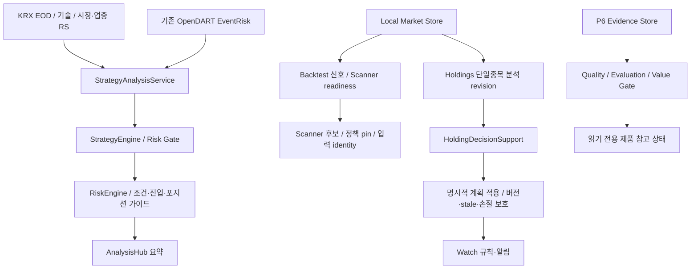
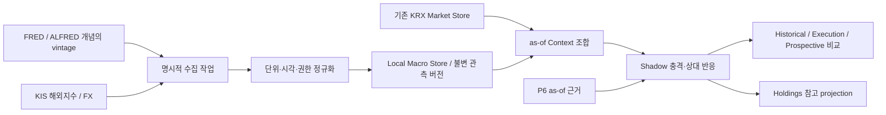
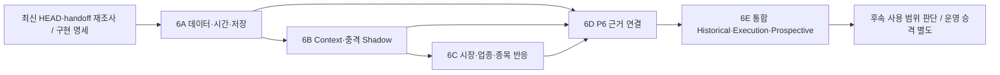

# StockScope NEXT-6 Macro / Event Architecture Design

작성일: 2026-09-29 (Asia/Seoul)  
문서 지위: **미래 구현을 위한 DESIGN BASELINE — 구현 명세·운영 승인·자동화 활성화 승인이 아님**  
조사 기준 HEAD: `170a57c3b942bdee807a7e3a9ce5389bf8fb7338`  
최근 커밋: `Merge pull request #14 from SkyBluekor/feature/next3-prospective-evidence-flow`

이 문서는 현재 코드의 읽기 조사와 공식 공급자 문서 확인만으로 작성했다. 소스·DB·migration·UI·테스트·환경설정을 변경하거나 애플리케이션을 실행하지 않았다. FRED 데이터 API, KIS 데이터 API, Jev를 호출하지 않았다. 실제 API Key를 출력하거나 문서에 저장하지 않았다. 웹 확인은 공개 설명 페이지와 공식 코드 예제에 한정했다.

작업 시작 시 `.env.example`에 기존 미커밋 변경이 있었다. 이를 유지했으며, FRED 항목은 비밀값을 출력하지 않는 검사에서 placeholder 형식으로 확인됐다. 엄격한 빈 값 표기와는 다르므로 향후 별도 설정 작업에서 사용자의 `FRED_API_KEY=` 요구를 반영할 수 있다. 이번 작업에서는 수정하지 않는다. `.env`의 실제 키 준비 여부는 사용자 제공 사실이며 인증 성공을 검증한 것이 아니다.

표기 원칙:

- **[현재 구현]**: 해당 HEAD의 코드에서 확인한 동작. 운영 데이터 충족·실제 배포 완료까지 의미하지 않는다.
- **[설계 제안]**: NEXT-6에서 구현 명세로 구체화할 방향. 아래 개념 필드와 상태는 클래스·DB schema의 확정 선언이 아니다.
- **[미결정]**: 데이터·운영 근거와 승인이 필요한 정책. 숫자·가중치·승격 조건을 임의로 채우지 않는다.
- 기존 `VN-P6-S1 Event Evidence`와 이번 `NEXT-6 Macro/Event`는 다른 작업 축이다. P6 기반이 이미 있다고 NEXT-6가 구현된 것은 아니다.

## 1. Executive Summary

StockScope는 이미 국내 EOD 분석, 시장 대비 상대강도, 제한된 업종 대비 상대강도, 위험 계획, Holdings 의사결정·Recovery·Watch, Historical/Execution/Prospective 검증, P6 Event Evidence를 갖추고 있다. 그러나 글로벌 거시 충격을 시점에 맞춰 국내 시장·업종·종목 반응과 연결하는 공통 입력은 없다.

권고안은 **기존 KRX 국내 EOD 기반을 유지하면서 KIS 해외지수·환율 후보와 FRED 금리·변동성 후보를 최소 조합으로 수집하고, 별도 Local Macro Store에서 읽는 Macro Context를 Shadow로 검증하는 것**이다. 기존 StrategyInput의 점수·MarketRegime·Risk Gate를 즉시 바꾸지 않는다.

핵심 설계 판단은 다음과 같다.

1. FRED의 우선 증분 가치는 DGS10과 관측 vintage 관리다. VIXCLS는 KIS 동일 시계열의 적합성·권한·과거 범위를 확인한 뒤 한 공급자만 선택한다.
2. 지표 수보다 observation date, 실제 이용 가능 시각, vintage, 수집 시각을 분리하는 계약을 먼저 만든다. FRED/ALFRED의 날짜 단위 이력만으로 정확한 장중 이용 가능 시각을 증명하지 않는다.
3. 기존 5/20/60 공통 거래일 상대강도 계산을 재사용하되, 충격 반응 창과 시장→업종→종목 분해는 별도 결과로 둔다. 현재 업종 매핑이 과거시점 기준임을 입증하지 못하면 연구용 제한을 유지한다.
4. 기업 사건, 거시 관측, 감지된 충격, 가격 반응을 서로 다른 근거로 보존한다. Evidence Quality와 shock strength는 수익 확률이 아니다.
5. NEXT-6A~E를 데이터/시간 계약 → Context/충격 → 상대 반응 → Event 연결 → 통합 검증으로 나눈다. 검증 프로토콜은 A에서 선등록하고 E에서 종합 평가한다.

예시의 “미국 금리 상승 → 기술주 약세 → 한국 Risk-Off → 업종 분화”는 **관측된 선후관계와 연관 반응**으로 설명한다. 이 경로만으로 인과관계나 개별 종목 하락의 원인을 확정하지 않는다.

## 2. Current State Audit

### 2.1 조사 범위와 문서보다 우선한 코드

아래 경로의 구현·호출 경계와 관련 테스트 선언을 읽었다. 테스트는 실행하지 않았고 로컬 DB의 실데이터 개수·진행 중 작업·운영 승인 상태는 확인하지 않았다. 따라서 “코드 존재”와 “운영 검증 완료”를 분리한다. 작업 트리에서 추적된 코드 변경은 없었으므로 소스 조사 결과는 위 HEAD와 일치한다.

기존 [handoff](StockScope_HANDOFF_2026-09-28_P5S1E_COMPLETE.md)는 P6를 LATER로 기록하지만 현재 코드에는 P6 평가·Value Gate·제품 조회가 존재한다. [P6 완료 보고서](StockScope_P6_S1_FINAL_VERIFICATION_2026-09-28.md)의 과거 실데이터 0건 기록은 당시 보고이며 이번 조사에서 다시 확인한 수치가 아니다. NEXT-3 병합과 NEXT-2 Workspace 조회 구현도 코드로 확인했다. NEXT-2 및 NEXT-3~5의 작업 상태를 이 문서에서 재정의하거나 완료 선언하지 않는다.

| 영역 | [현재 구현] 확인 내용과 코드 근거 | NEXT-6에서 재사용할 것 / 한계 |
|---|---|---|
| Scanner | [`backtest/scanner.py`](../backend/app/backtest/scanner.py)의 `StockScannerService`, `_quick_current_candidate`, `run`. 공통 확정 날짜, 입력 fingerprint, 선택 정책 pin, 후보 readiness 및 과거 evidence를 사용한다. 실체는 `app/scanner`가 아니라 `app/backtest`에 있다. | 기본 후보 집합·순서·점수·결과 identity를 동결한 비교 기준. Macro 필드는 현재 없다. |
| Strategy Engine | [`strategy/engine.py`](../backend/app/strategy/engine.py)의 `evaluate_all`, `_risk_gate`; [`strategy/context.py`](../backend/app/strategy/context.py)의 `build_strategy_input`. 여러 전략의 적합도와 유동성·사건·급격한 움직임 등 gate를 평가한다. | 적합도 점수는 수익 확률이 아니다. Macro strength를 기존 점수로 더하지 않는다. |
| Risk Engine | [`risk/engine.py`](../backend/app/risk/engine.py)의 `build_plan`. ATR·구조적 기준·전략별 손절/목표/RR, unavailable 및 risk gate를 반영한다. | 위험 계획이 최종 방어 경계. 상대적 강세가 손절 위반을 무효화하지 않는다. |
| Strategy Market Regime | [`strategy/context.py`](../backend/app/strategy/context.py)의 `regime_from_index`: 지수 일변화율 ≥1.0이면 TREND_UP, ≤−1.0이면 TREND_DOWN, 나머지는 RANGE, 값이 없으면 UNKNOWN. | 국내 일별 단순 분류. 이 함수는 PANIC을 생성하지 않지만 Engine은 PANIC 입력을 차단한다. Macro 충격을 PANIC으로 자동 치환하면 기존 계약을 바꾼다. |
| Dashboard Market Regime | [`market/service.py`](../backend/app/market/service.py)의 `_market_regime`: KOSPI/KOSDAQ 변화와 상승 종목 비율로 별도 표시 문구를 만든다. | Strategy regime과 동일한 전역 체계가 아니다. Macro Context에 출처·버전을 구분해 담아야 한다. |
| 시장 상대강도 | [`market/relative_strength.py`](../backend/app/market/relative_strength.py)의 `RelativeStrengthAnalyzer.analyze`: KRX 확정 EOD 공통 날짜, 5/20/60 기간, 종목수익률−지수수익률, 상대비율 추세. | 계산·결측 처리 재사용 가능. 수동 현재가와 EOD 지수를 혼합하지 않는 원칙 유지. 1일 충격 반응은 현재 기본 기간에 없다. |
| 업종 상대강도 | [`market/sector_relative_strength.py`](../backend/app/market/sector_relative_strength.py): OpenDART 산업코드 앞자리→넓은 KRX 업종 alias 매핑, 신뢰 가능한 지수 없으면 unavailable. | 반도체·2차전지 같은 세밀한 테마를 정확히 대표한다고 보장할 수 없다. |
| 과거 업종 입력 | [`backtest/sector_rs_input.py`](../backend/app/backtest/sector_rs_input.py)의 `HistoricalSectorInput`, `evaluate_historical_sector_input`: POINT_IN_TIME만 Production 입력 허용, STATIC_CURRENT/UNKNOWN은 audit-only. Scanner prefetch는 기본 비활성이고 준비된 현재 매핑은 STATIC_CURRENT다. | 이미 있는 누수 방지 경계를 유지. 현재 매핑을 과거 소속으로 대입하는 방식은 금지. |
| Holdings analysis | [`holdings/analysis.py`](../backend/app/holdings/analysis.py): `SingleStockAnalysis`, read-only Market Store, `_NoNetworkProvider`, Scanner 공통 분석 사용, fingerprint와 source versions. | 분석 중 외부 조회 금지 경계 재사용. Macro는 미리 준비한 별도 snapshot을 읽도록 설계. |
| Holdings decision support | [`holdings/decision_support.py`](../backend/app/holdings/decision_support.py): HOLD/ADD/REDUCE/TAKE_PROFIT/STOP/EXIT 판단, 불변 근거 저장, resolution, 원본 position/revision/plan/valuation 변화에 대한 stale 검사. | 기존 판단 옆의 Shadow proposal만 추가하는 방향. 실제 계획 변경은 기존 명령·검증을 거쳐야 한다. |
| 계획 적용 | [`holdings/management.py`](../backend/app/holdings/management.py): 계획 버전, 원본 revision/시간/horizon/적용 가능성, 충돌 및 `HOLD_PLAN_STOP_LOOSENING_BLOCKED`. | 상대적 강세를 근거로 손절을 낮추거나 활성 계획을 직접 덮어쓰지 않는다. |
| NEXT-2 Workspace | [`holdings/workspace_query.py`](../backend/app/holdings/workspace_query.py)의 `HoldingsWorkspaceQueryService`: 저장된 상태를 read-only로 조합하며 schema 초기화·재분석·Watch 전이·계획 적용을 수행하지 않는다. | 향후 조회 연결 지점. 조회 요청에서 Macro backfill/갱신/재평가를 실행하지 않는다. |
| Recovery | [`holdings/recovery.py`](../backend/app/holdings/recovery.py): 검토와 assessment, thesis/review action, 현재 근거·원본 active plan version·분석 revision을 보존하고 source 변경을 검사한다. | 추가 분석 근거를 연결할 후보. 손실 회복·물타기를 Macro가 승인하는 구조는 아니다. |
| Watch | [`watch/state_machine.py`](../backend/app/watch/state_machine.py), [`watch/service.py`](../backend/app/watch/service.py), [`watch/coordinator.py`](../backend/app/watch/coordinator.py): quote coverage/stale/order, 확인·재무장, 계획 버전 기반 규칙 및 episode. | 상태 기계는 계획·거래를 변경하지 않는다. [`watch/policy.py`](../backend/app/watch/policy.py)의 Production 기본은 `enabled=False`, `OPERATING_THRESHOLDS_UNAPPROVED`. 존재와 활성화를 혼동하지 않는다. |
| P6 Event Evidence | [`event_evidence/models.py`](../backend/app/event_evidence/models.py), [`store.py`](../backend/app/event_evidence/store.py), [`time.py`](../backend/app/event_evidence/time.py), [`policy.py`](../backend/app/event_evidence/policy.py). source/native identity/hash, source 권한 snapshot, revision 및 available_at 계약. | FRED가 자동으로 승인된 source는 아니다. series 정책·시간 증거를 별도 판정해야 한다. |
| P6 entity / resolution / quality | [`entity.py`](../backend/app/event_evidence/entity.py)에 MACRO/POLICY/COUNTRY/INDUSTRY, MACRO_EXPOSURE 등이 이미 존재. [`resolution.py`](../backend/app/event_evidence/resolution.py)의 canonical/duplicate/정정/철회 as-of 조회, [`quality.py`](../backend/app/event_evidence/quality.py)의 USABLE/LIMITED/INSUFFICIENT/BLOCKED. | 완전히 새 event 체계를 만들 필요는 없다. enum 존재가 실제 macro corpus·검증된 기업 노출 관계의 존재를 뜻하지 않는다. |
| P6 평가·제품 연결 | [`evaluation.py`](../backend/app/event_evidence/evaluation.py), [`value_gate.py`](../backend/app/event_evidence/value_gate.py), [`product.py`](../backend/app/event_evidence/product.py). 시장 반응·대조군·불변 보고·증분 가치와 read-only projection 존재. Value Gate V1은 prediction 승인 불가. [`StockNewsPanel.tsx`](../frontend/src/components/StockNewsPanel.tsx)는 full view에 P6 표시. | 단순 뉴스 패널 기능으로 축소하지 않는다. compact Scanner/Holdings 경로와 점수·계획 통합 완료로 확대 해석하지 않는다. |
| 기존 OpenDART EventRisk | [`market/event_risk.py`](../backend/app/market/event_risk.py)의 제목 규칙·구조화 공시·가격 반응, NEGATIVE/HIGH 사건 gate. [`strategy/service.py`](../backend/app/strategy/service.py)의 단일종목 경로에 연결. | 기존 제품시간 공시 위험 경로와 P6 corpus를 구분. Backtest `_signal_snapshot`은 `event_risk=False`이므로 동일 사건 기능이 전 경로에 있다고 가정하면 안 된다. |
| NEWS | [`news/policy.py`](../backend/app/news/policy.py), [`news/service.py`](../backend/app/news/service.py): NAVER 검색 표시/정규화, provider별 임시 캐시 정책, transform/AI 불허. | NEWS.1 표시 결과를 Macro 감지·예측 입력으로 가져오지 않는다. |
| Historical Validation | [`simulation/validation_replay.py`](../backend/app/simulation/validation_replay.py): Production Scanner 코드를 사용하는 로컬 전용 재생, 날짜별 manifest·선택 정책 고정, 네트워크 hard block. | Macro 과거 재생도 사전 수집된 입력만 사용. 기존 replay를 새 거시 전략으로 은밀히 교체하지 않는다. |
| Execution Validation | [`simulation/execution_engine.py`](../backend/app/simulation/execution_engine.py): D까지 신호 구성, D+1 이후는 동결된 실행 시뮬레이터에 전달. 기본 보유 기간 20일·왕복 비용 0.0 코드 존재. | D+1은 다음 국내 거래일. 비용 기본값을 현실 비용의 검증 완료로 간주하지 않고 후보 정책과 baseline에 동일 비용을 적용. |
| Prospective / Feedback | [`prospective/service.py`](../backend/app/prospective/service.py), [`evaluation.py`](../backend/app/prospective/evaluation.py), [`feedback/adapter.py`](../backend/app/feedback/adapter.py): capture 고정·중복/partial 처리·development/holdout/purge·원본 read-only 근거 조합. 현재 NEXT-3에는 P5 evidence 등록 UI도 존재. | 앞으로 알게 될 outcome과 현재 snapshot을 분리하는 기반. evidence 등록이 Production 승격은 아니다. |
| P5 Governance | [`simulation/strategy_change.py`](../backend/app/simulation/strategy_change.py), [`strategy_governance.py`](../backend/app/simulation/strategy_governance.py). Production 기본 protocol은 `activation_eligible=False`, `q7_precommitted=False`; 테스트 전용 protocol은 별도다. | Macro의 좋은 실험 결과만으로 선택 정책 활성화·교체 금지. |
| KIS | [`market/kis/client.py`](../backend/app/market/kis/client.py)는 국내 가격/일봉 허용목록. [`integrations/kis/`](../backend/app/integrations/kis/__init__.py)는 국내 quote, 잔고, 휴장일, token, WebSocket 등을 제공. | 해외지수·환율·금리 Macro connector는 현재 검색 범위에서 발견되지 않았다. 공식 제공 가능성과 현재 연동을 구분한다. |
| Market Store / Cache | [`backtest/market_store.py`](../backend/app/backtest/market_store.py): KOSPI/KOSDAQ 전용 stock_daily/main_index_daily/day_status 및 무결성. 날짜별 upsert/replace. [`history_store.py`](../backend/app/backtest/history_store.py): 종목/지수 gzip 이력. KRX provider raw cache·예산과 Scanner 결과 캐시도 존재. | 일별 국내 최신 snapshot 저장과 Macro vintage 보존은 다른 계약. 현재 store를 불변 vintage DB라고 부르지 않는다. |

### 2.2 현재 Final Decision 흐름

단일 통합 `FinalDecision` 서비스가 모든 기능을 처리하는 구조로 가정하지 않는다. 현재 주요 경로는 다음과 같다.

단일종목 서비스는 EOD와 수동 기준가격 경로를 구분하며, 상대강도는 확정 EOD 기준을 유지한다. Scanner/Holdings 공통 신호 경로와 단일종목 서비스의 EventRisk 입력은 동일하지 않다. P6·NEWS가 이 모든 판단에 이미 직접 반영되는 것도 아니다. 향후 비교는 각 baseline 경로별로 수행해야 한다.

Execution의 `_freeze_signal`은 현재 `sector_input=None`으로 Scanner 후보를 다시 만들고 전략/action/state의 일치 여부를 검사한다. 따라서 과거 업종 입력 타입이 존재한다고 Execution Validation까지 업종·Macro 신호를 재생한다고 주장할 수 없다. 새 Shadow 입력은 별도 실행 계약과 identity를 통해 전달해야 하며 baseline의 parity 검사를 무력화해서는 안 된다.

## 3. Current Capability Gaps

| 우선순위 | 공백 | 왜 중요한가 |
|---|---|---|
| 1 | 거시 관측의 실제 이용 가능 시각·vintage·수집 이력 및 공통 Context 부재 | 현재 수정값으로 과거 신호를 재계산하면 성과가 왜곡된다. |
| 2 | 글로벌 충격→국내→업종→종목의 동일 cutoff/반응 창 연결 부재 | 미국 D 종가와 한국 D 종가를 무조건 합치면 미래 정보를 사용한다. |
| 3 | 과거시점 업종 소속과 세밀한 업종 benchmark 부족 | 현재 broad industry mapping으로 과거 반도체/2차전지 상대 반응을 확정할 수 없다. |
| 4 | 공급자 capability와 구현 차이 | KIS 해외 기능을 이미 수집 중이라고 전제하거나 FRED와 중복 수집하기 쉽다. |
| 5 | 증분 가치 검증과 변경 정책의 연결 미정 | Evidence-only 결과만으로 수익률 개선·자동 방어 효과를 주장할 수 없다. |
| 6 | 기존 경로별 의미 차이 | dashboard regime/Strategy regime, live EventRisk/backtest, P6 reference/판단 입력의 경계를 유지해야 한다. |

최대 공백은 단일 금리 시계열이 없다는 것이 아니라 **시간에 맞는 입력·관계·결과 identity를 끝까지 보존하는 cross-market 분석 계약**이 없다는 점이다.

## 4. NEXT-6 Goals / Non-Goals

**[설계 제안] 목표**: 최소 거시 입력, 재현 가능한 Local Macro Store, 재사용 가능한 Context, 설명 가능한 충격 후보, 시장·업종·종목 상대 반응, P6 근거 연결, 동일 baseline 대비 Shadow 검증, Holdings 재평가를 위한 읽기 전용 근거를 만든다.

**비목표**: 전방위 경제 데이터 플랫폼, 뉴스 감성 예측, 인과 추정의 확정, 운영 임계값/가중치의 임의 설정, 기존 Scanner 점수·Holdings 계획 즉시 변경, Watch 자동 활성화, NEXT-2~5 선행/대체 구현, Jev API/schema/call, MCP 구현, 증권사 주문 실행.

최종 제품 목표인 “충분히 검증된 범위의 대응 계획 자동 조정”은 보존한다. 그러나 NEXT-6A~E의 기본 완료 범위는 Shadow/Evidence-only다. 자동 조정은 별도 정책·검증·운영 승인 명세를 통과해야 하며 증권사의 실제 매수/매도 주문은 영구 금지한다. 근거: [`core/trading_policy.py`](../backend/app/core/trading_policy.py).

## 5. Data Source Architecture

### 5.1 최소 조합과 소유권

| 데이터 의미 | 우선 소유자 제안 | 현재 상태 / 채택 조건 |
|---|---|---|
| 국내 종목·KOSPI/KOSDAQ EOD | 기존 KRX + Market Store | 이미 사용. KIS/FRED로 중복 backfill하지 않는다. |
| 국내 업종 EOD·소속 | 기존 KRX 업종지수 + 검증된 mapping | 현재 OpenDART broad mapping 재사용 후보. 과거 소속 증명과 업종 이력 저장 보강 필요. |
| USD/KRW | KIS 해외 환율 일별 조회 후보 | 현재 connector 없음. 통화 방향, 기준시각, 일봉 의미·과거 범위·권한 확인 후 채택. |
| 미국 주가지수 | KIS 해외지수 후보 | 초기는 broad index 1개. 기술주 반응을 별도로 검증할 때 Nasdaq 계열 1개를 추가할지 결정. 정확한 코드/지수 종류는 미확정. |
| 미국 10년 만기 constant-maturity yield | FRED DGS10 우선 | percent 단위 일별 관측, H.15 출처. 단순 국채 가격/선물/다른 수익률과 동일 지표로 취급하지 않는다. |
| VIX close | FRED VIXCLS 조건부 우선 | KIS가 동일 close의 권한·과거 범위·시점 근거를 충족하면 KIS로 단일화 가능. VIX 선물·유사 변동성 지수는 대체물이 아니다. |
| 미국 정책금리 | 기본 제외, 필요 시 FRED | effective rate와 target range를 구분한 가설이 있어야 한다. 금리 충격 검증에 증분 가치가 없으면 추가하지 않는다. |
| 기타 거시지표 | 초기 제외 | 발표지연·수정·권한·증분 가치 비용을 정당화할 때 별도 채택. |

공식 KIS 예제는 `inquire-daily-chartprice`에서 해외지수(N), 환율(X), 국채(I) 등의 구분을 안내한다. 따라서 “KIS에는 금리가 없으니 무조건 FRED”라고 단정하지 않는다. 다만 이 예제만으로 DGS10과 같은 측정 정의, VIX close coverage, 계정별 사용 가능성, 과거 PIT 시점까지 충족한다고 볼 수 없다. [한국투자증권 공식 예제](https://github.com/koreainvestment/open-trading-api/blob/main/examples_llm/overseas_stock/inquire_daily_chartprice/inquire_daily_chartprice.py).

**중복 방지 단위는 이름이 아닌 의미**다. series owner 등록부에 instrument/측정 정의, 단위, 통화, close session, adjustment, source를 고정한다. 하나의 의미에 active owner는 하나만 둔다. 장애 시 두 공급자를 동시에 수집하거나 값 사이를 조용히 오가지 않는다. 공급자 전환은 별도 버전·전환일·승인과 재검증을 남기며 기존 snapshot을 재작성하지 않는다.

### 5.2 데이터 흐름

외부 수집은 사용자 분석·조회 요청과 분리한다. 종목별 분석마다 FRED/KIS 요청을 반복하지 않으며 같은 cutoff의 시장 Context를 여러 종목이 참조한다.

## 6. FRED Integration Concept

### 6.1 기능 경계

**[현재 구현]** `backend/app`과 `frontend/src` 조사 범위에서 FRED connector, MacroContext, RATE_SPIKE 분석을 찾지 못했다. `FRED_API_KEY` 환경 항목이 있다고 코드 연동이 존재하는 것은 아니다.

**[설계 제안]** 수집기는 키를 서버에서만 읽고 series allowlist·요청 범위·vintage 정책·응답 정규화를 담당한다. URL query, 예외, retry log, request identity, raw request 기록에서 키를 제거한다. 키는 dataset hash·source identity에 포함하지 않는다. `.env.example`에는 비밀값을 저장하지 않는다.

FRED series metadata, observations, vintage dates, release metadata를 구분해 취급한다. `observation_start/end`는 관측기간이고 `realtime_start/end` 또는 `vintage_dates`는 과거 정보 상태 선택이다. observations에는 real-time period, vintage별 전체/신규·수정, 최초 발표만의 출력 방식이 있다. NEXT-6에서는 최초값만으로 모든 과거 판단을 대신하지 않고 각 cutoff 당시 보였던 버전을 재구성해야 한다. [공식 observations 문서](https://fred.stlouisfed.org/docs/api/fred/series_observations.html), [공식 vintage dates 문서](https://fred.stlouisfed.org/docs/api/fred/series_vintagedates.html).

### 6.2 최소 후보의 의미

- DGS10: 미국 10년 constant-maturity yield의 일별 percent 값. 변화량은 `100 × (금리_t − 금리_previous)` bp로 계산한다. 예를 들어 4.00%→4.10%는 +10bp이며 +0.10% 수익률로 해석하지 않는다. [DGS10 공식 설명](https://fred.stlouisfed.org/series/DGS10).
- VIXCLS: CBOE 변동성 지수의 daily close. level, point 변화, 상대 변화율을 혼동하지 않는다. 공식 설명에 CBOE 저작권·출처 요구가 있으므로 FRED 공개 접근을 P6의 모든 retention/AI/prediction 권한으로 확대하지 않는다. [VIXCLS 공식 설명](https://fred.stlouisfed.org/series/VIXCLS).
- 정책금리: 금리 level 배경의 필요성과 실제 거래 판단 증분 가치가 확인될 때만 후보를 확정한다. GDP/CPI 등 수정·발표 주기가 다른 지표를 단순히 목록을 늘리기 위해 넣지 않는다.

**[미결정]** series별 archive coverage, 정확한 availability 증거, 수집 주기·허용 age, 비용/호출 예산, 이용 범위, KIS와의 최종 소유권. 공식 문서만 읽었으며 데이터 API 호출로 확인하지 않았다.

## 7. Macro Context Model

### 7.1 공통 시장 Context와 종목 영향의 분리

**[설계 제안]** 시장 전체에서 공유하는 Macro Context와 특정 종목·업종의 Impact Context를 분리한다. 동일 시장 날짜의 금리·환율 관측을 종목 수만큼 복제하지 않는다. typed object를 새로 만들지, 기존 dict projection에 연결할지는 구현 시 결정한다.

| 개념 묶음 | 필요한 의미 | 불변조건 |
|---|---|---|
| identity | context ID/hash, contract/normalizer/policy version, source manifest hash | 같은 의미 입력+정책+cutoff는 같은 내용 identity. 조회 시각은 별도 운영 metadata. |
| decision clock | UTC decision cutoff, 국내 market_date, session calendar/version, EOD 확정 근거 | 날짜 문자열만으로 as-of join하지 않는다. |
| availability | complete/partial/unavailable, missing reasons, freshness, time quality, 허용 사용 범위 | null은 0 또는 NORMAL이 아니다. component별로 표시. |
| observations | series/native source, 단위, 값, observation date, session end, available_at 근거, vintage ID, local first_seen, hash | 모든 계산 입력을 원본 버전까지 추적 가능. |
| features | 금리 bp 변화, VIX level/변화, USD/KRW 변화, 미국지수 수익률, 기간/기준 관측 | 변환식·기간·정렬 방법·기준 날짜를 명시. |
| Korea context | 국내 시장 return, breadth 등 실제 준비된 항목, 기존 Strategy regime과 그 버전 | 기존 regime 그대로 참조. Dashboard 표시 분류와 구분. |
| shock assessment | 후보 유형 목록, 각 차원의 강도, episode identity, detection cutoff, calibration version, 미확정 사유 | 방향 예측·점수 가중치와 분리. 복합 충격은 원소를 보존. |
| evidence links | P6 canonical event/revision/quality/policy 참조 | 뉴스 원문·미승인 corpus를 복제하지 않는다. |
| usage scope | reference-only / 연구 Shadow / 적용 비허용 사유 | quality=USABLE이 Production 승인을 뜻하지 않는다. |

종목 Impact Context는 `context_ref`, ticker/market, 업종 benchmark/mapping version/effective dates, 공통 반응 창, 시장/업종/종목 return과 excess, 기존 RS 참조, limitations를 가진다. Holdings/Watch의 plan_version 등은 소비자 연결 기록에 둔다.

### 7.2 재현성과 격리

입력 manifest는 거시 관측 버전, 국내 시장 입력 identity, 업종 매핑, source policy, 달력·cutoff 정책, feature/충격 calibration 버전을 모두 포함한다. 기존 Scanner fingerprint의 의미를 바꾸지 않고 `baseline identity + macro identity + comparison protocol identity`의 별도 결합 identity를 제안한다. 새로운 거시 데이터를 수집해도 이미 동결된 판단·과거 보고서 hash는 바뀌지 않는다.

## 8. Market Shock Detection

### 8.1 분류 후보

| 후보 | 관측 근거 | 주의점 |
|---|---|---|
| RATE_SPIKE | 가용 DGS10의 bp 상승과 과거 분포 대비 이례성 | 금리 상승이 항상 주가 하락을 뜻하지 않는다. |
| VOLATILITY_SHOCK | VIX level·변화·분포 | 높은 level의 지속과 새 충격을 분리한다. |
| FX_SHOCK | USD/KRW의 방향·변화 크기 | 원화 약세 방향 정의와 평가 close 시각을 고정한다. |
| GLOBAL_EQUITY_SELL_OFF | 선택된 미국 broad/기술 지수의 하락 | 소수 지수만으로 전 세계가 하락했다고 단정하지 않고 coverage를 표시한다. |
| SECTOR_SPECIFIC_SHOCK | 시장 대비 업종 하락·기업군 반응 | 글로벌 원인 유형과 별도 reaction classification. 당일 업종 수익률로 미래 진입시점의 충격을 소급 정의하지 않는다. |
| 복합 충격 | 같은 episode/window의 여러 독립 차원 | 원소 목록을 유지. 임의 가중합 severity는 만들지 않는다. |
| NORMAL | 필요한 입력이 충분하고 승인된 규칙에서 이례 조건이 없음 | 데이터 결측 상태를 NORMAL로 대체하지 않는다. |
| UNKNOWN / 정책 미정 | 데이터·시각·학습 표본·분류 정책 불충분 | 충격 부재와 구분하며 이유를 보존한다. |

이는 taxonomy 후보이며 enum 확정안이 아니다. 시장 하락·급등 금리·섹터 weakness를 동시에 설명할 수 있는 다중 레이블 방식부터 검토한다. PRIMARY shock를 꼭 하나 선택해야 하는지는 미결정이다.

### 8.2 임계값 결정 절차

1. A 단계에서 source/시점/표본·기간 및 비교 가설을 선등록한다. training/development와 holdout을 분리한다.
2. training 구간에서 관측 간격별 bp/return 분포, rolling quantile 또는 robust standardized deviation 후보를 조사한다. 분포 추정은 각 시점 이전 데이터만 사용한다.
3. rate level과 변화, VIX level과 변화처럼 다른 feature를 구분하고 다중 탐색 수·선택 과정을 남긴다. lookback·최소 표본·threshold는 데이터와 검증 결과로 정한다.
4. 충격 episode 시작/유지/종료·반복 알림 정책을 훈련 구간에서 결정하고 고정한다. 검증 구간의 성과가 좋아지도록 사후 label을 수정하지 않는다.
5. holdout 및 이후 Prospective에서 같은 calibration을 평가한다. 표본 부족이면 UNCALIBRATED/판단 불가로 남긴다.

strength는 원시 크기(bp, point, %)와 동결된 분포의 percentile 등을 병기하는 후보다. “80점 충격 = 80% 하락 확률” 같은 해석을 금지한다. 공개 과거 위기 명칭으로 test 사건만 골라 튜닝하지 않고 전체 거래일 평가도 수행한다.

## 9. Market → Sector → Stock Impact

### 9.1 동일 기간에서의 설명용 분해

동일 공통 시작/종료 시점으로 계산한 단순 수익률을 각각 `r_market`, `r_sector`, `r_stock`이라 할 때:

- 시장 반응: `r_market`
- 업종의 시장 대비 반응: `r_sector − r_market`
- 종목의 업종 대비 반응: `r_stock − r_sector`
- 종목의 시장 대비 반응: `r_stock − r_market`
- 설명용 항등식: `r_stock = r_market + (r_sector − r_market) + (r_stock − r_sector)`

단위는 수익률 %와 차이 %p를 구분한다. 이는 동일 창의 산술 분해이며 인과 기여율이나 beta-adjusted alpha가 아니다.

| 예시 | 시장 | 업종 | 종목 | 업종−시장 | 종목−업종 | 종목−시장 |
|---|---:|---:|---:|---:|---:|---:|
| 상대적으로 강한 하락 | −2.0% | −0.5% | −0.4% | +1.5%p | +0.1%p | +1.6%p |
| 시장·업종·종목 추가 약세 | −2.0% | −2.8% | −4.0% | −0.8%p | −1.2%p | −2.0%p |

숫자는 사용자 시나리오를 설명하는 가상 예시이며 실제 주가 데이터가 아니다. 상대적 강세는 절대 손실과 함께 표시하며 “안전”, “손절 불필요”로 바꾸지 않는다.

### 9.2 기존 RS의 재사용 범위

기존 5/20/60 RS와 공통 날짜 정렬·결측 처리·benchmark 표시를 재사용한다. 하지만 종목−시장과 종목−업종을 각각 다른 날짜 집합에서 계산한 뒤 뺄셈하면 위 항등식이 깨진다. 세 자산의 **공통 session set과 endpoints를 먼저 고정**해야 한다. 누락 거래일이 있다면 실제 기간·누락 상태를 기록하고 단순 “20거래일”이라고 과장하지 않는다.

1일/충격 후 반응 창은 기존 장기 RS와 별도 feature다. 과거 반응 label의 D+1 이후 값은 평가 저장소에서만 다룬다. 실시간/당일 부분 반응은 confirmed EOD와 별도 basis로 격리하며 초기 범위에서는 제외하는 안을 권고한다.

### 9.3 글로벌 연결과 업종 제약

미국 session과 한국 session을 이용 가능 시각으로 연결한 후, 국내 반응을 해당 cutoff에 이미 알려진 부분과 이후 평가 label로 나눈다. “금리 충격 발생 직후 다음 한국 장”과 “한국 D 종가 판단 이후 D+1 실행”은 다른 실험이며 결과를 섞지 않는다.

현재 broad 업종 매핑은 반도체·2차전지 세부 benchmark를 보장하지 않는다. historical mapping에는 유효기간과 당시 알려진 분류, 변경 근거, benchmark identity가 필요하다. 현재 구성종목으로 과거 sector basket을 재구성하면 생존편향·소속변경 누수가 생길 수 있다. 대응 순서는 기존 KRX 업종 coverage 확인 → 소속 이력 확보 가능성 확인 → 부족한 구간을 제외/제한 → 필요할 때만 추가 공급자 검토다.

업종이 없으면 시장 대비 종목 반응만 제공하고 업종 잔차는 null로 남긴다. 기존 Strategy의 sector→market fallback을 “관측된 업종 강세”로 표시하지 않는다. beta/요인 회귀 방식은 충분한 과거 표본과 별도 검증이 있는 후속 후보이며 초기 필수 범위가 아니다.

## 10. Event Evidence Integration

### 10.1 유지할 네 가지 근거

| 근거 | 담당 역할 | 다른 근거로 변환하면 안 되는 것 |
|---|---|---|
| 기업 Event Evidence | 특정 기업 사건의 source authority·relevance·시간·revision | 권위 높은 기업 사건이 반드시 주가 상승/하락으로 이어진다는 결론 |
| Macro observation / event evidence | 금리·변동성 관측 또는 공식 정책 사건 | 수치 변화만으로 “연준 발표 사건”을 만들어내는 것 |
| Market Reaction | 정해진 시장·시각·창에서 확인된 반응 | 사후 하락을 최초 충격 감지의 입력으로 소급하는 것 |
| Sector / Stock Reaction | 동일 창에서의 relative impact | 사건 원인·상승 확률 또는 위험 gate 해제 |

거시 **관측값**, 알고리즘이 감지한 **충격 episode**, 실제 발표·정책 **사건**을 분리한다. 거시 시계열의 모든 행을 기업 뉴스처럼 canonical event로 저장하지 않는다. 감지 결과는 사용한 관측 버전과 detector 버전을 참조하고, 실제 사건 근거가 있을 때만 P6 canonical event에 연결한다.

### 10.2 P6 계약 재사용

**[현재 구현]** entity에는 MACRO/COUNTRY/POLICY/INDUSTRY와 MACRO_EXPOSURE가 있으므로 거시 범위를 표현할 출발점은 있다. source policy는 DISPLAY/NORMALIZE/RAW_RETENTION/DERIVED_RETENTION/AI_TRANSFORM/HISTORICAL_EVALUATION/PREDICTION_INPUT을 분리한다. NAVER/OpenDART 제품 표시 권한을 P6 연구·AI·예측 권한으로 자동 확장하지 않는 코드가 존재한다.

**[설계 제안]** FRED·KIS series별 정책을 확인한 뒤, 기업 사건과 거시 사건의 관계를 as-of evidence link로 표현한다. 예를 들어 “금리에 민감한 사업/재무 구조”는 당시 확인 가능한 구조화 노출 근거를 요구한다. 기술 업종이라는 이름이나 뉴스 제목만으로 모든 기업의 금리 노출을 CONFIRMED로 만들지 않는다. 권한 불명확한 필드는 제외하고 제한 사유를 남긴다.

중복·정정·철회 처리는 다음 경계를 가진다.

- 같은 발표를 인용한 여러 뉴스는 독립 사건 표본으로 세지 않는다. P6 canonical ID와 source origin을 유지한다.
- 같은 충격이 여러 날 계속되면 episode와 일별 관측을 구분한다. 새 threshold crossing과 기존 episode 갱신을 정책으로 구분한다.
- 동일 shock에 노출된 100개 종목을 100개의 독립 거시 충격으로 세지 않는다.
- 기업 사건의 정정/철회는 해당 수정본의 available_at 이후에만 반영한다. 이미 동결된 과거 판단은 보존한다.
- FRED 관측 revision은 수치 이력이다. 모든 수정 관측을 P6 사건의 WITHDRAWN 상태로 동일 처리하지 않는다.
- Evidence Quality=USABLE은 특정 사용 범위에서 근거를 쓸 수 있다는 뜻이다. 긍정/부정·수익률·확률로 환산하지 않는다.

### 10.3 기존 평가·제품 projection과의 차이

P6 `HistoricalEventEvaluator`는 reference close, 1/5/20 반응 창, 대조군·중복·maturity·hash 검증을 제공한다. 이 틀은 재사용할 수 있지만 현재 날짜 단위 시장 반응 계산을 미국/한국 timestamp join으로 곧바로 확장해서는 안 된다. 특히 `assessment_as_of`에서 날짜를 추출하는 경계는 market timezone 기준으로 재검토해야 한다.

P6 Value Gate V1은 observational incremental value이며 prediction이나 Strategy/Scanner 변경을 승인하지 않는다. Macro의 탐지·연관 반응 평가와 정책 성과 평가도 별도 protocol로 둔다. product query는 현재 LISTED_COMPANY 중심 projection이므로 MACRO entity가 있다는 이유만으로 모든 macro context가 UI/보유 판단에 노출된다고 가정하지 않는다.

## 11. Temporal / Leakage Safety

### 11.1 시간 축을 분리한다

| 시간/버전 | 의미 | 사용 원칙 |
|---|---|---|
| observation date / period | 경제 관측이 가리키는 날짜·기간 | 발표일·수집일이 아니다. |
| source release timestamp | 원천이 실제 공개한 시각 | timezone과 증거를 보존. 예정 calendar와 구분. |
| provider available timestamp | FRED/KIS에서 실제 이용 가능해진 시각 | 원천 발표보다 늦을 수 있다. |
| realtime interval / vintage date | 공급자가 표현하는 당시 정보 상태 | 날짜 단위 정보로 정확한 시각을 꾸며내지 않는다. |
| local first_seen / fetched_at | 이 시스템이 처음 확인/수집한 시각 | 오늘 backfill한 사실을 과거 운영 수집으로 위장하지 않는다. |
| available_at + time quality | 선택한 연구/운영 계약에서 이용 가능하다고 증명된 경계 | 근거와 사용 scope를 같이 기록. |
| decision cutoff | 판단에 들어갈 수 있는 최종 시각 | 모든 입력의 가용성이 이 시각 이하여야 한다. |
| outcome cutoff | 평가에 사용할 미래 label의 마지막 시각 | decision 입력과 다른 저장·조회 경계. |

**[설계 제안]** 운영 재현과 과거 공개정보 재구성을 분리한다.

- 운영 replay: 당시 로컬에 실제 수집된 version과 first_seen을 사용한다. 이후 backfill은 포함하지 않는다.
- historical research: 공식 archive에서 당시 공개된 version을 재구성할 수 있으나, 그 근거·불확실성을 표시한다. 당시 StockScope가 수집했다고 주장하지 않는다.
- today/latest research: 최신 수정값만 확보한 구간은 별도 탐색 자료이며 PIT 검증 표본에서 제외한다.

조회는 먼저 cutoff에 이용 가능한 관측 버전들을 제한하고 그 안에서 당시 최신 유효 버전을 선택한다. 현재 최신 row를 선택한 뒤 observation date만 과거로 자르는 방식은 금지한다. 과거 두 시점의 변화량 계산도 같은 cutoff에서 가용한 vintage를 사용하며 revision으로 바뀐 과거 기준값을 식별한다.

### 11.2 FRED와 ALFRED

FRED의 현재 시계열과 ALFRED의 과거 정보 상태는 목적이 다르다. FRED API는 real-time period/vintage 조회로 FRED·ALFRED 정보를 다룰 수 있어 ALFRED를 무조건 별도 공급자·별도 키 서비스로 추가할 필요는 없다. 다만 모든 series와 모든 과거 날짜에서 필요한 archive와 시간 정밀도가 확보된다는 보장은 없다. [FRED API 개요](https://fred.stlouisfed.org/docs/api/fred/overview.html), [Real-Time Periods](https://fred.stlouisfed.org/docs/api/fred/realtime_period.html), [ALFRED Help](https://alfred.stlouisfed.org/help).

공식 release/dates 문서는 원천 발표일이 FRED/ALFRED 이용 가능일과 반드시 같지 않다고 설명한다. 예정 발표일·페이지의 현재 Updated 시각·observation date를 각 과거 관측의 정확한 available_at으로 대입하지 않는다. [공식 release dates 문서](https://fred.stlouisfed.org/docs/api/fred/release_dates.html).

금리·시장 기반 series도 수정이 불가능하다고 가정하지 않는다. 과거 버전이 조회되지 않는 구간은 revision-free라고 단정하지 않고 `vintage coverage unknown`으로 기록한다. source revision과 adapter normalization 수정 역시 구분한다.

### 11.3 P6 시간 계약과 충돌하는 지점

**[현재 구현]** `TemporalEvidence`는 timezone-aware 시각을 요구하고 `available_at <= fetched_at` 등을 검사한다. `historical_evaluation_eligible`은 EXACT/PROVIDER_TIME만 허용하며 DATE_ONLY/INFERRED/UNKNOWN은 시간 분리 평가에 사용할 수 없다.

따라서 FRED vintage 날짜에 임의 자정이나 한국 장마감 시각을 붙여 PROVIDER_TIME으로 통과시키지 않는다. 날짜 정보만 있는 경우 다음 선택지를 명시한다.

1. 정확한 공개/제공 시각을 추가 증거로 입증하여 해당 scope에서 사용한다.
2. 입증 가능한 보수적 availability 상한을 별도 date-bounded 연구 protocol로 취급한다. 정책 승인 전에는 P6 historical eligible과 동등하게 보지 않는다.
3. 상한도 입증할 수 없으면 엄격한 historical 평가에서 제외하고 prospective 수집을 시작한 뒤 표본을 축적한다.

보수적 하루 지연을 적용했다는 이유만으로 누수 없음이 증명되지는 않는다. 정책의 상한·timezone·series 지연 근거와 제외 구간을 먼저 정해야 한다. 기본 권고는 기존 P6 계약을 느슨하게 바꾸지 않는 것이다.

### 11.4 미국/한국 EOD와 D / D+1

초기 비교는 **한국 D의 확정 EOD 분석 → 다음 국내 거래일 D+1 이후의 기존 실행 계약**을 유지한다. decision cutoff는 단순 15:30 고정이 아니라 해당 거래 세션의 close와 실제 EOD 확정·이용 가능성 정책을 포함해 구현 시 확정한다.

- 미국 현지 D의 장마감은 한국 D 장마감보다 뒤다. 한국 D의 판단에 미국 D 종가·D VIX close를 이름이 같은 날짜라는 이유로 넣으면 안 된다.
- “미국 직전 거래일”도 발표/제공 지연 때문에 한국 D cutoff 전에 이용 불가능할 수 있다. 실제 available_at을 확인한다.
- 미국 D−1의 정보가 한국 D 이전에 알려졌고 한국 D 반응을 확인했다면 D 종가 시점의 Context로는 유효할 수 있다. 같은 D 종가에 진입했다고 가정하면 안 된다.
- D cutoff 뒤 overnight 정보로 D+1 계획을 다시 평가하려면 별도의 pre-open 결정 snapshot·실행 protocol이 필요하다. 기존 D 신호를 다시 쓰지 않는다.
- 미국 DST는 `America/New_York`, 국내 시간은 `Asia/Seoul`, 비교는 UTC aware timestamp로 처리하는 안을 권고한다. FRED 날짜 경계의 의미는 source metadata에 따라 별도 확인한다.
- 미국/한국 휴장과 특수 세션을 각각 반영한다. D+1은 달력 다음 날이 아니다. 휴일의 carry-forward는 새 관측·0% 변화로 세지 않고 age와 stale 상태를 남긴다.

### 11.5 미래 구현에서 요구할 시간 검증 사례

한국 close 직전/직후 발표, 미국 DST 전환, 한쪽만 휴장, 지연 배포, 오늘 수집한 과거 자료, 나중 revision, 같은 날짜의 여러 수정, timezone 없는 입력, 기준 관측 결측, 현재 업종 소속의 과거 주입을 fixture로 검증한다. 미래 row를 추가해도 과거 context hash와 판단이 같아야 한다. 미래 correction/withdrawal 역시 과거 결과에 소급 적용되지 않아야 한다. 이번 작업에서는 fixture나 테스트 파일을 만들지 않는다.

## 12. Storage / Caching / Provenance

### 12.1 별도 Local Macro Store 권고

**[설계 제안]** Macro 저장소를 기존 Market Store와 논리적·물리적으로 분리한 SQLite 계열 저장소로 시작하는 안을 우선한다. 실제 경로·DDL은 구현 시 결정한다.

이유는 현재 `HistoricalMarketStore`가 KOSPI/KOSDAQ만 허용하고, `stock_daily/main_index_daily`의 날짜별 row를 upsert/replace하며, 생성자에서 schema를 준비하기 때문이다. 글로벌 series·발표 시각·동일 관측의 여러 vintage를 이 테이블에 억지로 넣으면 종목/시장 날짜 계약과 재현성이 손상된다. 기존 `day_status empty`도 macro 결측·미발표·API 장애와 같은 의미가 아니다.

공통 재사용 대상은 SQLite 운영 경험, canonical JSON/hash, input manifest, 로컬 reader, backup/restore 패턴이다. row 교체 방식까지 복사하지 않는다. 업종 이력은 국내 시장 데이터의 책임으로 남기되 저장 보강 위치는 최신 Market Store 구조를 다시 보고 결정한다.

### 12.2 개념상 보존 대상

| 대상 | 보존할 것 |
|---|---|
| series registry | canonical 의미, active owner, 단위/통화/빈도/달력/adjustment, source authority·capability 정책, normalizer version |
| immutable observation versions | observation period, 값 또는 missing 상태, source vintage/real-time metadata, 공개·제공·수집 시각 증거, 원본/정규화 hash |
| fetch manifest | 비밀정보 없는 요청 범위·옵션·pagination·응답 hash·수집 결과·검증된 coverage |
| derived context snapshot | 사용한 관측 version 목록, 국내 입력 proof, 정책·시간 정렬·변환 버전, content hash |
| operational cursor | series별 관측 진행과 vintage 변경 진행, 실패/재시도·누락 구간 | 

내용 identity와 작업 실행 ID를 분리한다. 동일 응답 재수집은 관측을 중복 생성하지 않되 수집 시도 이력은 운영 기록으로 남길 수 있다. 같은 observation date에 새 값이 오면 append-only revision을 만들고 과거 값을 덮어쓰지 않는다. FRED 날짜 범위 결과의 `realtime_start/end`를 무조건 원천 수정 발생시각으로 해석하지 않고 요청 방식과 원본 metadata를 함께 보존한다.

### 12.3 backfill과 증분 갱신

1. **최초 backfill**: 승인된 series·기간·vintage scope와 권한을 먼저 고정한다. 좁은 범위부터 pagination·정규화·누락·시간 근거를 검증하고 완료된 구간만 게시한다. latest-only backfill과 PIT archive coverage는 다른 완료 상태다.
2. **증분 update**: 최신 observation date만 추적하지 않는다. 과거 관측의 새 revision을 찾을 vintage cursor와 재확인 정책도 필요하다. metadata는 별도 느린 갱신으로 중복 다운로드를 줄인다.
3. **수집 합치기**: `(owner, series, observation 범위, vintage 범위, 변환 옵션)` 요청 단위로 single-flight·잠금·checkpoint를 둔다. 종목 100개 분석 시 series 수만큼만 수집한다.
4. **atomic publish**: 부분 응답은 staging/불완전 상태로 격리하고 검증된 manifest만 reader에 노출한다. 전체 Context가 같은 generation의 입력 참조를 보도록 한다.
5. **재시도**: source별 요청 예산·backoff·retry ceiling을 둔다. 숫자는 운영 정책으로 결정한다. 실패를 성공한 empty day로 저장하지 않는다.

분석은 local reader만 호출한다. cache miss이면 `MISSING/NOT_PREPARED`를 반환하고 별도 데이터 준비 명령을 안내할 수 있으며 즉석 API 호출로 복구하지 않는다.

### 12.4 freshness, 보존, 복구

freshness는 시스템 현재시간과의 단순 차이만이 아니라 series 발표 주기·예상 가용성·휴장일에 따라 판단한다. `latest observation age`, `last successful fetch`, `expected release status`, `revision check age`를 분리한다. 오래된 값은 reference-only 사용 여부까지 정책에 명시하고 live shock detection에 신선한 값처럼 투입하지 않는다.

불변 snapshot은 policy/version/hash로 검증한다. 국내 Market Store가 정정되어 원본 hash가 달라지면 과거 실행을 조용히 재계산하지 않고 현재 proof 패턴처럼 변경을 감지한다. 재현에 필요한 입력을 보존할 권한·공간이 없으면 그 한계를 보고한다.

Macro Store는 기존 [`backup_runtime.py`](../tools/data/backup_runtime.py) / [`restore_runtime.py`](../tools/data/restore_runtime.py)의 후속 명시적 확장 대상으로 기록한다. 별도 DB 간 원자 트랜잭션을 가정하지 않고 manifest가 참조하는 version들이 모두 존재하는지 검증하는 복구 계약이 필요하다. writer 중단/일관 snapshot 전략·무결성·정책 snapshot·reader schema 지원 여부를 미래 backup 검증에 포함한다. 지금 backup 실행·schema/migration 작성은 하지 않는다.

## 13. Validation Architecture

### 13.1 비교 단위와 두 가지 평가

baseline은 당시 HEAD, Scanner/Strategy/exit/selection policy, horizon, 입력 manifest, 국내 시장 날짜, 후보 집합을 고정한 **Existing StockScope**다. 비교군은 같은 baseline에 별도 Macro Context를 결합한다. live 단일종목 EventRisk와 Scanner replay의 입력 차이도 cohort metadata에 남긴다.

**평가 A — Evidence-only**: 기존 점수·계획·거래는 그대로이며 Macro annotation만 추가한다. 주된 지표는 coverage, availability 증명률, 재현성, 충격 episode 구분, 근거 관련성, 반응의 설명 가능성이다. 동작이 같으므로 거래 수익률·MDD가 개선됐다고 주장할 수 없다.

**평가 B — Shadow 정책**: 향후 명시적으로 정의한 대안 정책을 가상 실행한다. 어떤 조건에 HOLD 유지/방어/재검토를 제안하는지 먼저 고정하고 baseline과 동일 실행 시뮬레이터·비용·자본·동시 포지션 규칙으로 비교한다. 정책이 아직 없으면 성과 지표는 “미평가”다. 이번 설계가 행동 threshold·비중·가중치를 정하지 않는다.

### 13.2 검증 계층

| 계층 | 기존 기반 | NEXT-6 추가 평가 |
|---|---|---|
| Contract / Data | input identity, P6 hash/time/rights, read-only provider 경계 | source 중복 방지, 단위 변환, 결측 상태, vintage 재생, 네트워크 0 분석, 미래 row 불변성 |
| Historical | frozen Scanner replay + manifest | D별 as-of Macro, 시간 안전성 등급별 coverage, 충격/정상 전체 구간, 업종 mapping 적격 여부 |
| Execution | D 신호 동결 / D+1 이후 실행 | baseline과 후보의 동일 비용·fill·gap·stop/target 순서·보유기간; 중도 방어 정책이면 기존 entry-only 실행과의 계약 확장을 별도 명세 |
| Event observational | P6 quality/outcome/control/value gate | 기업 사건·Macro·반응을 분리한 ablation, canonical/episode 표본 dedup, 날짜→timezone 변환 재검사 |
| Prospective | immutable capture, maturity, holdout/purge | capture 당시 Context를 고정, 이후 데이터로 feature를 보충하지 않기, 정정은 새 버전으로 기록 |
| Feedback / Governance | 원본 read-only cohort, P5 evidence 등록·승격 구분 | Macro protocol/context manifest를 별도 연결, 증거 등록 후에도 기존 승인 gate 유지 |

기존 테스트 예시로 [`test_prospective_vnp2s2.py`](../backend/tests/test_prospective_vnp2s2.py)는 partial capture, time split/purge, non-entry 구분을 검사하며 [`test_event_evidence_evaluation_vnp6s1.py`](../backend/tests/test_event_evidence_evaluation_vnp6s1.py)는 canonical 중복 표본·시장 row 변조·미승인 표본 threshold를 다룬다. NEXT-6는 이 의미를 확장할 대상이지 지금 이 테스트들을 변경하는 작업이 아니다.

### 13.3 평가 지표와 해석 조건

| 지표 후보 | 정의·비교 시 요구사항 |
|---|---|
| Average Return | 동일 단위의 거래/기회 cohort를 명시하고 실현·미실현·censored를 구분. 단순 평균이 포트폴리오 성과를 대신하지 않음. |
| MDD | 시간순 자본 경로·현금·포지션 중첩 규칙을 고정해야 계산 가능. 거래별 최악 손실을 MDD로 부르지 않음. |
| Profit Factor | 같은 비용 기준의 총이익/총손실. 손실 분모가 0이면 처리 규칙·표본 수 표시. |
| Large Loss Frequency | 사전 정의한 큰 손실 경계와 분모 사용. 수치 미정이며 holdout을 보고 정하지 않음. |
| False Defensive Action | 대안 정책의 방어 때문에 baseline 대비 보호 이득 없이 기회 손실이 발생한 경우를 고정 horizon·비용으로 평가하는 후보. “주가가 나중에 올랐다”만으로 정의하지 않음. |
| Incorrect Hold | 유지 결정 후 사전 정의한 위험 조건/손실을 충족하고 허용된 방어 대안과 비교가 가능한 경우. 반사실 정책·label 정의 없이는 계산 불가. |
| Shock / 정상 구간 | 같은 calibration의 사전 shock label로 구분. 전체·충격·정상 결과와 각 표본 수를 모두 보고. |
| Sector별 성능 | 검증된 PIT mapping·benchmark별로 분리, sector 부재/넓은 분류 표본은 별도 표시. |
| 판단 안정성 | 동일 입력 재계산 일치, 빈번한 계획 제안 변경, 작은 데이터 수정에 대한 민감도, 결측/복구 때의 전환. 실질 새 정보에 대한 정당한 변경과 구분. |

검증 프로토콜은 development/holdout/Prospective 구간, purge/embargo, 비용, 여러 시험의 선택 과정, 최소 표본/효과크기·허용 악화 범위를 **평가 전** 고정해야 한다. 동일 충격에 동시 노출된 종목과 겹치는 horizon의 상관을 고려하여 episode/session 단위 묶음 평가 및 불확실성 구간을 검토한다.

평상시 성능을 희생하면서 충격 구간만 개선하는지 별도 판정한다. 충격 성과가 좋아도 정상 구간 손상·전체 성과 악화·판단 불안정이 사전 허용 범위를 넘으면 승격하지 않는다. 최소 표본·통계 기준은 미정이며 부족하면 HOLD/INSUFFICIENT로 남긴다.

### 13.4 ablation과 누락 편향

금리만 → 금리+변동성 → FX/미국지수 → 시장·업종·종목 반응 → 기업 Event 추가의 제한된 비교로 각 입력의 증분 가치를 확인한다. 필수 단계 수나 조합을 무한히 늘리지 않는다. 업종·Macro 데이터가 모두 있는 종목만 남겨 성과가 좋아 보이지 않도록 전체 baseline cohort, 공통 비교 cohort, 제외 이유/비율을 함께 보존한다.

PIT archive가 충분하지 않으면 synthetic fixture로 계약 검증은 할 수 있으나 실증 성과를 선언할 수 없다. NEXT-6E의 유효한 결론은 “참고 근거 유용”, “추가 표본 필요”, “효과 없음”, “정책 승격 불가”도 포함한다.

## 14. Holdings / Watch Integration

### 14.1 초기 연결

**[설계 제안]** 기본 경로는 `새 Macro Context/충격 → 보유종목 상대 반응 projection → 재평가 근거/Shadow proposal → 기존 결정과의 차이 기록`이다. `StockScope+Macro`의 제안은 기존 활성 계획을 바꾸지 않는다.

연결 기록에는 position ID/quantity 상태, 원본 분석 revision, active plan ID/version, valuation date, horizon policy, baseline fingerprint, Macro Context/impact/assessment hash가 필요하다. 처음에는 별도 attachment identity로 기록해 기존 baseline의 캐시·입력 proof를 무효화하지 않는 안을 권고한다.

“시장 대비 강하므로 계획 유지 검토”, “업종보다 추가 약세여서 재평가 필요”는 **근거 표현**이다. 실제 계획 유지/강화/재검토 정책과 수치·자동 조정 권한은 별도 검증 대상이다.

### 14.2 보호 경계

- 위험 gate·구조적 손절·horizon 적용 가능성이 Macro보다 우선한다. 상대적 강세가 이미 발생한 손절 위반을 해제하지 않는다.
- 계획 변경 시 기존 `HoldingDecisionSupportService`와 `HoldingManagementService`의 stale·원본·충돌·손절 완화 방지 검사를 유지한다.
- 향후 Macro 의존 계획 후보에는 context 또는 정책 변경의 stale 의미도 필요하지만, Macro 업데이트마다 기존 계획을 자동 폐기하지 않는다. 기존 계획의 유효성과 새 제안의 최신성을 분리한다.
- 분석/조회 read-only 경계와 갱신/평가/계획 적용 command 경계를 유지한다. Workspace GET에서 수집·판단 생성·Watch 전이를 실행하지 않는다.
- Recovery에는 추가 근거를 붙일 수 있으나 손실 복구 성공확률·물타기 허가로 해석하지 않는다. 원본 상태가 달라지면 기존 source-change 검사를 따른다.

### 14.3 Watch와 자동 조정의 미래 경계

Watch의 현재 가격 threshold·quote coverage·확인·재무장 상태 기계에 macro event를 가짜 quote로 넣지 않는다. 향후 macro 재검토 알림은 별도 event reason/projection으로 연결하고 episode/context/plan version 기준으로 중복을 제어하는 안을 검토한다. Production Watch threshold 미승인 상태를 NEXT-6가 우회하지 않는다.

알림 확인은 계획 승인이나 거래 실행이 아니다. Macro 장애로 기존 stop 알림·quote coverage를 끄거나 기존 risk guardrail을 약화하지 않는다. 향후 자동 계획 조정이 승인되면 기존 적용 명령 경계에 검증된 정책 주체를 추가하는 별도 작업이 필요하다. Jev나 Macro 모듈이 plan DB를 직접 쓰는 구조는 채택하지 않는다.

## 15. Future Jev Integration Hook

Jev는 NEXT-7 검토 대상이다. 확장 지점은 **as-of Context와 Impact·Event 참조가 동결된 뒤, 최종 결정/계획 적용 전의 읽기 전용 입력 조합 경계**다.

개념 입력은 shock 유형/강도/불확실성, 시장·업종·종목 반응, 기존 Strategy, Risk State, Event Context, source/time/rights 제한과 identity다. 이 문서는 Jev 전용 schema, API, 호출 방식, 모델 선택·가중치·앙상블 정책을 정의하지 않는다.

향후 Jev Decision Provider가 제안하더라도 기존 Risk·stale·계획 버전·stop-loosening protection·P5 governance가 최종 경계다. P6 reference 권한과 Jev로 전송/AI 변환할 권한은 별도이며 허용되지 않은 source 본문·값은 입력에서 제외해야 한다. [기존 Jev 개념 문서](StockScope_JEV_INTEGRATION_CONCEPT.md)는 참고이며 시작 시 최신 코드와 재대조한다.

## 16. Failure / Fallback Strategy

| 실패 상황 | Context / 평가 동작 | 기존 제품 동작 / 복구 |
|---|---|---|
| FRED 키 없음·인증 실패·rate limit·네트워크 장애 | 수집 실패 기록, 검증된 이전 snapshot의 age 표시 또는 unavailable | 기존 Scanner/Holdings 유지. 분석 경로에서 재시도 폭주 금지. 별도 수집 작업으로 복구. |
| KIS 해외 series 불가 | 해당 FX/미국지수 component missing, 관련 shock 분류 보류 | 다른 공급자 자동 전환 금지. 단일 owner 재선정 또는 부분 Context 유지. |
| 미발표·휴장·관측 결측 | missing 이유·예상 가용성·마지막 실제 관측을 구분 | 0 또는 NORMAL로 채우지 않는다. |
| stale 거시값 | live detection 제외 또는 승인된 reference-only | 기존 가격/손절 guardrail 유지. 허용 age 미정이면 최신 판단 입력 불가. |
| 시간/vintage 근거 부족 | strict historical 제외, coverage 제한 보고 | 최신 수정값으로 대체해 평가하지 않는다. prospective 또는 제한 연구로 전환. |
| 업종 매핑/지수 부재 | 시장 대비 종목 반응만 사용, sector excess=null | 업종 강세·약세를 추정해서 채우지 않는다. |
| P6 권한·품질 차단 | 해당 evidence link 사용 차단 및 이유 기록 | 기존 EventRisk/NEWS 경로의 권한을 빌려 우회하지 않는다. |
| 정정·철회·raw hash 불일치 | 새 version 또는 격리, 관련 보고서 검증 실패 표시 | 과거 snapshot은 보존. 유효성 확인 전 새 제안에 사용하지 않음. |
| Store 미설치·schema 불일치 | 명시적 NOT_READY, read-only reader가 초기화하지 않음 | baseline 그대로. 명시적 미래 migration/복구 절차로만 준비. |
| partial write·중단 | 미게시 batch 격리, 완료 manifest부터 재개 | reader는 마지막 검증된 snapshot 사용. |
| Macro 결과와 Risk 충돌 | conflict reason 기록, Macro proposal 미적용 | Risk gate·손절·stale 보호 우선. |
| 검증 열위·정상 구간 악화 | rollout 중단, Shadow/참고 단계 유지 또는 기능 비활성 | 기존 정책 pin 유지. 실험 자료는 삭제하지 않음. |

rollback은 우선 Macro 소비·수집을 비활성화하고 기존 baseline 경로로 되돌리는 것이다. 이미 적용된 계획을 되돌리는 운영 기능은 NEXT-6A~E 기본 범위에 없으며, 향후 자동화에서 필요해지면 이전 계획 복원도 stop-loosening 보호를 통과해야 한다. DB 파일 삭제·과거 evidence 삭제를 rollback으로 삼지 않는다.

## 17. NEXT-6A~NEXT-6E Work Breakdown

공통 원칙: 아래는 미래 변경 후보다. 이번 작업에서 실제 파일·schema·endpoint·테스트를 생성하지 않는다. 각 단계에 로컬/fixture 검증을 포함하고 통합 실증은 E에서 수행한다. **검증 protocol 설계는 A에 선행하며, E를 기다렸다가 평가 조건을 정하지 않는다.**

### NEXT-6A — Minimal Data Sources / Temporal Foundation / Local Store

| 항목 | 설계 |
|---|---|
| 목적 | 최소 series owner, 시간·권한·vintage 계약, 별도 Local Macro Store와 명시적 수집/읽기 경계를 준비한다. |
| 선행조건 | 최신 HEAD/handoff 재조사, NEXT-2~5 소유 경계 확인, 구현 명세, series 정의·KIS capability 확인, 연구 protocol 초안. 키 준비는 사용 가능성의 충분조건이 아님. |
| 변경 대상 | 미래 macro ingestion/normalization/store/reader 영역, 필요한 KIS 해외 read-only adapter, 명시적 저장소 준비·backup manifest. 기존 구조를 보고 위치 결정. |
| 변경하지 않을 영역 | Scanner 점수/정책, Strategy/Risk, 기존 Market Store row 의미, Holdings/Watch 계획, 기존 `.env` 비밀값, Jev/MCP. |
| 완료 조건 | 재시도·중복 없이 동일 관측 재수집, revision 보존, 준비된 범위 manifest, PIT/최신값 구분, 키 비노출, local-only reader, backup/restore 가능성 확인. 외부 과거 시점 미입증 구간은 적격 완료로 세지 않음. |
| 검증 방법 | 향후 synthetic 응답으로 단위·결측·pagination·중단 복구·revision·동일 identity 검사; 권한 있는 명시적 연결 검증은 미래 구현 작업에서만 수행. |
| rollback/fallback | 신규 수집/reader 사용 중지, 기존 제품 경로 유지. 미준비 component는 unavailable. |
| 다음 단계 의존성 | B는 시간 적격 관측·read-only snapshot 필요. C의 업종 자료 범위와 D의 source/time scope가 여기서 식별돼야 함. |

### NEXT-6B — Macro Context / Versioned Shock Detection

| 항목 | 설계 |
|---|---|
| 목적 | 동일 cutoff의 재사용 Context와 설명 가능한 다중 충격 후보를 만든다. |
| 선행조건 | A의 series·시간·manifest 계약, development/holdout 분리, 필요한 국내 calendar·시장 입력. |
| 변경 대상 | 미래 Context builder, feature 변환, shock detector/calibration, 별도 Shadow artifact. 기존 regime은 참조 입력. |
| 변경하지 않을 영역 | `regime_from_index`, PANIC 의미, StrategyInput 점수/가중치, P5 selection policy, 운영 임계값의 임의 확정. |
| 완료 조건 | Context 결정성, cutoff 이후 입력 차단, UNKNOWN/NORMAL/결측 구분, calibration 추적, 복합 충격 원소·episode identity 보존. calibration 미승인은 명시적 비활성 상태. |
| 검증 방법 | 미래 revision/row 추가 불변성, DST/휴장 fixture, 단위·희소 표본 검사, training-only 분포 계산, holdout annotation 검증. |
| rollback/fallback | Context 설명만 남기거나 detector를 비활성. baseline 판단은 동일. |
| 다음 단계 의존성 | C는 동일 cutoff/episode 참조, D는 거시 observation·shock·event 구분, E는 고정 calibration을 필요로 함. |

### NEXT-6C — Market → Sector → Stock Relative Impact

| 항목 | 설계 |
|---|---|
| 목적 | 절대 하락과 시장/업종 대비 상대 반응을 분리하고 global-to-Korea session 관계를 명시한다. |
| 선행조건 | A/B, 기존 RS 계약, 국내 업종 benchmark·mapping의 PIT 적격 판정. |
| 변경 대상 | 미래 Impact projection, 공통 창 계산, 준비된 업종 데이터 reader/manifest, RS 재사용 adapter. |
| 변경하지 않을 영역 | 기존 20일 RS 점수·fallback 의미, STATIC_CURRENT의 Production 금지, 현재 업종 매핑을 과거 사실로 승격하는 코드, Scanner baseline. |
| 완료 조건 | 동일 시작/종료 날짜에서 분해 항등식 성립, 1일 충격 창과 5/20/60 RS 구분, missing mapping 제한, 예시 두 경우 설명 가능. 세부 테마 지원은 자료가 있을 때만 선언. |
| 검증 방법 | 공통 날짜 불일치·거래정지·상장기간·업종변경·split/adjustment basis·미래 sector row fixture, 시장/업종/종목 각 hash 재현. |
| rollback/fallback | 업종 비교를 제외하고 시장 대비만 유지하거나 annotation 전체 비활성. 기존 분석 유지. |
| 다음 단계 의존성 | D는 반응 evidence 참조, E는 sector coverage·cohort 제외 기준을 필요로 함. PIT 업종 부재 시 제한 범위로 진행하고 full sector 완료는 보류. |

### NEXT-6D — Event Evidence / Macro Context Composition

| 항목 | 설계 |
|---|---|
| 목적 | 기업 사건·거시 관측/사건·반응을 source/time/quality를 보존하면서 연결한다. |
| 선행조건 | A의 권한·시점 계약, B/C, 최신 P6 모델·quality/resolution/value gate 재검사. |
| 변경 대상 | 미래 P6 연결 adapter/reference projection, 필요 시 승인된 source policy·relation 등록, read-only Holdings 참고 연결 계약. |
| 변경하지 않을 영역 | NEWS.1 AI/transform 금지, 기존 OpenDART EventRisk, P6 quality→확률 변환 금지, Value Gate V1 prediction 금지, Holdings 계획/Watch 상태 변경. |
| 완료 조건 | 근거 link의 as-of/권한/관련성 확인, canonical·correction·withdrawal 반영, shock episode 중복 방지, blocked source 제외, source가 없어도 독립 수치 Context 가능. |
| 검증 방법 | 중복 보도·미래 정정·철회·MACRO_EXPOSURE 근거 부족·권한 차단·DATE_ONLY 제외·평가/제품 scope 구분 fixture. |
| rollback/fallback | P6 연결만 제거하고 A~C의 허용된 quantitative Context 유지. 기업 사건/거시 사건을 억지로 합치지 않음. |
| 다음 단계 의존성 | E에 event/source/quality identity 제공. real corpus 미승인 시 통합 계약 검증만 완료하고 실증 증분 가치 평가는 제한. |

### NEXT-6E — Historical / Execution / Prospective Validation and Readiness Decision

| 항목 | 설계 |
|---|---|
| 목적 | baseline 대비 설명력·Shadow 정책 성과·안정성과 실제 사용 가능한 범위를 판정한다. |
| 선행조건 | A~D 적격 snapshot, 사전 고정 protocol·비교 가설, 충분한 표본 또는 표본 부족을 판정할 기준. 행동 변경 실험은 명시적 대안 정책이 추가로 필요. |
| 변경 대상 | 미래 별도 comparison run/report·Prospective Context capture·Feedback evidence adapter. 기존 검증 runner 확장은 baseline 재현을 보장하는 별도 버전으로 검토. |
| 변경하지 않을 영역 | 기존 immutable 결과, D/D+1 실행 경계, baseline 점수·선택 정책, Production 승인 protocol, 실제 거래·계획 자동 적용. |
| 완료 조건 | 데이터 적격성·coverage, Evidence-only와 정책 평가 분리, 충격/정상/업종/전체 결과와 불확실성, ablation·비용·편향 점검, 실패/보류 포함 명시적 권고. 모든 값이 개선돼야 “단계 완료”인 것은 아님. |
| 검증 방법 | local-only 반복 재생 동일성, 미래자료 차단, paired execution 비교, 과거자료/Prospective 엄격 분리, guardrail/stale/plan version/stop-loosening 회귀, fallback baseline 동일성. |
| rollback/fallback | 실험 비활성·baseline 유지·근거 보존. 데이터 부족이면 Prospective 축적 또는 범위 축소. |
| 다음 단계 의존성 | 실제 운영 영향은 별도 승인 명세. NEXT-7 Jev에는 적격 Context를 읽는 hook만 인계하며 호출·자동 활성화는 시작하지 않음. |

## 18. Implementation Preconditions

### 18.1 NEXT-6 시작 시 필수 재기준화 순서

1. **당시 최신 HEAD를 확인**하고 브랜치·작업 트리·진행 중 변경을 기록한다.
2. **최신 handoff를 확인**하되 완료 여부는 코드·검증 기록과 대조한다.
3. **현재 코드 구조를 재검사**한다. NEXT-2 Workspace, NEXT-3 Prospective/P5 evidence, NEXT-4~5에서 바뀐 Final Decision·Risk·계획·Watch·검증 계약을 우선 확인한다.
4. **이 문서와 당시 구현의 차이**를 목록화한다. 저장소·시각·source 권한·데이터 범위·운영 정책 변화를 포함한다.
5. **차이가 있으면 설계를 현재 코드에 맞춰 갱신**한다. 오래된 경로·필드·가정을 코드에 강제로 맞추지 않는다.
6. **그 뒤 구현 명세를 작성**하고 단계별 변경 범위·테스트·rollback·운영 gate를 확정한다.

### 18.2 착수·검증·승격의 별도 조건

- A 착수: source owner/의미·권한 확인 계획, 시간 계약, 저장·보안 경계, 기존 작업과의 파일 소유 충돌 해소.
- strict historical 평가: series별 vintage coverage와 실제 as-of 적격 증거, 업종 PIT 범위, 달력·cutoff·label 규칙, frozen protocol.
- 정책 성과 평가: 대안 행동 정의, 실행·비용·자본 경로·위험 방어 기준이 사전 고정되어야 함.
- 운영 영향: 충분한 Historical/Prospective 증거, 정상/충격 구간 허용 기준, 기존 P5/계획 승인 계약, 관측·중단·복구 가능성. 코드 존재·기간 경과·test fixture 통과만으로 승인하지 않음.

### 18.3 충돌하면 지켜야 할 기존 계약

| 잘못된 NEXT-6 접근 | 충돌하는 현재 계약 | 설계 해법 |
|---|---|---|
| FRED 날짜를 정확한 발표시각으로 승격 | P6 EXACT/PROVIDER_TIME 전용 historical eligibility | 원천 시각 증거 확보 또는 제외/별도 제한 protocol. |
| 글로벌 shock를 곧바로 PANIC/NO_TRADE로 치환 | 국내 `regime_from_index`와 StrategyEngine gate | 별도 shadow assessment 유지. 운영 변경은 후속 검증. |
| 현재 업종으로 과거 sector alpha 계산 | `STATIC_CURRENT` audit-only / POINT_IN_TIME gate | PIT 매핑 확보 또는 sector 평가 제외. |
| 분석·Workspace GET에서 FRED 자동 조회 | Holdings `_NoNetworkProvider`, validation local-only, read-only workspace | 명시적 수집·local reader 분리. |
| macro revision으로 날짜별 row 덮어쓰기 | 재현성/불변 근거 요구, 현재 Market Store의 다른 저장 의미 | 별도 immutable observation versions + manifest. |
| Macro가 plan/stop 직접 변경 | stale·원본 revision·plan version·손절 완화 차단 | Shadow proposal 후 기존 command 검증. |
| Macro 알림을 위해 Watch 자동 활성화 | 운영 threshold 미승인 기본 정책 | 별도 운영 승인 전 활성화 금지. |
| P6 PASS를 매매 신호 승인으로 사용 | Value Gate V1 observational only / P5 승인 분리 | 참고 근거·실증 평가·운영 승격을 분리. |
| NEWS/OpenDART 표시 권한을 연구/AI로 승계 | 현재 source policy capability 제한 | source별 별도 정책 증거. |
| D+1 미국/국내 반응을 D feature로 사용 | 신호 D / 이후 실행·outcome 경계 | feature/label 저장·query·identity 분리. |

## 19. Open Decisions

아래 항목은 구현 시작 시 다시 결정한다. 이번 문서가 숫자나 권한을 대신 승인하지 않는다.

| 항목 | 필요한 근거 | 결정 시점 / 미결정 시 기본 |
|---|---|---|
| 최종 series owner | KIS 정확한 해외 code/정의/coverage/권한과 FRED 비교 | A 전. 동일 의미 중복 수집 금지. |
| DGS10 외 최소 목록 | VIX 증분 가치·권한, FX·미국지수 1개/2개 필요성 | A/B. 정책금리·기타는 기본 제외. |
| source 권한 범위 | 표시·보존·평가·파생·AI·예측 각각의 series별 근거 | A/D. 미확인은 해당 용도 차단. |
| FRED vintage 시간 정밀도 | source/provider archive timestamp·보수적 상한 증명 | A. DATE_ONLY를 엄격한 P6 평가에 통과시키지 않음. |
| EOD cutoff / overnight 재평가 | 당시 NEXT-2~5 데이터·horizon·실행 계약, 실제 가용 지연 | A. D 판단 동결, 새 정보는 별도 결정. |
| 갱신 주기·stale 기준·API 예산 | series publication cadence, quota·지연 관측 | A. 숫자 임의 설정 금지, 분석 중 네트워크 금지. |
| 저장소 경로·migration·보존 기간 | 최신 store/backup 구조, 권한·용량·재현 필요 | A. 별도 store 권고, 이번 문서에서는 schema 미확정. |
| 국내 업종 benchmark·PIT 소속 | 기존 KRX/OpenDART 지원 이력, 테마 정의·변경 이력 | C. broad/unknown을 세밀한 업종으로 과장하지 않음. |
| 충격 분류·threshold·window | training 분포·효과·안정성·최소 표본 | B. 미승인/UNKNOWN 유지. |
| strength / 복합 shock / episode | 중복 방지와 설명 가능성·실험 결과 | B. 원시 크기·차원별 결과 우선, 가중합 없음. |
| 정책 행동·False Defensive/Incorrect Hold 정의 | 공정한 반사실 baseline, 적용 가능한 실행/포지션 모형 | E의 행동 평가 전. 없으면 Evidence-only 평가. |
| 최소 표본·허용 악화·승격 기준 | episode 상관·효과크기·정상/충격 trade-off | 평가 전에 precommit, 미정이면 승격 불가. |
| Holdings 연결 필드·stale 책임 | 최신 decision/plan/horizon/input proof 구조 | D/E. 기존 plan 쓰기 없이 별도 참조. |
| Watch 알림 범위·자동 계획 조정 | 당시 운영 정책·coverage·guardrail 검증 | 후속 승인 작업. 기본 비활성/미적용. |
| 추가 외부 API | 기존 공급자에서 불가능한 PIT 업종·시각·benchmark 범위의 실증 | 부족함이 확인될 때만 검토. 현재 새 공급자 필수 선언 없음. |
| Jev 사용 scope | NEXT-7 요구·source 전송/AI 권한·최신 결정 계약 | NEXT-7. hook note만 유지. |

## 20. Final Recommendation

**NEXT-6는 “FRED 화면 추가”가 아니라 시간에 맞는 Macro Evidence 기반을 만드는 작업으로 시작한다.** 첫 구현 목표는 A의 최소 데이터·vintage·local-only 경계다. 이후 B/C에서 충격과 상대 반응을 설명하고 D에서 기존 P6 근거를 연결하며 E에서 증분 가치를 판정한다.

현재 재사용 가치가 가장 큰 것은 공통 EOD/RS 계산, POINT_IN_TIME sector gate, local-only Holdings/검증, 입력 identity, P6 as-of·canonical·quality, Prospective와 P5 증거 흐름이다. 가장 큰 제약은 과거 시각 증명·업종 소속 이력과 기존 판단 경로별 차이다.

FRED는 DGS10 등 명확한 거시 측정과 archive 재구성에 우선 활용하고, VIX는 권한·coverage와 KIS 역할을 확인해 한 공급자에 맡긴다. KIS+FRED에 더해 **이미 사용 중인 KRX/OpenDART**를 유지하는 구성이 최소 권고안이다. 새로운 제3 거시/뉴스 API는 현재 필수가 아니다. 단, 엄격한 PIT 업종 이력·정확한 발표시각·세부 테마를 기존 공급자가 충족하지 못하면 추가 자료가 필요할 수 있으며, 그때도 범위 축소·Prospective 축적을 먼저 비교한다.

Jev는 동결된 Context를 읽는 미래 hook에만 남긴다. 이번 문서 작성 후 구현을 시작하지 않는다. NEXT-6 착수 시 최신 HEAD→handoff→코드 재조사→차이 확인→설계 갱신→구현 명세 순서를 반드시 다시 수행한다.

### 문서 검증 및 변경 범위

- 요청된 20개 장과 각 NEXT-6A~E의 목적·선행조건·변경 대상·비변경 영역·완료 조건·검증·rollback/fallback·후속 의존성을 포함했다.
- 코드 사실, 설계 제안, 미결정 정책을 구분하고 공식 FRED/KIS 근거 링크를 해당 절에 남겼다.
- 정적 소스 조사와 문서 구조/링크 검사를 수행했다. 실행 테스트·성능 평가·실 API 인증·로컬 DB 실데이터 감사는 수행하지 않았다.
- 이 작업의 변경 파일은 **본 Markdown 문서 1개**다. 소스코드·DB·migration·UI·테스트·환경설정 변경은 **0건**이다. 시작 전에 존재한 `.env.example` 변경은 이 작업의 변경에 포함하지 않는다.

## 2026-10-06 cleanup consolidation

### Sector PIT source capability

기존 sector source feasibility / KRX membership access proof의 현재 보존 결론:

- public/current membership surface가 존재한다는 사실과 **historical PIT membership을 자동 ingestion할 권한·증거**는 다르다.
- known-at / historical membership이 증명되지 않으면 세밀한 과거 업종 소속으로 과장하지 않는다.
- source capability는 표시·저장·파생·AI 입력·prediction 용도를 각각 별도로 승인한다.
- 추가 provider는 기존 KRX/OpenDART/KIS/FRED로 필요한 범위를 만들 수 없는 것이 확인될 때만 검토한다.

과거 상세 조사 문서는 cleanup 기준 revision의 Git history에서 복원할 수 있다.

### R5R / JEV 경계

- R5R은 macro empirical reference reuse의 observed-path validation이다.
- Phase-1 JEV Decision Reviewer는 macro/event payload를 입력하지 않는 quant-only Scanner reviewer다.
- 따라서 R5R actual evaluation을 JEV shadow 착수의 불필요한 선행 gate로 만들지 않는다.
- 향후 macro/event를 AI input으로 쓰려면 source capability와 AI_TRANSFORM/PREDICTION_INPUT 권한을 별도 확인한다.
